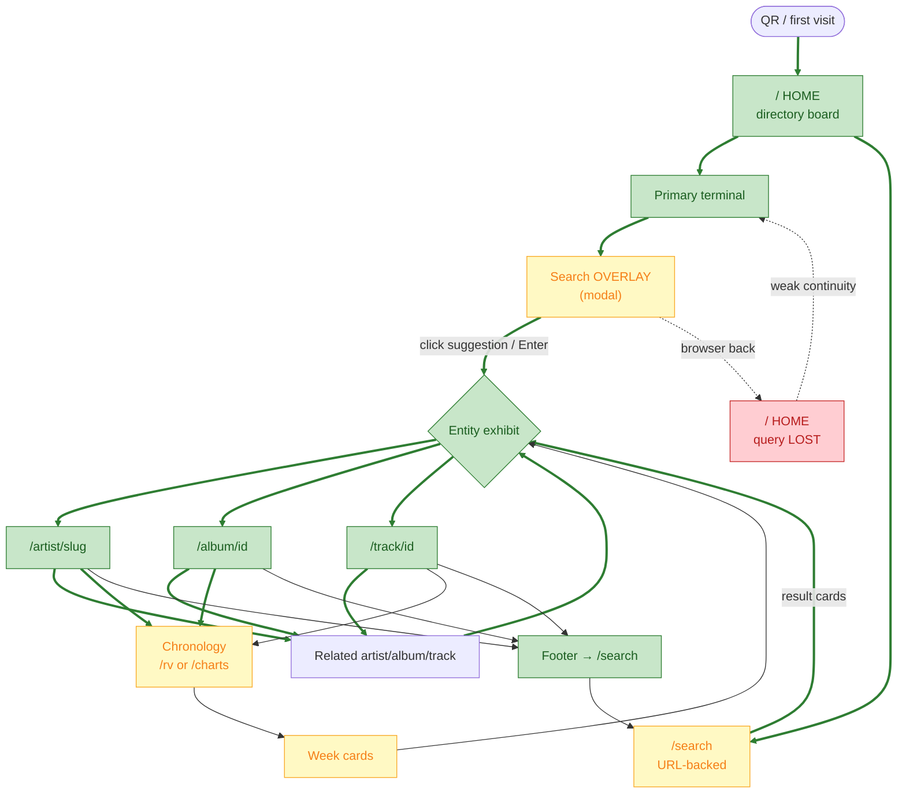
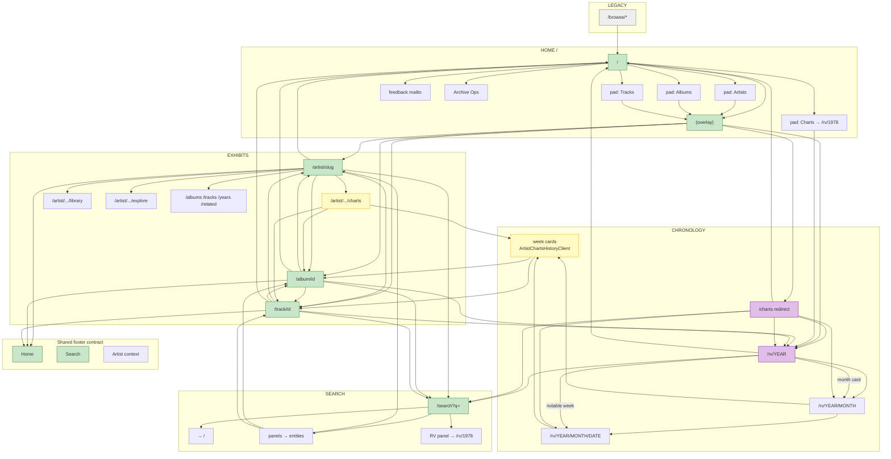
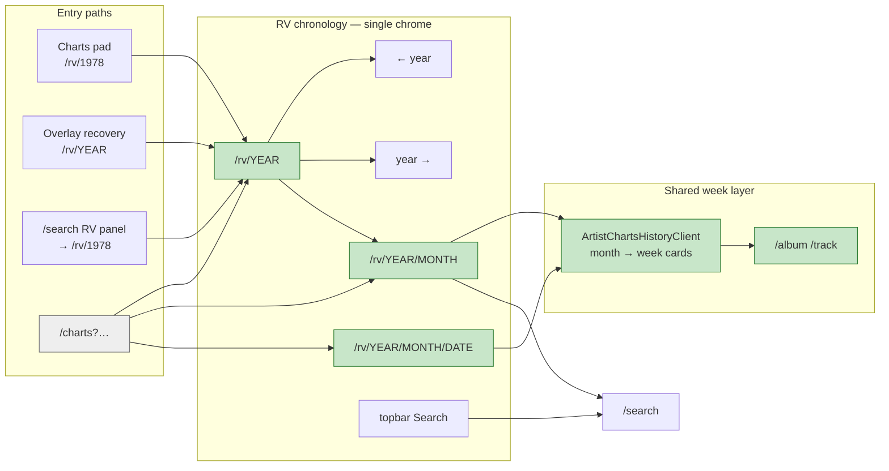
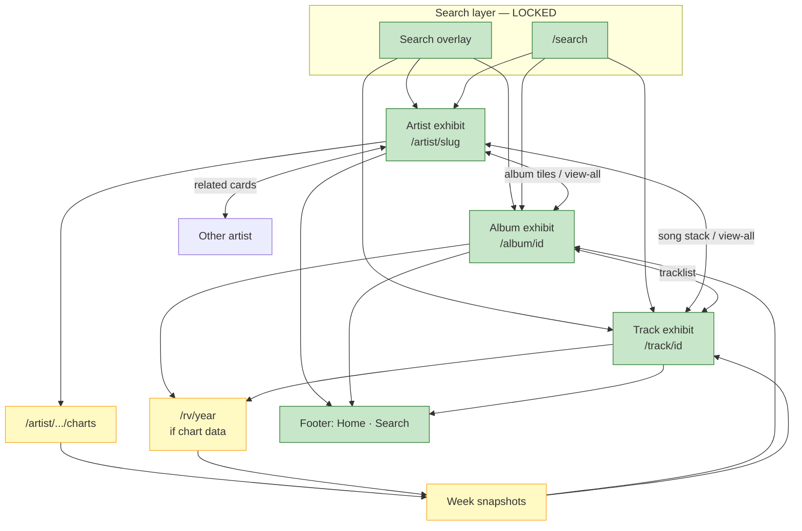
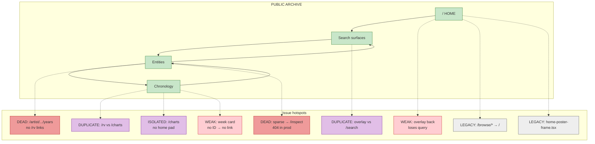
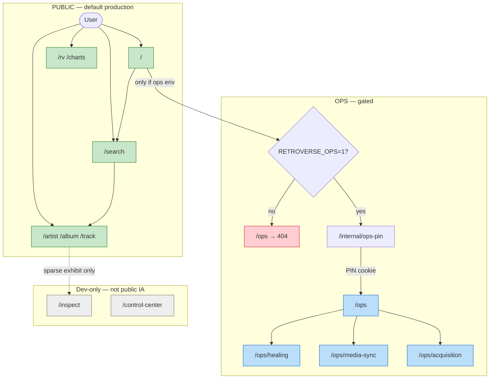
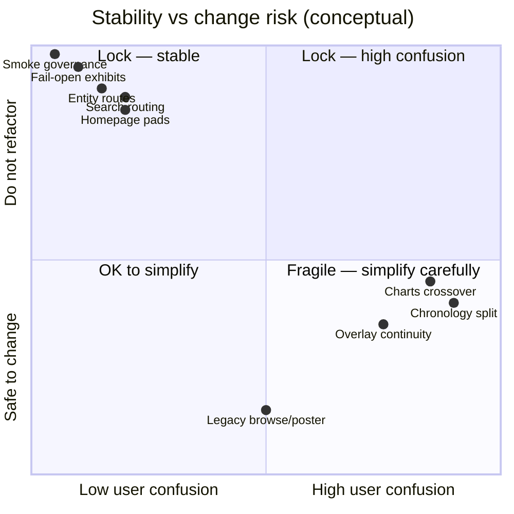

# Retroverse Public Navigation Flowchart

**Status:** Visual companion to `docs/PUBLIC_NAVIGATION_MAP.md`  
**Date:** 2026-05-27  
**Scope:** Mermaid diagrams only — no runtime changes

Legend (diagram styles):
- **Green** = locked / foundational
- **Yellow** = fragile — change carefully
- **Red** = weak / dead-end / confusion risk
- **Gray** = legacy / redirect / dev-only
- **Purple** = duplicate system (parallel path to same place)

---

## 1. Primary user flow

**Intended loop:** QR → Home → Search → Entity → Related → (optional chronology) → Search again.

**Strongest path (thick green):** Home → overlay/search → entity → footer search → repeat.

---

## 2. Full public navigation tree

Directional map of all public routes and major exits.

---

## 3. Chronology flow

**Canonical:** `/rv/[year]` → `/rv/[year]/[month]` → `/rv/[year]/[month]/[YYYY-MM-DD]`. Legacy `/charts?…` redirects into this tree.

---

## 4. Entity relationship map

---

## 5. Problem map

Nodes labeled by issue type. See `PUBLIC_NAVIGATION_MAP.md` for full tables.

| Label | Meaning |
|-------|---------|
| WEAK | Works but breaks continuity / trust |
| DUPLICATE | Two paths, same outcome, different UX |
| DEAD | User hits wall or misleading link |
| LEGACY | Stale route or unused code |
| ISOLATED | Hard to reach from main loop |

---

## 6. Ops separation map

Public archive and ops are separate by env + middleware. No ops in exhibit footers.

**Gate chain:** `RETROVERSE_OPS=1` → middleware on `/ops/*` → cookie after PIN → ops pages. API `/api/ops/*` requires same cookie.

---

## Locked vs fragile (quick reference)

| LOCKED | FRAGILE |
|--------|---------|
| Homepage pad model | Chronology `/rv` + `/charts` split |
| Fail-open exhibits | Overlay session (no URL) |
| Search entity routes | Month → `/charts` crossover |
| `sanitizePublicNavigationHref` | Week card ID gaps |
| Smoke test CI | Hidden artist sections |

---

## Governance

- **Text map:** `docs/PUBLIC_NAVIGATION_MAP.md`
- **Visual map:** this file
- Update both when public navigation changes.

---

## Deployment impact

**None.** Documentation only.
