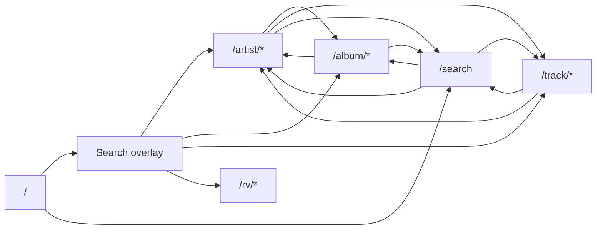
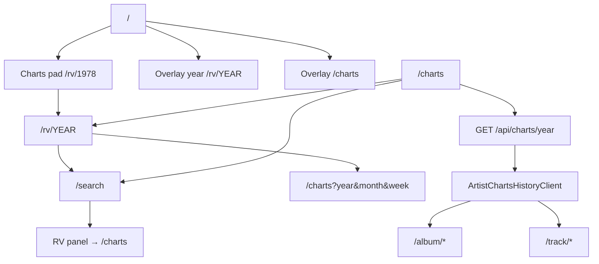

# Retroverse Public Navigation Map

**Status:** Authoritative interaction map (documentation only)  
**Date:** 2026-05-27  
**Scope:** Public user-facing navigation, flows, and system boundaries  
**Non-goals:** Runtime changes, redesign, architecture refactor

Use this document before adding routes, nav chrome, or chronology features. If behavior diverges from this map, update the map first.

---

## 1. Complete public navigation tree

Legend:
- `(overlay)` = in-page modal, not a route change
- `(gated)` = not public in production by default
- `[weak]` = known continuity or IA issue

```
/  HOME (directory board)
├── Primary terminal → (overlay) HomeSearchOverlay
│   ├── Suggestion click → /artist/[slug] | /album/[id] | /track/[id] | /rv/[year]
│   ├── Enter → first scoped suggestion OR /rv/[year] if year-only query
│   ├── Idle recovery pills → /rv/1973|1978|1984|1999, /artist/[slug], /charts
│   └── Close → stays on /
├── Pads (scoped overlay openers — no route)
│   ├── Artists → overlay scope=artists
│   ├── Albums → overlay scope=albums
│   └── Tracks → overlay scope=songs
├── Charts pad → /rv/1978
├── Footer → mailto:feedback@retroverse.live
└── Archive Ops (if RETROVERSE_OPS=1) → /ops → (gated) /internal/ops-pin

/search  FULL SEARCH
├── Topbar → / , /search (home link)
├── Query ?q= drives panels fetch
├── Enter → commits ?q= (URL update, results refresh)
├── Result cards → /artist | /album | /track
├── View-all panels → /artist/[slug]#anchors | /charts fallback
├── RV history panel → /charts OR embedded chart history
└── RV year entry panel → /charts

/artist/[slug]  ARTIST EXHIBIT (shared layout shell)
├── Topbar → / , /search , /artist/[slug]
├── Nav pills → Exhibit | /charts | /library | /explore
├── Exhibit (/)
│   ├── Album tiles → /album/[id|slug]
│   ├── Song stack → /track/[id|slug]
│   ├── Related → /artist/[other-slug]
│   ├── Era CTA → varies (data-driven href)
│   ├── View-all → /albums | /tracks | /years | /library | /related
│   └── Sparse exhibit only → /search , /inspect [weak in prod]
├── /charts → ArtistChartsHistoryClient (year/month/week drill)
│   └── Week cards → /album | /track (when IDs resolve)
├── /library , /explore , /albums , /tracks , /years , /related
│   └── Mostly section content; /years has no /rv links [weak]
└── Footer shell → / , /search , /artist/[slug]

/album/[id]  ALBUM EXHIBIT
├── Topbar → /
├── Artist link → /artist/[slug]
├── Tracklist rows → /track/[id]
├── Chart year link (if data) → /rv/[year]
└── Footer → / , /search , /artist/[slug]

/track/[id]  TRACK EXHIBIT
├── Topbar → /
├── Artist link → /artist/[slug]
├── Album rows → /album/[id]
├── Related songs → /track/[id]
├── Chart year link (if data) → /rv/[year]
└── Footer → / , /search , /artist/[slug]

/rv/[year]  RV YEAR CHRONICLE
├── Topbar → / , /search?q=[year]
├── Year nav → /rv/[year±1]
├── Month cards → /charts?year=&month=
├── Notable rows → /charts?year=&month=&week=
└── Footer → / , /search , prev/next year

/charts  CHART TIME TRAVEL (second chronology surface)
├── Topbar → /
├── Step 1 decade pills (in-page state)
├── Step 2 year pills → loads /api/charts/year?year=
├── Embedded ArtistChartsHistoryClient (same week cards as artist charts)
├── Bridge link → /rv/[selectedYear]
└── Footer → / , /search

LEGACY / REDIRECT
└── /browse/* → 301/302 → /

NOT PUBLIC BY DEFAULT
├── /ops/* (RETROVERSE_OPS=1 + PIN cookie via middleware)
├── /internal/ops-pin
├── /inspect (RETROVERSE_INSPECT or non-production)
├── /control-center (RETROVERSE_CONTROL_CENTER or non-production)
└── /api/ops/* (gated)
```

---

## 2. Primary user-flow map

**Intended core loop (product priority #1):**

```
QR / landing
  → HOME
  → Search (overlay OR /search)
  → Entity exhibit (artist | album | track)
  → Related navigation within exhibit
  → Back OR footer Search
  → repeat
```

| Step | Surface | User action | Destination | State preserved? |
|------|---------|-------------|-------------|------------------|
| 1 | `/` | Open terminal | Overlay | Query in overlay only |
| 2 | Overlay | Pick suggestion | Entity route | Overlay closes; query lost on back |
| 3 | Entity | Footer Search | `/search?q=…` | URL-backed |
| 4 | Entity | Related link | Another entity | Browser history |
| 5 | Any | Browser back | Previous route | Overlay not restored |

**Mermaid — primary loop:**



---

## 3. Chronology-flow map

Two public chronology entry systems coexist:

| Entry | Default path | Interaction model | Returns to search? |
|-------|--------------|-------------------|--------------------|
| Charts pad | `/rv/1978` | Vertical year → month cards → `/charts` deep link | Yes (topbar/footer Search) |
| Overlay recovery | `/charts` or `/rv/YEAR` | Split by pill | Partial |
| Search RV panel | `/charts` | Secondary entry | Via `/search` only |
| `/charts` direct | decade → year → week UI | 3-step explorer + API load | Footer Search only |

**Mermaid — chronology paths:**



**Isolation risk:** Users entering via `/rv/1978` get year stepping and month cards; users entering `/charts` get decade/year pills and a different chrome. Both land on the same week-card component but with different surrounding IA.

---

## 4. Entity-flow map

### Artist

```
/artist/[slug]
  ├─ Exhibit sections (inline deep links)
  ├─ /artist/[slug]/charts  (full chronology for this artist)
  ├─ /artist/[slug]/library
  ├─ /artist/[slug]/explore
  └─ View-all-only sections: /albums /tracks /years /related
```

Chronology crossover: artist charts week cards → album/track exhibits. Artist exhibit may link `rvYearHref` on sparse data paths via album/track pages, not always from artist home.

### Album

```
/album/[id] → artist, tracks, optional /rv/[year]
```

### Track

```
/track/[id] → artist, albums, related tracks, optional /rv/[year], SongActions (may include inspect in dev)
```

**Shared exhibit footer contract:** Home · Search · Artist (album/track pages mirror this).

---

## 5. Dead-end list

| Location | Symptom | Why |
|----------|---------|-----|
| Home overlay → entity → browser back | Returns to bare home; search query gone | Overlay state is component-local |
| `/artist/[slug]/years` | Bar chart only; no navigation to `/rv/[year]` | Section is display-only |
| Sparse artist exhibit | "Inspect graph" link | `/inspect` 404 in production unless flag set |
| `/charts` with failed year load | Error string only | No automatic fallback to `/rv/[year]` |
| `/rv/[year]` months with no Album 200 | "No Album 200 #1 captured" | Data gap (not nav dead-end, feels like one) |
| Scoped pad with zero results + Enter | No navigation | Enter only routes when suggestion/year match exists |
| `view-all` fallbacks in search | May send user to `/charts` | When artist slug cannot be resolved |

---

## 6. Duplicate-system list

| Duplicate | Paths | Notes |
|-----------|-------|-------|
| **Dual chronology shells** | `/rv/[year]` vs `/charts` | Same week data component; different entry and chrome |
| **Dual search surfaces** | Home overlay vs `/search` | Different Enter semantics, different panel richness |
| **Chronology entry trio** | `/rv/1978` pad, `/charts` recovery, search RV panel | Three ways into chart history |
| **Year navigation** | `/rv/Y` prev/next vs `/charts` decade/year pills | Same years, different controls |
| **Artist chart history** | `/artist/[slug]/charts` vs `/charts` vs `/rv/[year]` | Shared `ArtistChartsHistoryClient` |

---

## 7. Legacy residue list

| Item | Path / behavior | Risk |
|------|-----------------|------|
| Poster homepage | `app/components/home-poster-frame.tsx` | Unused; could be re-wired by mistake |
| Browse mini-sites | `/browse/*` → `/` redirect | Stale links/prefetch still hit redirect |
| Browse comments in code | `home-directory.tsx` | Documents intent; keep in sync |
| Artist section routes without nav pills | `/albums`, `/tracks`, `/years`, `/related` | Discoverable only via View-all |
| Public flow audit (pre-fix) | `docs/PUBLIC_FLOW_AUDIT_2026-05-27.md` | Enter-on-`/search` marked broken; fixed since |
| Ops on homepage | Bottom-right when env set | Must stay env-gated in production |

---

## 8. Biggest architectural confusion points

1. **Two chronology products** — `/rv/[year]` reads as "year world"; `/charts` reads as "chart control panel." Users cannot tell they are one system.
2. **Search is split-brain** — Overlay (modal, best-match Enter) vs `/search` (URL-backed, panels, commit Enter). Mental model differs by entry point.
3. **Month navigation indirection** — `/rv` month card does not show weeks inline; it jumps to `/charts` with query params. Back button crosses systems.
4. **Artist IA vs routes** — Four nav pills vs eight section routes; hidden sections feel like dead ends if user never hits View-all.
5. **Chronology ↔ entity ID resolution** — Week cards without RVAR/RVAL/RVTR may render non-linkable; feels broken though data-sparse.
6. **Dev tools in public copy** — Inspect links on sparse artist exhibits leak internal tooling language.

---

## 9. Recommended simplifications (documentation-only proposals)

**Do not implement in this pass.** Ordered by human clarity impact:

1. **Declare canonical chronology entry:** `/rv/[year]` for discovery; `/charts` as deep drill tool only (or merge chrome).
2. **Unify month/week destination:** Either weeks live on `/rv/[year]` OR `/charts` — avoid cross-route month cards with different chrome.
3. **Single search contract document:** Overlay Enter = `/search` Enter behavior table in this doc; keep both but identical outcomes where possible.
4. **URL-backed overlay optional:** `/?q=&scope=` for back-button continuity (future).
5. **Hide inspect links in production** when `!isInspectEnabled()`.
6. **Link `/artist/.../years` bars to `/rv/[year]`** when year known.
7. **Remove or quarantine `home-poster-frame.tsx`** to prevent IA regression.

---

## 10. Systems considered "locked" (do not refactor casually)

| System | Why locked |
|--------|------------|
| Entity route resolution | `lib/search/entity-routes.ts`, `sanitizePublicNavigationHref` — public trust depends on stable hrefs |
| Fail-open exhibits | Artist/album/track render sparse state instead of 404 |
| Home directory pads | Scoped overlay accelerators; no `/browse/*` resurrection |
| Search smoke governance | `npm run smoke:public-search` + CI |
| RV year API | `/api/charts/year` + `loadRvYearChartHistory` |
| Ops middleware gate | `middleware.ts` + `RETROVERSE_OPS` |
| Billboard 200 backfill tool | `tools/backfill-billboard200-missing-weeks.mjs` (data integrity) |

---

## 11. Systems: stable vs fragile vs legacy

| Classification | Systems |
|----------------|---------|
| **Stable / foundational** | Entity exhibits, search suggestion routing, homepage directory board, ops gate, fail-open loading |
| **Fragile (change carefully)** | Dual chronology (`/rv` + `/charts`), overlay session state, chart week → entity ID mapping |
| **Legacy / duplicated** | `home-poster-frame`, `/browse` redirects, hidden artist section routes, inspect links on public sparse exhibits |

---

## 12. Homepage subsystem detail

| Control | Behavior | Outgoing paths |
|---------|----------|----------------|
| Primary terminal button | Opens overlay (`scope=all`) | Suggestions → entities |
| Artists pad | `scope=artists` overlay | Filtered suggestions |
| Albums pad | `scope=albums` overlay | Filtered suggestions |
| Tracks pad | `scope=songs` overlay | Filtered suggestions |
| Charts pad | Link navigation | `/rv/1978` |
| Archive Ops | Link (env only) | `/ops` → pin gate |
| Feedback | `mailto:` | External |

Overlay keyboard: `Escape` closes; `Enter` → `routeBestMatch()` (first suggestion or RV year).

---

## 13. Search subsystem detail

| Surface | Query state | Enter | Result click |
|---------|-------------|-------|--------------|
| Home overlay | Local React state | Best match / RV year | `navigateToEntityRoute` + close overlay |
| `/search` | URL `?q=` via `useSearchQuery` | `commitQuery()` updates URL | `<Link>` / DiscoverCard |

Scoped filters: `lib/search/home-search-scope.ts` filters suggestion groups on homepage only.

Chronology crossover on `/search`:
- `SearchRvHistoryEntryPanel` → `/charts`
- `SearchChartsHistoryPanel` → embedded history + view-all hrefs
- Year-detected queries may surface RV panels

---

## 14. Ops subsystem (public separation)

```
Public user
  └─ never sees /ops unless RETROVERSE_OPS=1 on server
       └─ /ops/* matched by middleware
            ├─ no cookie → /internal/ops-pin?next=...
            └─ cookie ok → /ops, /ops/healing, /ops/media-sync, /ops/acquisition
```

Ops links do not appear in public exhibit footers. Only homepage `Archive Ops` when `isOpsEnabled()`.

Production default: `/ops` returns 404 when flag off (middleware not registered for matcher? Actually middleware only runs on ops paths - if ops disabled, middleware returns 404 for those paths).

Wait - when RETROVERSE_OPS is not 1, middleware returns 404 for /ops routes. Good.

---

## 15. Problem map (visual)

```
[STABLE]  Home ──search──► Entity exhibits ◄──► Related entities
              │                    │
              │                    └── chart links ──► /rv/YEAR (sparse)
              │
[WEAK]        ├── overlay back loses query
              │
[CONFUSED]    ├── Charts pad ──► /rv/1978 ──month──► /charts?...
              │       ▲                           │
              │       └──── "Open full year" ───────┘
              │
              └── /search ──RV panel──► /charts (third entry)

[ISOLATED]    /charts decade UI (no direct pad from home)

[GATED]       /ops  /inspect  /control-center
```

---

## Governance

- **Authoritative path:** `docs/PUBLIC_NAVIGATION_MAP.md`
- **Update when:** new public routes, pad behavior, chronology links, or search contracts change
- **Companion docs:** `docs/PUBLIC_FLOW_AUDIT_2026-05-27.md` (issue log), `docs/RETROVERSE_OPERATING_BOARD.md` (priorities)

---

## Deployment impact

**None.** Documentation-only pass.
