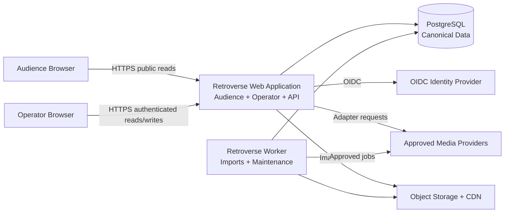
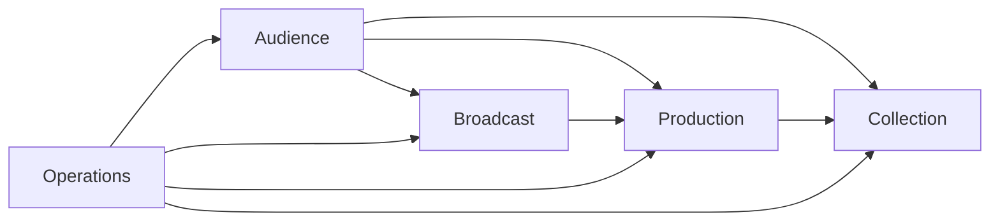
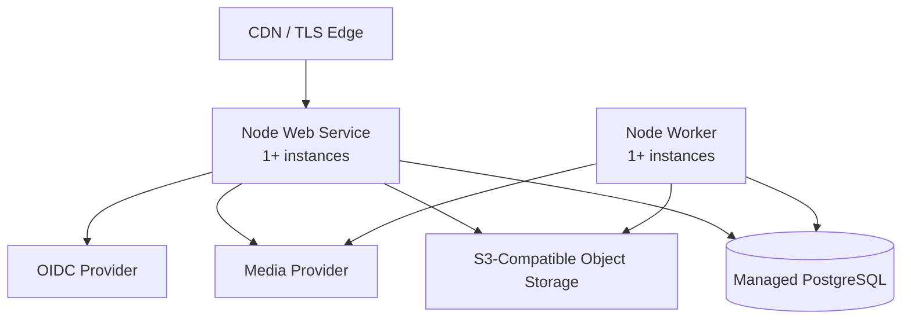

# Retroverse Architecture

[Foundation Index](./README.md) · [Previous: RV2-FND-05](./05-Data-Model.md) · [Next: RV2-FND-07](./07-UX-Standards.md)

## Document Control

| Field | Value |
|---|---|
| Document ID | RV2-FND-06 |
| Version | 0.1.0 |
| Document Status | Draft |
| Review Status | Not Started |
| Approval Status | Not Submitted |
| Content Authority | Chief Product Architect |
| Document Maintainer | Engineering Program Manager |

## Table of Contents

- [Purpose](#purpose)
- [Architecture Goals](#architecture-goals)
- [Architecture Style](#architecture-style)
- [System Context](#system-context)
- [Technology Baseline](#technology-baseline)
- [Core Layer Mapping](#core-layer-mapping)
- [Runtime Components](#runtime-components)
- [Module Boundaries and Dependencies](#module-boundaries-and-dependencies)
- [Request and Rendering Model](#request-and-rendering-model)
- [Channel Zero Architecture](#channel-zero-architecture)
- [API Architecture](#api-architecture)
- [Import and Background Work](#import-and-background-work)
- [Media Architecture](#media-architecture)
- [Authentication and Authorization](#authentication-and-authorization)
- [Caching and Search](#caching-and-search)
- [Deployment Topology](#deployment-topology)
- [Reliability and Recovery](#reliability-and-recovery)
- [Security and Trust Boundaries](#security-and-trust-boundaries)
- [Observability](#observability)
- [Performance and Scaling](#performance-and-scaling)
- [Architecture Invariants](#architecture-invariants)
- [Architecture Decisions and Rationale](#architecture-decisions-and-rationale)
- [Cross-References](#cross-references)
- [Review and Change Control](#review-and-change-control)
- [Version History](#version-history)

## Purpose

This document defines the system architecture for Retroverse V2 Release 1. It assigns responsibility for the approved Product Specification and Data Model while preserving the four core layers: Collection, Production, Broadcast, and Audience.

The architecture is intentionally small. It favors one deployable application, one relational database, explicit modules, and replaceable external adapters over microservices, event infrastructure, or speculative scale mechanisms.

## Architecture Goals

| ID | Goal |
|---|---|
| AR-GOAL-001 | Preserve the approved four-layer model in code and data ownership. |
| AR-GOAL-002 | Keep Channel Zero deterministic, globally shared, and recoverable from persisted state. |
| AR-GOAL-003 | Keep PostgreSQL as the single canonical data authority. |
| AR-GOAL-004 | Support anonymous public reads and tightly controlled operator writes. |
| AR-GOAL-005 | Make published content immutable and reproducible. |
| AR-GOAL-006 | Isolate external media and identity providers behind adapters. |
| AR-GOAL-007 | Support one-machine local development and a simple managed production deployment. |
| AR-GOAL-008 | Allow future extraction of modules only after measured need. |

## Architecture Style

Retroverse V2 is a **modular monolith**.

It consists of:

- one TypeScript codebase;
- one Next.js web application;
- one PostgreSQL database;
- one optional worker process built from the same codebase;
- a small set of external adapters for identity, object storage, and media providers.

The modular monolith is a deliberate architecture, not an absence of boundaries. Domain modules expose explicit application services and repositories. Cross-module database access is prohibited outside those interfaces.

Release 1 does not use microservices, GraphQL, Redis, Kafka, a separate search engine, WebSockets, or a second authoritative datastore.

## System Context



## Technology Baseline

| Concern | Decision |
|---|---|
| Language | TypeScript with strict compiler settings |
| Runtime | Active Node.js LTS, pinned by repository tool configuration |
| Web framework | Next.js using the App Router |
| UI | React and a repo-owned component library |
| Database | PostgreSQL |
| Data access | Drizzle ORM for typed schema access plus reviewed SQL migrations |
| Validation | Zod schemas at external and module boundaries |
| Package manager | pnpm with a committed lockfile |
| Unit/integration tests | Vitest |
| Browser tests | Playwright Test |
| Job execution | PostgreSQL-backed job queue using the same application modules |
| Authentication | Standards-based OIDC with allowlisted Operator identities |
| Image storage | Private S3-compatible object storage; immutable CDN delivery only for non-revocable brand assets |
| Observability | Structured JSON logs, error reporting, health checks, and metrics |

Dependencies are pinned by the lockfile. The Build Specification controls exact bootstrap versions and upgrade policy.

## Core Layer Mapping

### Collection Module

**Owns:**

- Artist, Album, Track;
- temporal entities;
- Chart, Chart Issue, Chart Entry;
- external identifiers;
- source provenance;
- import staging and commit;
- Media Asset eligibility metadata.

**Exposes:**

- curated entity reads;
- operator create/update/archive operations;
- validated import services;
- public collection projections;
- relationship queries for production and exploration.

**Does not own:** Experience composition, Program order, Channel state, or audience session state.

### Production Module

**Owns:**

- Experience identities and revisions;
- Experience type specifications and links;
- Program identities, revisions, and ordered items;
- Playlists and ordered Track membership;
- preview and publication validation.

**Depends on:** Collection read services and media eligibility reads.

**Does not own:** canonical Broadcast State or public page routing.

### Broadcast Module

**Owns:**

- Channel Zero configuration;
- canonical Broadcast State;
- canonical timeline calculation;
- fallback selection;
- typed broadcast Audit Events;
- Channel Manifest construction.

**Depends on:** Published Program and Experience read models from Production.

**Does not own:** Program authoring, Collection data, or per-audience playback state.

### Audience Module

**Owns:**

- public routes and view models;
- Channel Zero client synchronization;
- Explore and search presentation;
- public entity pages;
- local, non-authoritative browser preferences.

**Depends on:** Public read services from Collection, Production, and Broadcast.

**Does not own:** authoritative domain data or operator mutations.

### Operations Module

Operations is a supporting module rather than a fifth product layer. It owns:

- Operator identity mapping;
- authorization policy;
- audit query surfaces;
- health and readiness endpoints;
- job execution and operational alerts.

## Runtime Components

### Web Application

The web application is the primary deployable process. It serves:

- server-rendered public pages;
- the hydrated Channel Zero client;
- authenticated operator pages;
- public and operator HTTP endpoints;
- OIDC login and session callbacks;
- health and readiness endpoints.

The web process is stateless except for encrypted session cookies and transient request memory. Canonical state is stored in PostgreSQL.

### Worker

The worker is built from the same repository and imports the same domain modules. It runs:

- import validation and commit jobs;
- media verification jobs;
- search document refresh;
- transactional outbox dispatch and leased job execution;
- five-second Broadcast Readiness reconciliation;
- derived-data rebuilds;
- maintenance and integrity checks;
- alert dispatch.

The worker is optional in local development: jobs may be run synchronously or by a local worker command. Production runs at least one worker process.

### PostgreSQL

PostgreSQL is the only canonical datastore. It provides:

- relational integrity;
- transactions;
- optimistic and row-level concurrency control;
- a transactional outbox and PostgreSQL-backed leased job queue;
- full-text and trigram search for Release 1;
- audit and revision persistence.

### Object Storage and CDN

Operator-approved image uploads are stored as private objects in S3-compatible object storage. Revocable Media Assets are delivered only through the web media projection after a current eligibility check and use `no-store`; they have no directly public origin URL. The CDN serves only non-revocable repository-owned brand assets using immutable keys. Original uploads remain private and transformations are generated by an approved image pipeline.

Audio and video are not uploaded to Retroverse object storage in Release 1 unless a future approved media adapter explicitly supports owned media.

## Module Boundaries and Dependencies

Allowed dependency direction:



Rules:

1. Collection imports no product-layer module.
2. Production may read Collection only through Collection application ports.
3. Broadcast may read Production only through published read ports.
4. Audience may read public projections but may not perform domain writes.
5. Operator routes call application commands; they do not write repositories directly.
6. Operations coordinates modules but may not duplicate their domain rules.
7. A module may not query another module's tables directly.
8. Shared code is limited to technical primitives, identifiers, time, validation, and test utilities; business rules remain in their owning module.

## Request and Rendering Model

### Public Entity Pages

Public entity and Explore pages use server rendering for accessibility, linkability, and search-engine readability. They may use client enhancement but must remain navigable without client-side routing.

Public pages read from public projection services that evaluate current canonical visibility. Visibility-sensitive entity responses use `no-store` shared-cache policy in Release 1. This deliberately favors correctness and revocation over speculative page caching.

### Channel Zero

The initial Channel Zero response is server-rendered with a current Channel Manifest snapshot. A small client application then:

1. estimates the PostgreSQL canonical clock offset from request send/receive timing;
2. advances the local presentation from the canonical timeline;
3. refreshes the manifest every five seconds;
4. resynchronizes after visibility changes, network recovery, or manifest-version changes;
5. maintains only local sound, fullscreen, and reduced-motion preferences.

### Operator Console

Operator pages use server rendering plus progressive client enhancement. All mutations pass authenticated server endpoints, validate input, enforce authorization, call application commands, and return canonical persisted state.

## Channel Zero Architecture

### Canonical Position

The Broadcast module calculates canonical position using only:

- active published Program revision;
- `effective_started_at`;
- `start_offset_seconds`;
- PostgreSQL `statement_timestamp()` read in the same transaction;
- persisted Program duration and item offsets.

The calculation is a pure domain function and is covered by deterministic tests for boundaries, looping, clock offsets, and control actions. Application-node wall clocks never determine canonical position.

For each manifest request, the client records its wall-clock send instant and a monotonic round-trip duration. It calculates `clock_offset_ms = serverTime_ms - (wall_send_ms + monotonic_round_trip_ms / 2)`. Samples with round-trip duration above one second are discarded for clock correction but their manifest version and state remain usable. The client uses the lowest-round-trip sample from its three most recent accepted samples, advances locally with a monotonic clock, and immediately rejoins canonical position when the resulting timeline error exceeds 250 milliseconds. Boundary presentation and multi-client convergence must remain within the Acceptance Criteria tolerances.

### Control Commands

Control commands are:

- `activateProgram(programRevisionId)`;
- `activateProgramAt(programRevisionId, experiencePosition)`;
- `skipCurrent()`;
- `replayCurrent()`;
- `activateFallback()`.

Each command:

1. authenticates and authorizes the Operator;
2. evaluates the single Broadcast Readiness predicate;
3. locks the Broadcast State row;
4. calculates the new persisted anchor;
5. increments `manifest_version`;
6. appends one typed Audit Event;
7. commits atomically;
8. returns a canonical manifest calculated after commit.

### Fallback

Manifest construction is side-effect free. Commands that publish, archive, block media, change visibility, configure fallback, or change Broadcast State evaluate Broadcast Readiness inside their transaction and atomically activate a ready fallback if they would invalidate the active state. A reconciliation worker evaluates readiness at least every five seconds and performs an idempotent compare-and-set automatic fallback if out-of-band inconsistency is detected. If both revisions are unready, the manifest returns the branded unavailable projection and alerts without exposing unpublished data. Media-provider failure alone does not change Broadcast State; the client shows the Experience's visual presentation while canonical time advances.

### Synchronization

Release 1 uses HTTP polling rather than WebSockets or Server-Sent Events. A five-second maximum visible polling interval, no shared manifest cache, and the endpoint latency budget leave margin inside the ten-second manual-control propagation objective. The Operator console refreshes immediately after command completion.

## API Architecture

### API Style

- HTTP over TLS;
- JSON request and response bodies;
- explicit Zod validation;
- versioned public paths under `/api/v1`;
- stable error envelope;
- request correlation ID on every response;
- idempotency key required for sensitive operator commands where retry could duplicate effects; keys are scoped, request-fingerprinted, retained for 24 hours, and replay the stored canonical response.

GraphQL is not used in Release 1.

### Public Endpoints

Minimum public endpoints:

| Method | Path | Purpose |
|---|---|---|
| `GET` | `/api/v1/channel-zero/manifest` | Current canonical Channel Manifest. |
| `GET` | `/api/v1/search` | Public filtered search. |
| `GET` | `/api/v1/experiences/:id` | Published Experience projection. |
| `GET` | `/api/v1/programs/:id` | Published Program projection. |

Entity pages may use server-internal application reads rather than public API round trips. The public API and server views share the same projection services.

### Operator Endpoints

Operator endpoints live under `/api/v1/operator` and are never cached publicly. They cover:

- collection commands;
- import upload, validation, review, and commit;
- media eligibility commands;
- Experience, Program, and Playlist commands;
- publication commands;
- broadcast-control commands;
- audit reads.

### Error Envelope

```json
{
  "error": {
    "code": "stable_machine_code",
    "message": "Safe human-readable message",
    "fieldErrors": {},
    "requestId": "correlation-id"
  }
}
```

Stack traces, SQL text, provider secrets, and private identifiers are never returned.

## Import and Background Work

Import is a staged pipeline:

```text
upload -> checksum -> parse -> normalize -> match -> validate -> operator review -> commit
```

Architecture rules:

- uploaded files are untrusted;
- parsing occurs with size and row limits;
- staged payloads never appear in public queries;
- proposed matches never merge automatically;
- commit calls Collection application services and normal validation;
- committed rows retain Source Record and Field Provenance;
- retries are idempotent by Import Job and batch key;
- failed jobs retain safe diagnostics and may be retried;
- legacy Retroverse data uses `legacy_research` provenance and no privileged trust.

## Media Architecture

### Adapter Contract

Each media provider adapter implements:

- `validateReference(providerKey)`;
- `getMetadata(providerKey)`;
- `getPublicPlaybackDescriptor(providerKey, context)`;
- `getAvailability(providerKey)`;
- `getCapabilities(providerKey)` returning media kind, seekability, offset precision, declared duration, browser-playback support, autoplay mode, and availability scope;
- `validatePlaybackInterval(providerKey, startSeconds, endSeconds)`.

Adapters return normalized data. Domain modules never depend on provider-specific response objects. A playable source is publishable for synchronized Channel Zero audio/video only when it can seek to the current canonical offset within 250 milliseconds, covers the declared interval, and reports supported browser playback. A source that cannot meet this contract may remain an unavailable or visual-only reference but cannot be selected as synchronized playable media.

### Playback Descriptor

A public playback descriptor contains only the minimum client-safe values required by the approved provider integration. It is short-lived when signing is required and never contains long-lived credentials.

### Failure Isolation

Provider timeouts and errors are bounded and circuit-broken. Channel Zero does not block timeline rendering on a provider metadata call; it uses stored approved metadata and visual fallback.

## Authentication and Authorization

### Public Access

Public routes require no identity. Public requests are rate-limited by network and route characteristics without creating persistent audience profiles.

### Operator Authentication

Operator authentication uses OIDC Authorization Code flow with PKCE where supported. Access requires:

1. a valid OIDC identity;
2. an exact `(issuer, subject)` match in `operator_identity`;
3. `allowlisted = true`;
4. no `disabled_at` value.

Session cookies are encrypted, `HttpOnly`, `Secure`, and `SameSite=Lax` or stricter. They carry the Operator `session_version`; allowlist removal, disablement, or forced sign-out increments the stored version and revokes existing sessions. State-changing requests use CSRF protection and origin validation.

First-operator enrollment is a single atomic bootstrap controlled by the Data Model's singleton bootstrap state and exact issuer/subject configuration. After consumption, PostgreSQL is authoritative and environment configuration cannot enroll another Operator. An active Operator may add or disable another exact identity through a confirmed, audited command; row locking prevents normal disablement of the final active Operator. Emergency recovery follows the approved break-glass runbook and creates an Audit Event.

### Authorization

Release 1 has one `operator` role. Authorization is still centralized in the Operations module; routes may not assume authentication alone grants a mutation.

## Caching and Search

### Caching

- Visibility-sensitive public entity responses, Channel Manifest, and revocable Media Assets use `no-store` shared-cache policy.
- Non-revocable repository-owned brand assets may use immutable CDN caching.
- Operator responses use `private, no-store`.
- Drafts and broadcast-control responses are never served from shared cache.
- Derived refresh follows transactional Outbox Events; correctness never depends on invalidation or a worker completing.

### Search

Release 1 search uses PostgreSQL full-text and trigram indexes. A derived `search_document` table stores:

- one enforced Public Target Reference;
- public title/name;
- normalized searchable text;
- public summary;
- source update/version key.

The worker updates search documents from Outbox Events after committed changes. Every search response joins the canonical target and applies current public visibility; a stale document can reduce freshness but cannot expose a hidden record. A full rebuild is always possible from canonical tables.

## Deployment Topology

Minimum production topology:



The web and worker use the same immutable build artifact with different start commands. Multiple web or worker instances are safe because canonical state, job claims, and locks are database-backed.

Production requires managed PostgreSQL with automated backups and point-in-time recovery. A provider-specific deployment configuration is permitted but must not enter domain modules.

## Reliability and Recovery

- Web instances are disposable and restart without losing Channel state.
- Broadcast State, published revision snapshots, Audit Events, and required Outbox Events are committed before acknowledgement.
- Readiness fails when the database is unavailable or required migrations are missing.
- Liveness verifies process health without requiring every external provider.
- Media-provider failure degrades to visual presentation.
- Search-index failure degrades public search but not Channel Zero or entity identity.
- Worker failure delays background work but does not stop public read paths.
- The same Broadcast Readiness predicate is checked at publication, configuration, activation, relevant mutations, deployment readiness, and recurring five-second reconciliation.
- Database restoration follows the recovery objectives in Build Specification.

## Security and Trust Boundaries

### Trust Boundaries

1. **Public internet → web application:** all input untrusted; public reads only.
2. **Operator browser → operator endpoints:** authenticated but still validated and CSRF-protected.
3. **Import file → staging:** untrusted content, bounded parser, no direct domain write.
4. **External provider → adapter:** untrusted response, schema validation, timeouts.
5. **Application → database:** least-privilege credentials by environment.
6. **Worker → external services:** allowlisted destinations and scoped credentials.

### Required Controls

- TLS for all non-local traffic;
- secure headers and Content Security Policy;
- parameterized database access;
- strict input schemas and output projections;
- route-specific rate limits;
- secret storage outside source control;
- dependency and vulnerability scanning;
- credential redaction in logs;
- audit records for privileged changes;
- upload size, type, and row limits;
- no HTML rendering from untrusted narrative text without sanitization;
- no remote URL fetching from arbitrary Operator input without allowlisting and SSRF controls.

## Observability

Every process emits structured JSON logs with:

- timestamp;
- severity;
- service and version;
- environment;
- request or job ID;
- module;
- safe action name;
- duration;
- outcome and stable error code.

Required metrics include:

- request count, latency, and error rate;
- Channel Manifest success and latency;
- automatic fallback command success and conflict;
- broadcast control count and failure;
- database pool saturation;
- job queue depth and age;
- import success and rejection counts;
- media adapter latency and availability;
- search refresh lag.

Alerts cover unavailable Channel Zero, invalid fallback, database exhaustion, sustained error rate, failed backups, and stalled critical jobs.

## Performance and Scaling

Release 1 scales vertically first and horizontally at the stateless web and worker processes.

- Public entity reads use indexes and bounded queries.
- Channel Manifest calculation is O(log n) or O(1) over precomputed Program offsets.
- Program item count is capped by publication validation in Build Specification.
- Search stays in PostgreSQL until measured query volume or relevance needs justify extraction.
- Repository-owned non-revocable brand images use CDN caching; revocable Media Assets do not.
- The database remains the coordination point; no distributed cache is required.
- Module extraction requires measured capacity, isolation, deployment, or ownership need plus an approved architecture amendment.

## Architecture Invariants

| ID | Invariant |
|---|---|
| AR-INV-001 | PostgreSQL is the only canonical datastore. |
| AR-INV-002 | Collection, Production, Broadcast, and Audience remain explicit module boundaries. |
| AR-INV-003 | Cross-module access occurs through application ports, never direct table queries. |
| AR-INV-004 | Published revisions, child rows, public snapshots, and content hashes are immutable. |
| AR-INV-005 | Broadcast State is global, persisted, and independent of audience sessions. |
| AR-INV-006 | Channel Zero can render without a live AI call or live provider metadata call. |
| AR-INV-007 | Playlists have no Broadcast dependency. |
| AR-INV-008 | Operator writes are authenticated, authorized, validated, transactional, and audited. |
| AR-INV-009 | Public projections exclude draft and private data by construction. |
| AR-INV-010 | External systems are accessed only through adapters. |
| AR-INV-011 | Web instances are stateless and replaceable. |
| AR-INV-012 | Fallback Program readiness is a deployment invariant. |
| AR-INV-013 | PostgreSQL statement time is the only canonical broadcast clock. |
| AR-INV-014 | Public manifest reads are side-effect free; automatic fallback is an idempotent command. |
| AR-INV-015 | Required derived work originates in the transactional outbox and can be replayed. |
| AR-INV-016 | Stale derived data and shared caches cannot grant public visibility or bypass media revocation. |

## Architecture Decisions and Rationale

The canonical wording and status of each decision are maintained in [RV2-FND-02](./02-Decision-Log.md#incorporated-decision-rationale). This section supplies architecture rationale only.

| Decision ID | Decision | Rationale |
|---|---|---|
| DEC-0036 | Use a modular monolith with one web application, one database, and a same-codebase worker required in production. | It is the simplest architecture that preserves domain boundaries and supports the complete Release 1 loop. |
| DEC-0037 | Use TypeScript, Node.js LTS, Next.js, React, Drizzle, and PostgreSQL. | This provides one language across server and client, strong typing, server rendering, explicit relational integrity, and a mature browser-testing path. |
| DEC-0038 | Synchronize Channel Zero with a side-effect-free versioned HTTP manifest polled at least every five seconds while visible. | PostgreSQL canonical time makes persistent connections unnecessary; the five-second interval leaves measurable margin inside the ten-second control-propagation objective. |
| DEC-0039 | Access audio/video through normalized capability-reporting provider adapters and store only manually approved metadata, Track associations, and references. | This isolates provider behavior, enforces join-at-current-offset playback, avoids making a provider the domain authority, and supports visual fallback. |
| DEC-0040 | Use OIDC, one database-authoritative allowlisted Operator role, and a single-use bootstrap enrollment path for Release 1. | It avoids password storage and complex role design while preserving strict private control and deterministic first-operator enrollment. |

## Cross-References

### Normative Inputs

- [RV2-FND-01 — Constitution](./01-Constitution.md)
- [RV2-FND-04 — Product Specification](./04-Product-Specification.md)
- [RV2-FND-05 — Data Model](./05-Data-Model.md)

### Normative Outputs

- [RV2-FND-07 — UX Standards](./07-UX-Standards.md) defines human interaction within these surfaces.
- [RV2-FND-08 — Development Manual](./08-Development-Manual.md) defines code organization and engineering workflow.
- [RV2-FND-09 — AI Operations](./09-AI-Operations.md) constrains AI work against these boundaries.
- [RV2-FND-11 — Build Specification](./11-Build-Specification.md) defines implementation phases and deployment gates.
- [RV2-FND-12 — Acceptance Criteria](./12-Acceptance-Criteria.md) verifies architecture invariants.

## Review and Change Control

### Review Record

| Review ID | Version | Reviewer | Review Type | Date | Outcome | Notes |
|---|---:|---|---|---|---|---|

### Approval Record

| Version | Approver | Decision | Date | Notes |
|---|---|---|---|---|

### Amendment History

| Amendment ID | From Version | To Version | Date | Summary | Approval Reference |
|---|---:|---:|---|---|---|

## Version History

| Version | Date | Status | Summary | Maintainer |
|---|---|---|---|---|
| 0.1.0 | 2026-07-13 | Draft | Defined the modular-monolith architecture, module boundaries, Channel Zero runtime, APIs, adapters, deployment, reliability, and security. | Engineering Program Manager |
| 0.0.0 | 2026-07-13 | Framework | Created document framework. No architect-authored content added. | Engineering Program Manager |
