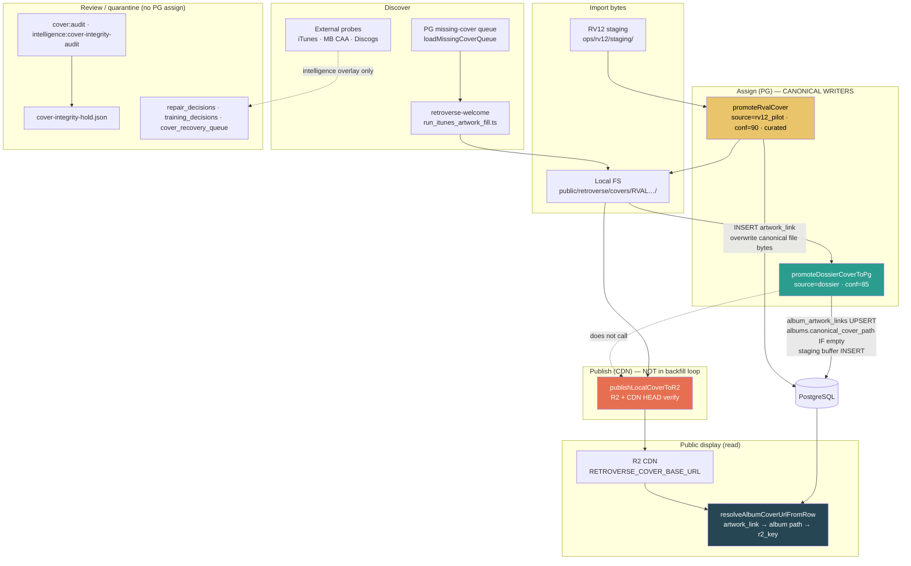

# Cover System Authority Map

Architecture audit of every path that can discover, import, assign, replace, promote, publish, review, or quarantine covers. **Not** an integrity count audit.

Generated: 2026-06-16

---

## Canonical path (today)

**Bold green path = production-scale canonical assignment:** Backfill → welcome iTunes acquire → `promoteDossierCoverToPg`.

**Yellow path = curated replacement (pilot):** RV12 create → `promoteRvalCover` (disk replace + new `album_artwork_links` row).

**Orange = delivery gap:** R2 publish exists but is **not** wired into the backfill runner; Phase 1 / MB R2 tools run it manually.

---

## SOURCE OF TRUTH

### Album covers

| Layer | Authoritative source |
| --- | --- |
| **Assignment table** | `album_artwork_links` (ranked by `review_flag IN ('curated','ok')` then `confidence_score`) |
| **Album pointer** | `albums.canonical_cover_path` (secondary; backfill only sets when empty) |
| **Staging cache** | `staging_album_artwork_link_buffer` (append-only mirror from dossier promote; not used for public resolve) |
| **Asset location (canonical path)** | Relative path `retroverse/covers/RVAL######/{artist}-{album}.jpg` under welcome `public/` (`coverFsRoot()`) |
| **Public delivery** | R2 object at same key as `canonical_cover_path` / `r2_cover_key`, served via `coverPathToUrl()` → CDN base |
| **Assignment process** | **Primary:** `processBackfillAlbum` → `acquireCoverViaWelcome` → `promoteDossierCoverToPg`. **Curated replace:** RV12 promote (`RETROVERSE_COVER_APPLY=1`, pilot RVAL guard). **Healing:** `mb-cover-apply` → same `promoteDossierCoverToPg` (`RETROVERSE_MB_COVER_APPLY=1`, fixed target list) |
| **URL resolver** | `lib/artwork/resolve-album-cover-url.ts` — artwork link path beats album column beats r2 key |

### Song covers (RVTR / track display)

| Layer | Authoritative source |
| --- | --- |
| **Assignment table** | **None at track level.** Songs inherit album cover via `canonical_album_tracks` → `albums` + `album_artwork_links` |
| **Asset location** | Same as parent album canonical path / R2 key |
| **Assignment process** | **No RVTR-specific writer.** Fix album cover on linked RVAL; track pages call `loadTrackPage` / `loadCoverInfoForRvtrs` |
| **Intelligence overlay** | `reports/intelligence/cover_recovery_queue.json` — **display metric only** for top-played readiness (`loadAutoRecoveredCovers`); does **not** write PG |

### Video covers / thumbnails

| Layer | Authoritative source |
| --- | --- |
| **Sunday Nights / VIDEO package cover** | Linked **RVTR → album cover** (`loadCoverInfoForRvtrs` + `auditVideoIdentification.hasCover`) |
| **YouTube thumbnail** | Computed only: `youtubeThumbnailUrl()` → `https://i.ytimg.com/vi/{id}/hqdefault.jpg` (`lib/youtube/match-rvtr.ts`) — not stored, not a canonical Retroverse assignment |
| **Media file artwork** | `media_assets.r2_media_key` when image extension — probed in cover recovery as fallback candidate only |
| **Content-creator thumbnails** | Separate path: `app/api/ops/content-creator/library/.../variations` — library run thumbnails, not album graph |

---

## PG write authority (only three code paths)

| Writer | File | `album_artwork_links` | `albums.canonical_cover_path` | Overwrite behavior |
| --- | --- | --- | --- | --- |
| **Dossier promote** | `lib/covers/backfill/promote-dossier.ts` | UPSERT on `(album_id, edition, source='dossier')` | UPDATE **only if currently empty** | Can replace dossier link row; cannot change non-empty album column |
| **RV12 promote** | `lib/rv12/promote-rval.ts` | INSERT new row (`rv12_pilot`, curated, 90) | UPDATE (same path string; **file bytes replaced on disk**) | Overwrites canonical **file** at path; adds link row (no UPSERT) |
| **RV12 rollback** | `lib/rv12/rollback-rval.ts` | — | UPDATE (same path string; restores prior bytes from backup) | Restores file from `ops/rv12/backups/`; does not remove extra link rows |

No other `.ts` file in this repo executes `INSERT INTO album_artwork_links` or `UPDATE albums SET canonical_cover_path`.

---

## Systems catalog

Capability key: **D** discover · **I** import · **A** assign · **R** replace · **P** promote · **Pu** publish · **Rev** review · **Q** quarantine

| # | Name | Status | D | I | A | R | P | Pu | Rev | Q | Routes | Scripts | Tables / stores modified | Key files |
| --- | --- | --- | --- | --- | --- | --- | --- | --- | --- | --- | --- | --- | --- | --- |
| 1 | **Cover Backfill Runner** | Active | ✓ | ✓ | ✓ | — | ✓ | — | — | — | `POST /api/ops/covers/backfill/run-batch`, `POST …/control`, `GET …/status` | `cover:backfill`, `cover:backfill:once`, `cover:backfill:safe`, `cover:backfill:skip-failed`, `cover:backfill:test-one` | PG: `album_artwork_links`, `albums` (if empty), `staging_album_artwork_link_buffer`; FS: welcome `public/retroverse/covers/`; JSON: `reports/cover_backfill/*` | `lib/covers/backfill/run-batch-core.ts`, `safe-run.ts`, `queue.ts`, `promote-dossier.ts`, `acquire-welcome.ts` |
| 2 | **retroverse-welcome iTunes Fill** | Active (external) | ✓ | ✓ | — | — | — | — | — | — | — (spawned child process) | `scripts/run_itunes_artwork_fill.ts` in welcome app | FS only under welcome `public/` | `lib/covers/backfill/acquire-welcome.ts`, `paths.ts` → `welcomeRoot()` |
| 3 | **MB Cover Apply** | Active (limited targets) | ✓ | ✓ | ✓ | — | ✓ | — | ✓ | — | — | `tools/healing/mb-cover-apply.ts` (`RETROVERSE_MB_COVER_APPLY=1`) | Same as dossier promote + FS; reports under `reports/healing/` | `lib/healing/mb-ingest/cover-apply.ts` |
| 4 | **MB Cover R2 Publish** | Active (limited targets) | — | — | — | — | — | ✓ | — | — | — | `tools/healing/mb-cover-r2-publish.ts` | R2 objects only (no PG) | `lib/healing/mb-ingest/cover-r2-publish.ts`, `publish-r2.ts` |
| 5 | **Phase 1 CDN Delivery Repair** | Active (ops tool) | ✓ | — | — | — | — | ✓ | — | — | — | `cover:phase1-delivery` | R2 only; reads PG inventory | `tools/cover-integrity/phase1-delivery-repair.ts` |
| 6 | **RV12 Curator Pipeline** | Active (pilot-gated) | ✓ | ✓ | ✓ | ✓ | ✓ | — | ✓ | — | `POST /api/ops/covers/rv12/create`, `…/promote`, `…/rollback`, `GET …/state`, `…/thumbnail` | `cover:rv12-pilot` | PG (promote/rollback); JSONL: `ops/rv12/*.jsonl`; FS: staging + backups + canonical file bytes | `lib/rv12/create-asset.ts`, `promote-rval.ts`, `rollback-rval.ts`, `guardrails.ts` |
| 7 | **Public Album Cover Curator Modal** | Active (ops API) | ✓ | ✓ | ✓ | ✓ | ✓ | — | ✓ | — | Uses RV12 routes above | — | Same as RV12 | `app/components/album-cover-curator-modal.tsx` |
| 8 | **Cover Integrity Audit** | Active (read-only) | ✓ | — | — | — | — | — | ✓ | ✓ | — | `cover:audit`, `cover:verify` | JSON/CSV: `reports/cover_integrity/*` (trust_registry, repair_queue, quarantine classification) | `lib/cover-integrity/run-audit.ts`, `album-cover-evidence.ts`, `trust-tier.ts` |
| 9 | **Intelligence Cover Integrity Audit** | Active (read-only + hold) | ✓ | — | — | — | — | — | ✓ | ✓ | — | `intelligence:cover-integrity-audit` | `reports/intelligence/cover-integrity-audit.*`, `cover-integrity-hold.json` | `tools/intelligence/cover-integrity-audit.ts`, `lib/ops/intelligence/intelligence-cover-hold.ts` |
| 10 | **Intelligence Cover Recovery** | Active (overlay) | ✓ | — | — | — | — | — | ✓ | — | — | `intelligence:cover-recovery` | `reports/intelligence/cover_recovery_queue.json` only | `lib/ops/intelligence/cover-recovery-queue.ts`, `cover-recovery-store.ts`, `cover-recovery-probes.ts` |
| 11 | **Cover Repair Batch Generator** | Active (read-only) | ✓ | — | — | — | — | — | ✓ | — | — | `cover:repair-batch` | CSV/HTML: `reports/cover_integrity/repair_batch_001.*` | `lib/cover-integrity/repair-batch.ts`, `tools/run-cover-repair-batch.ts` |
| 12 | **Operator Corrections Workbench** | Active (review; apply pilot) | ✓ | ✓ | ✓* | ✓* | ✓* | — | ✓ | — | `GET/POST /api/ops/covers/decisions` | — | JSON: `reports/cover_integrity/repair_decisions.json`; RV12 when applied | `app/ops/covers/corrections/page.tsx`, `OpsCoverReviewWorkbench.tsx`, `OpsCoverRv12Actions.tsx` |
| 13 | **Helper Cover Review (train/acquire)** | Active (review only) | ✓ | — | — | — | — | — | ✓ | — | `POST /api/ops/review/covers/advance-batch`, `…/retrain`, `…/generate-integrity-batch`, `POST /api/ops/covers/train/decisions`, `…/train/advance-batch` | `cover:next-batch`, `cover:retrain`, `cover:train-queue-report` | JSON: training_decisions, acquire_batch manifests, training_weights | `app/ops/review/covers/page.tsx`, `lib/cover-integrity/training-batch.ts`, `lib/ops/review/covers/acquire-batch.ts` |
| 14 | **Proposal / candidate engine** | Active (read-only) | ✓ | — | — | — | — | — | — | — | — | (used by repair-batch) | — | `lib/cover-integrity/propose-candidate.ts`, `repair-queue.ts` |
| 15 | **MB Cover Recovery Audit** | Active (read-only) | ✓ | — | — | — | — | — | ✓ | — | — | `tools/healing/mb-cover-recovery-audit.ts` | Reports only | `lib/healing/mb-ingest/cover-recovery-audit.ts` |
| 16 | **Discogs Embed (ops)** | Active (UI) | ✓ | — | — | — | — | — | ✓ | — | `/ops/covers/embed` | — | — | `app/ops/covers/embed/page.tsx` |
| 17 | **Ops cover thumbnail proxy** | Active (read) | — | — | — | — | — | — | — | — | `GET /api/ops/covers/thumbnail` | — | — | Serves local FS for ops UI |
| 18 | **Intelligence production hold** | Active (gate) | — | — | — | — | — | — | — | ✓ | — | — | `cover-integrity-hold.json` blocks pipeline via `assertIntelligenceNotBlocked` | `lib/ops/intelligence/intelligence-cover-hold.ts`, `production-pipeline.ts` |
| 19 | **YouTube thumbnail helper** | Active (computed) | ✓ | — | — | — | — | — | — | — | — | — | None | `lib/youtube/match-rvtr.ts` |
| 20 | **RVTR cover loader (read)** | Active | — | — | — | — | — | — | — | — | — | — | Read-only PG | `lib/ops/intelligence/load-rvtr-covers.ts`, `lib/track/load-track-page.ts` |

\* RV12 assign/replace/promote only when `RETROVERSE_COVER_APPLY=1` **and** target is pilot RVAL (`RVAL823723` today).

### Legacy / latent / non-writers

| Name | Status | Notes |
| --- | --- | --- |
| **Repair decision → PG apply bridge** | **Not implemented** | `approve` in repair_decisions does not trigger promote; operators must use RV12 manually |
| **RV12 at scale** | **Pilot / latent** | Guard limits writes to `RV12_PILOT_RVALS`; UI exists but most RVALs blocked |
| **Welcome curator scripts** | **External / undocumented here** | Referenced in healing docs; not in RETROVERSE_PUBLIC repo |
| **Content-creator library thumbnails** | **Separate domain** | Not album canonical graph |

---

## Per-system detail (writers and overwrite)

### 1. Cover Backfill Runner — **CANONICAL ASSIGNER (scale)**

- **Routes:** `/api/ops/covers/backfill/run-batch`, `…/control`, `…/status`
- **Scripts:** `npm run cover:backfill*`
- **Flow:** `loadMissingCoverQueue` → `findAcquiredCoverRelPath` or `acquireCoverViaWelcome` → `promoteDossierCoverToPg` → `verifyCoverPromotedByRval`
- **Canonical write:** Yes (`source=dossier`, confidence 85, `review_flag=ok`)
- **Overwrite:** UPSERT dossier link row; album column only if empty
- **Gap:** Does **not** call `publishLocalCoverToR2` — local assign without CDN publish

### 2. retroverse-welcome iTunes Fill — **CANONICAL IMPORTER**

- **Scripts:** `run_itunes_artwork_fill.ts` (welcome repo)
- **Tables:** None (filesystem)
- **Canonical write:** No
- **Overwrite:** Can write/replace files under `retroverse/covers/RVAL…/`

### 3. MB Cover Apply — **CANONICAL ASSIGNER (healing batch)**

- **Scripts:** `tools/healing/mb-cover-apply.ts`
- **Env:** `RETROVERSE_MB_COVER_APPLY=1`
- **Targets:** Fixed `MB_COVER_APPLY_TARGETS` list; `MB_COVER_REVIEW_HELD` skips auto-apply
- **Flow:** CAA download → optional iTunes fallback → `promoteDossierCoverToPg`
- **Canonical write:** Yes (same as backfill)
- **Overwrite:** Same as dossier promote

### 4. RV12 Curator Pipeline — **CANONICAL REPLACER (pilot)**

- **Routes:** `/api/ops/covers/rv12/*`
- **Env:** `RETROVERSE_COVER_APPLY=1`
- **Canonical write:** Yes (`rv12_pilot`, curated, 90)
- **Overwrite:** Replaces image bytes at existing `canonical_cover_path`; INSERTs new link (may duplicate rows); blocks TRUSTED without force override

### 5. Phase 1 / MB R2 Publish — **CANONICAL DELIVERY (not assignment)**

- **Scripts:** `cover:phase1-delivery`, `tools/healing/mb-cover-r2-publish.ts`
- **Canonical write:** No PG
- **Overwrite:** R2 PutObject over existing key

### 6–13. Review / audit / recovery — **NO PG ASSIGN**

- Classify trust (`TRUSTED` / `REVIEW` / `HIGH_RISK` / `BROKEN`), quarantine flags, repair queues, training labels, intelligence hold, recovery overlay
- **Quarantine** = evidence classification (`assessAlbumCoverEvidence`, `buildQuarantineList`) and `cover-integrity-hold.json` — **no quarantine table**, no automatic unassign

---

## Duplicated functionality

| Capability | Systems | Risk |
| --- | --- | --- |
| **iTunes discover + download** | Backfill welcome spawn, MB cover-apply fallback, intelligence `probeItunesCover`, healing recovery audit | Same source, different callers; no shared dedupe |
| **MB CAA fetch** | `cover-apply.ts`, `cover-recovery-probes.ts`, recovery audit | Parallel implementations |
| **Promote to PG** | `promoteDossierCoverToPg` (backfill + MB) vs `promoteRvalCover` (RV12) | Different overwrite semantics and `source` values |
| **CDN publish** | `publish-r2.ts` used by Phase 1, MB R2, healing — **not** backfill | Assignment without delivery is systematic |
| **Integrity audit** | `cover:audit` (corpus) vs `intelligence:cover-integrity-audit` (spotlight + hold) | Two audit products, different scopes |
| **Review UIs** | `/ops/review/covers` (helpers) vs `/ops/covers/corrections` (operators) vs public curator modal | Three decision stores; only RV12 applies to PG |
| **Top-played cover metric** | `loadCoverInfoForRvtrs` + optional `cover_recovery_queue.json` overlay | Overlay can show “has cover” without PG change |

---

## Obsolete or incomplete systems

1. **Repair approve → apply** — Decisions saved to JSON; no batch executor promotes approved proposals.
2. **RV12 pilot scope** — Promotion machinery built; guard restricts to one RVAL; public curator modal will fail promote for non-pilot albums unless guard expanded.
3. **Training weights → auto repair** — `cover:retrain` updates weights for batch selection only; does not write covers.
4. **Intelligence cover recovery** — Produces candidates and readiness metrics; explicitly does not persist assignments.

---

## Conflicting writers

| Conflict | Detail |
| --- | --- |
| **Display vs album column** | `resolveAlbumCoverUrl` prefers `album_artwork_links` over `albums.canonical_cover_path`. Backfill can leave album column empty while link row drives UI — or dossier UPSERT can change link without updating album column. |
| **Dossier UPSERT vs RV12 INSERT** | Multiple `album_artwork_links` rows per album; SQL picks highest `review_flag` / `confidence`. RV12 curated (90) can outrank dossier (85) even if album path unchanged. |
| **File replace vs PG path** | RV12 replaces bytes at fixed path; PG paths unchanged. Hash/title audits may disagree with link metadata until re-audit. |
| **RV12 rollback** | Restores file; does not delete `rv12_pilot` link rows — resolver may still prefer curated link. |
| **R2 key = local path** | `promoteDossierCoverToPg` sets `r2_cover_key` to filesystem path before publish. CDN 404 if publish skipped — assignment looks valid in PG but fails public delivery. |
| **Intelligence overlay** | `cover_recovery_queue.json` inflates `hasCover` in top-100 metrics without PG writes — operational readiness can disagree with album pages. |

---

## Environment gates

| Gate | Effect |
| --- | --- |
| `RETROVERSE_OPS=1` | Ops routes and pages |
| `RETROVERSE_COVER_APPLY=1` | RV12 promote/rollback |
| `RETROVERSE_MB_COVER_APPLY=1` | MB cover apply writes |
| `cover-integrity-hold.json` `active: true` | Blocks intelligence pipeline (`assertIntelligenceNotBlocked`); **does not** block `cover:backfill` |
| Pilot RVAL set | `validateCoverApplyTarget` — only `RVAL823723` unless expanded |

---

## File / asset roots

| Asset | Path |
| --- | --- |
| Cover filesystem | `{welcomeRoot}/public/` → `retroverse/covers/RVAL######/` |
| RV12 staging | `{retroverseDataRoot}/ops/rv12/staging/` |
| RV12 ledgers | `ops/rv12/rv12_assets.jsonl`, `rval_assignments.jsonl`, `promotion_audit.jsonl` |
| Backfill state | `reports/cover_backfill/state.json` |
| Integrity artifacts | `reports/cover_integrity/` |
| Intelligence artifacts | `reports/intelligence/cover_recovery_queue.json`, `cover-integrity-hold.json` |

---

## Summary

- **One canonical assignment path at scale:** Cover Backfill → welcome iTunes → `promoteDossierCoverToPg`.
- **One canonical curated replace path (pilot):** RV12 create → `promoteRvalCover`.
- **One canonical public URL resolver:** `resolveAlbumCoverUrlFromRow` over PG + CDN.
- **Delivery is a separate, manual step:** `publishLocalCoverToR2` — the largest structural gap between “assigned” and “user-visible.”
- **Songs and VIDEO packages** do not have separate cover writers; they inherit album graph assignments (plus non-canonical YouTube thumbs and intelligence JSON overlays).
