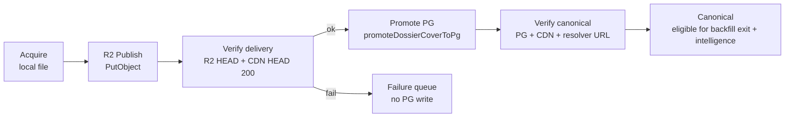

# Cover Pipeline Consolidation — Proposal

**Status:** Proposal only — no code changes  
**Generated:** 2026-06-16  
**Context:** [`cover-authority-map.md`](./cover-authority-map.md)

---

## Question

Should `publishLocalCoverToR2` become part of the **canonical promotion workflow**?

| | Steps |
| --- | --- |
| **Current** | Acquire → Promote *(PG)* → *(Publish is separate / manual)* |
| **Proposed** | Acquire → Promote → Publish → Verify → **Canonical** |

---

## Recommendation

**Yes — with one ordering change.**

Integrate R2 publish and CDN verification into the same atomic unit as PG promotion, but prefer:

```text
Acquire → Publish → Verify (R2 + CDN) → Promote (PG) → Verify (resolver + CDN)
```

not strictly “promote first, publish second.”

**Why:** The failure mode we are eliminating is *“PG says assigned, user gets 404.”* That is created the moment `promoteDossierCoverToPg` runs. Publishing after promote leaves a window where the system is already non-canonical per `assessAlbumCoverEvidence` (canonical requires `cdnHttpStatus === 200`).

If promote-before-publish is kept for compatibility, promotion must be **rolled back or left in staging** when publish/verify fails. Staging-only until delivery proves out is cleaner.

**Canonical definition (align code + ops):**

| Gate | Requirement |
| --- | --- |
| **Assigned** | Local file exists at expected dossier path |
| **Published** | R2 `HeadObject` ok for `r2_cover_key` |
| **Deliverable** | CDN `HEAD` returns 200 |
| **Canonical (PG)** | `album_artwork_links` row exists **and** deliverable |
| **Canonical (certification)** | Above + title/artist evidence (`assessAlbumCoverEvidence`) |

Today backfill stops at **Assigned + PG row**, skipping Published/Deliverable. Phase 1 proved ~3,817 assignments were PG-valid but CDN-broken until republished.

---

## Current state (ground truth)

### What each step does today

| Step | Implementation | Writes PG? | Verifies CDN? |
| --- | --- | --- | --- |
| **Acquire** | `acquireCoverViaWelcome` / CAA download | No | No |
| **Promote** | `promoteDossierCoverToPg` | Yes | No |
| **Verify (backfill)** | `verifyCoverPromotedByRval` | — | No — only checks `albums.canonical_cover_path` contains RVAL |
| **Publish** | `publishLocalCoverToR2` | No | Partial — R2 HEAD yes; CDN HEAD optional |
| **Publish callers** | Phase 1 tool, `mb-cover-r2-publish` | No | Yes (when `publicCdnUrl` passed) |

### Known gap scale (from Phase 1 delivery repair)

| Metric | Value |
| --- | ---: |
| Assigned albums with CDN 404 + local file (repaired) | 3,817 |
| Assigned CDN 404 remaining (no local file) | 864 |
| Display rate before → after Phase 1 | 69.8% → 77.5% |
| PG assignment changes in Phase 1 | 0 |

Backfill (`run-batch-core.ts`) calls promote + PG verify only — **never** `publishLocalCoverToR2`.

### Implementation quirks to fix in consolidation

1. **`publishLocalCoverToR2` success semantics** — returns `ok: true` when CDN HEAD is `"err"` (line 164: `ok: cdnHeadStatus === 200 \|\| cdnHeadStatus === "err"`). Consolidation must treat **CDN 200 as hard gate**, not optional.
2. **`verifyCoverPromotedByRval`** — ignores `album_artwork_links` (resolver’s primary source) and CDN. Must be replaced or extended for the new workflow.
3. **`resolveAlbumCoverUrl` / `loadCoverInfoForRvtrs`** — builds CDN URLs without HEAD. Intelligence `hasCover` can be true while images 404.

---

## Proposed unified workflow



**Single entry point (proposed):** `promoteCoverWithDelivery({ albumId, rval, canonicalCoverPath })` wrapping publish + verify + existing PG promote.

**Env gate (proposed):** `RETROVERSE_COVER_PUBLISH=1` — required for PG promote in production runners (fail closed if R2 env missing).

---

## 1. Benefits

| Benefit | Detail |
| --- | --- |
| **Eliminates undeliverable canonical assignments** | No new PG rows unless CDN returns 200 (or explicit staging mode). |
| **Aligns runtime with certification** | `assessAlbumCoverEvidence` already requires CDN 200 for `status: canonical`. Pipeline and audit speak the same language. |
| **Fixes backfill false success** | Albums currently leave `loadMissingCoverQueue` when PG shows covered — even if public site 404s. |
| **Reduces ops toil** | Phase 1–style catch-up runs become exceptional, not routine. `mb-cover-r2-publish` automation recommendation is already documented in healing reports. |
| **Honest intelligence gates** | `hasCover` for top-played / VIDEO readiness stops counting URL strings that 404. |
| **Idempotent republish** | `publishLocalCoverToR2` overwrites R2 key; safe to retry on same path. |
| **Single repair story** | Acquire failure vs publish failure vs evidence failure become distinct queue states. |

---

## 2. Risks

| Risk | Severity | Mitigation |
| --- | --- | --- |
| **Backfill throughput drop** | Medium | R2 PutObject + 2× HEAD per album; tune concurrency (`PHASE1_PUBLISH_CONCURRENCY=4` baseline); batch pause unchanged. |
| **R2 credentials dependency** | High | Today backfill succeeds without R2; consolidation **blocks promote** without env. Document welcome `.env.local` R2_* as required for production backfill. |
| **Transient CDN 404 after successful R2 put** | Medium | Retry CDN HEAD with backoff (3×, 2–5s); optional short cache-bust query param on verify only. |
| **Promote-then-publish ordering** | High | If order kept: failed publish leaves bad PG state — requires rollback or compensating transaction. Prefer publish-before-promote. |
| **`publishLocalCoverToR2` false positives** | Medium | Fix `ok` semantics before wiring in; require `cdnHeadStatus === 200` for canonical. |
| **864 assigned + no local file** | Medium | Publish step fails; album stays in repair/acquire queue — not a regression, already broken. |
| **Welcome / RETROVERSE_PUBLIC split** | Low | Publisher reads R2 env from welcome root; backfill already spawns welcome for acquire — same dependency surface. |
| **RV12 disk replace without republish** | High | Curated replace changes bytes at fixed path; CDN serves stale image until republish. Consolidation must include RV12 path. |

---

## 3. Failure recovery

### Failure taxonomy (proposed)

| Code | Stage | PG state | Recovery action |
| --- | --- | --- | --- |
| `acquire_failed` | Acquire | None | Retry backfill / iTunes / CAA |
| `local_missing` | Pre-publish | None | Re-acquire |
| `r2_env_missing` | Publish | None | Fix credentials; retry batch |
| `r2_put_failed` | Publish | None* | Retry with backoff; alert if persistent |
| `cdn_verify_failed` | Verify | None* | Retry HEAD; if R2 ok, check CDN config/cache |
| `promote_failed` | Promote | Partial | Rare — inspectExecute error; manual PG check |
| `pg_verify_failed` | Post-promote | Row exists | Reconcile artwork_links vs album column |
| `delivery_drift` | Ongoing | Row exists | Background sweeper: assigned + CDN≠200 → republish |

\*Assumes **publish-before-promote**. If promote-first is kept, add `rollbackDossierPromotion` or delete staging row on publish failure.

### Retry strategy (backfill-safe-run compatible)

- **Do not advance main cursor** on `cdn_verify_failed` / `r2_put_failed` (same as current acquire failures).
- **Retry queue:** albums with local file + publish failures get higher priority than fresh acquires.
- **Idempotent publish:** safe to retry same `r2Key` without PG change.
- **No partial canonical:** failed verify → album remains in `loadMissingCoverQueue` (no curated link).

### Rollback (RV12 only today)

- RV12 already has `rollbackRvalCover` for file restore.
- Consolidation should add **R2 republish of restored bytes** on rollback, or rollback is incomplete for public site.

### Observability

Extend batch JSON (`reports/cover_backfill/batch_*.json`) with per-album:

`acquired | published | cdnStatus | promoted | canonical`

---

## 4. Migration strategy

### Phase 0 — Preconditions (no workflow change)

1. Fix `publishLocalCoverToR2` to return `ok: false` unless CDN HEAD 200 (or explicit `skipCdnVerify` dev flag).
2. Add `verifyCoverDeliverable(rval)` — resolver URL + CDN HEAD 200 + optional R2 HEAD.
3. Document R2 env as production requirement.

### Phase 1 — Backlog delivery (mostly done)

- **Completed:** Phase 1 repaired 3,817 local+404 assignments.
- **Remaining:** 864 assigned CDN 404 without local file → acquire/repair track, not publish-only.
- **One-time sweeper:** `cover:phase1-delivery` or equivalent cron until assigned+local+404 = 0.

### Phase 2 — Shadow mode

- Wire `publishLocalCoverToR2` after promote in `run-batch-core` behind `RETROVERSE_COVER_PUBLISH=1`.
- **Do not fail batch on publish failure** — log `would_fail_canonical` metrics.
- Compare: promoted count vs deliverable count for N batches.

### Phase 3 — Enforce publish-before-promote

- Flip order: publish → verify → promote.
- Failed delivery → no PG write; album stays in queue.
- Enable for `cover:backfill` and `mb-cover-apply`.

### Phase 4 — RV12 + curator paths

- `promoteRvalCover` → publish same `canonical_cover_path` after disk copy.
- Public curator modal inherits same wrapper.

### Phase 5 — Certification + intelligence

- `cover:audit` / intelligence hold: use deliverable gate for quarantine counts.
- Optional: `loadCoverInfoForRvtrs` optional CDN probe for top-N cohort only (expensive).
- Clear `cover-integrity-hold.json` when spotlight albums pass **delivery + evidence**.

### Rollback lever

`RETROVERSE_COVER_PUBLISH=0` restores promote-only behavior for emergency — accept known delivery debt.

---

## 5. Impact on backfill

| Area | Impact |
| --- | --- |
| **Queue semantics** | Albums only exit missing-cover queue when **deliverable**, not merely PG-linked. Queue length may appear larger briefly (honest). |
| **Batch duration** | +2–8s per album (R2 + CDN). At batch size 100, +3–13 min per batch at concurrency 4. |
| **Success rate** | Reported success rate will **drop** initially (failures no longer hidden). True operational rate **improves**. |
| **State files** | `reports/cover_backfill/state.json` — failure reasons gain `publish_failed` / `cdn_verify_failed`. |
| **Safe-run / retry** | `retryFailures` queue should prioritize publish failures (local exists). |
| **Skip-failed tools** | `cover:backfill:skip-failed` must classify publish vs acquire failures separately. |
| **Ops API** | `/api/ops/covers/backfill/run-batch` returns delivery stats in batch payload. |

**Net:** Backfill becomes slower but **complete** — each success is user-visible on CDN.

---

## 6. Impact on RV12 replacement

| Area | Impact |
| --- | --- |
| **Curated replace** | `promoteRvalCover` copies new bytes to existing `canonical_cover_path` — **must** call `publishLocalCoverToR2` immediately or CDN shows stale cover (same key, new bytes). |
| **Pilot guard** | Unchanged (`RVAL823723`); consolidation is orthogonal. |
| **TRUSTED override** | Unchanged; delivery verify runs after disk replace regardless. |
| **Rollback** | `rollbackRvalCover` restores local file → must republish to R2 or CDN stays wrong. |
| **New artwork_links row** | RV12 INSERT without UPSERT — consolidation doesn’t fix duplicate rows; separate cleanup. |
| **Ops UI** | `OpsCoverRv12Actions` / curator modal should show delivery status (CDN HEAD) after promote. |

RV12 is **higher risk** than dossier backfill for stale CDN cache because key is unchanged but bytes change — may need `Cache-Control` bump or CDN purge on replace (today: `max-age=300`).

---

## 7. Impact on intelligence packages

| Area | Impact |
| --- | --- |
| **Cover gate** | Top-played / VIDEO `hasCover` uses `loadCoverInfoForRvtrs` → URL built from PG path **without HEAD**. Consolidation makes PG ⊂ deliverable, so `hasCover` becomes trustworthy without probe changes (still recommended for overlay JSON). |
| **Cover recovery overlay** | `cover_recovery_queue.json` can still inflate readiness without PG — keep separate from canonical pipeline; label as `provisional` in reports. |
| **Production pipeline** | `assertIntelligenceNotBlocked` uses hold file from spotlight audit — clearing hold requires delivery + evidence; consolidation accelerates that. |
| **Package publish** | `production-pipeline` does not upload covers; depends on album graph. Fewer 404s → better song sheet / package UX. |
| **Priority scoring** | `video-priority-score` `coverBoost` when `hasCover` — becomes meaningful. |
| **Overnight / top100 batches** | Fewer false-positive “ready” tracks; may **reduce** eligible batch size until backfill catches up — expected tightening. |

**Intelligence does not need to call R2 directly** if album promotion pipeline guarantees delivery before PG write.

---

## Decision matrix

| Option | Undeliverable assignments | Complexity | Recommendation |
| --- | --- | --- | --- |
| **A. Status quo** | Continues | Low | Reject |
| **B. Publish after promote (user order)** | Possible if publish fails | Medium | Accept only with PG rollback |
| **C. Publish before promote** | Prevented | Medium | **Preferred** |
| **D. Staging table only until delivered** | Prevented | Higher | Future — uses `staging_album_artwork_link_buffer` as gate |
| **E. Publish-only sweeper (Phase 1 forever)** | Reduced not eliminated | Low | Interim only |

---

## Proposed API surface (future implementation)

```typescript
// lib/covers/backfill/promote-with-delivery.ts (proposed)

type PromoteWithDeliveryResult =
  | { ok: true; stage: "canonical"; canonicalCoverPath: string; cdnHeadStatus: 200 }
  | { ok: false; stage: Acquire | Publish | Verify | Promote; error: string; retryable: boolean };

async function promoteCoverWithDelivery(input: {
  albumId: number;
  rval: string;
  canonicalCoverPath: string;
  publicCdnUrl?: string;
}): Promise<PromoteWithDeliveryResult>;
```

**Call sites to unify:**

- `lib/covers/backfill/run-batch-core.ts`
- `lib/healing/mb-ingest/cover-apply.ts`
- `lib/rv12/promote-rval.ts`
- *(optional)* welcome curator persist path — audit for duplicate R2 clients

---

## Success criteria

| Metric | Target |
| --- | --- |
| New backfill successes with CDN 404 | **0** |
| `assigned ∧ local_exists ∧ cdn_404` | Trend to **0** (sweeper + new pipeline) |
| `verifyCoverPromotedByRval` pass ∧ CDN 404 | **0** |
| Intelligence top-100 `hasCover` ∧ CDN 404 | **0** on spot-check cohort |
| Phase-1-style manual delivery runs | Only for legacy debt / incidents |

---

## Summary

**Yes** — `publishLocalCoverToR2` should be part of the canonical promotion workflow.

The goal *“eliminate canonical assignments pointing at undeliverable assets”* requires:

1. **Delivery verification before PG promote** (or immediate rollback).
2. **CDN HEAD 200 as hard gate** (fix current `ok` semantics).
3. **Unified wrapper** called from backfill, MB apply, and RV12 promote.
4. **One-time + ongoing sweep** for legacy assigned-but-404 rows (864 + any drift).

Promote → Publish → Verify → Canonical is directionally correct; **Publish → Verify → Promote → Verify** is the safer instantiation of the same idea.

**Next step (when approved):** Phase 0 + Phase 2 shadow mode behind `RETROVERSE_COVER_PUBLISH=1` — no change to canonical semantics until Phase 3 flip.
