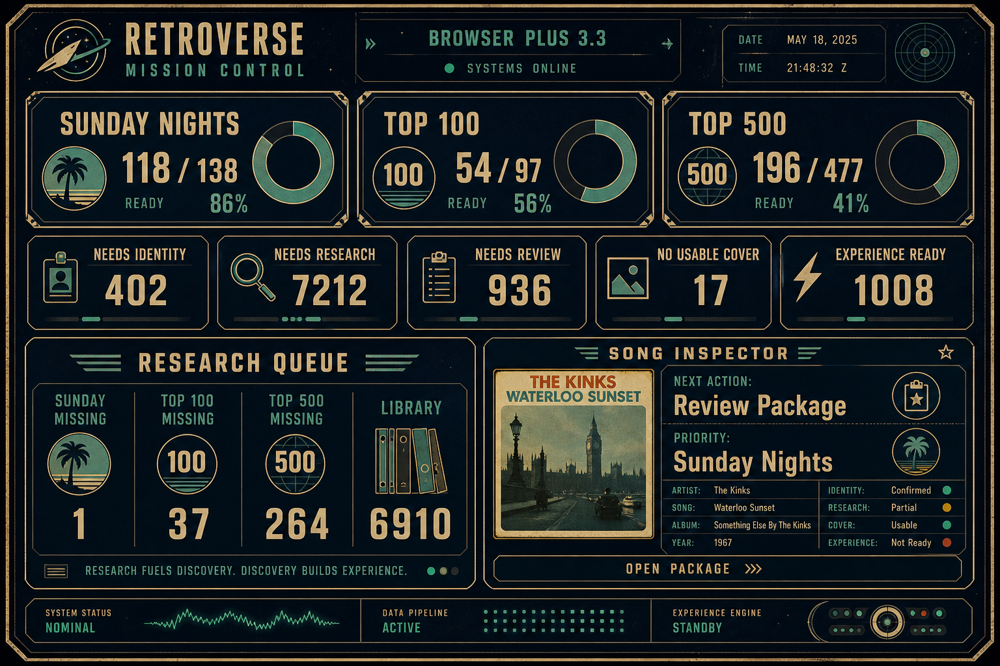

# Browser Plus 3.3 — Mission Control Implementation Report

**Date:** 2026-06-24  
**Route:** `/ops/browser-plus-2`  
**Title:** Browser Plus 3.3 — Mission Control

---

## Summary

Browser Plus is now **readiness-first Mission Control**. Library-wide counts moved to a collapsible Operations drawer. Patron-aligned metrics from the 3.2 audit are live.



---

## Validated Metrics (live loader)

| Metric | Before (3.1) | After (3.3) |
|---|---|---|
| Needs Cover | 7,705 | **No Usable Cover: 17** |
| Experience Ready | 611 (package cover only) | **1,008 (patron-aligned)** |
| Sunday Nights | not shown | **118 / 138 (86%)** |
| Top 100 | not shown | **54 / 97 (56%)** |
| Top 500 | not shown | **196 / 477 (41%)** |
| Ollama banner | 7,212 library-wide | **Tiered queue (sums to 7,212)** |

### Research Queue tiers (active VIDEO only)

| Tier | Count |
|---|---|
| Sunday Missing | 1 |
| Top 100 Missing | 37 |
| Top 500 Missing | 264 |
| Library | 6,910 |

Reproduce: `NODE_OPTIONS='--require ./tools/finance/preload-server-only.cjs' npx tsx tools/ops/bp-readiness-audit.ts`

---

## Phase 1 — Readiness First

**Top cards:** Sunday Nights · Top 100 · Top 500  
**Display:** Ready / Total + percent  
**Click:** Filters browser to cohort missing items

Files:
- `lib/ops/browser-plus-2/cohorts.ts` — cohort membership + panel builder
- `components/ops/browser-plus-2/BrowserPlus2Client.tsx` — readiness section
- `app/ops/browser-plus-2/browser-plus-2.css` — `.bp2__readiness-*`

Sunday denominator = **138 snapshot RVTRs** (canonical event pool), not full library.

---

## Phase 2 — No Usable Cover

**Replaced:** Needs Cover → **No Usable Cover**

**Rule** (`lib/ops/browser-plus-2/readiness.ts`):

```
noUsableCover = rvtr && !(
  package.metadata.coverUrl
  || canonical Cover Library URL
  || VDJ embedded cover
  || VDJ sidecar thumbnail
)
```

**Count:** 17

---

## Phase 3 — Patron-Aligned Experience Ready

**Rule** (`isPatronExperienceReady`):

All must be true:

1. RVTR assigned  
2. Research package JSON exists  
3. Usable cover (any source above)  
4. Story count > 0  
5. Package status `review` or `published` (`isSongExperienceRenderable`)

**Count:** 1,008

---

## Phase 4 — Next Action Engine

**Inspector field:** `Next Action` (single recommendation)

| Condition | Action |
|---|---|
| No RVTR | Assign RVTR |
| No package | Build Research |
| Status = review | Review Package |
| No usable cover | Acquire Cover |
| No story or not renderable | Fix Renderability |
| Patron ready | Experience Ready |

File: `lib/ops/browser-plus-2/readiness.ts` → `computeNextAction()`

---

## Phase 5 — Priority System

**Inspector + table column:** `Priority`

| Value | When |
|---|---|
| Sunday Nights | RVTR in Sunday snapshot pool |
| Top 100 | In top 100 play-count cohort (not Sunday) |
| Top 500 | In top 500 cohort (not Sunday/Top 100) |
| Library | Everything else |

File: `computePatronPriority()` in `readiness.ts`

---

## Phase 6 — Ollama Queue Cleanup

**Removed:** “X songs need research” library banner  
**Added:** Research Queue tier breakdown + priority-sorted batch

Sort order (`research-build-queue.ts`):

1. Sunday Missing  
2. Top 100 Missing  
3. Top 500 Missing  
4. Library  

Then play count DESC within tier.

---

## Phase 7 — Operations Drawer

**Collapsed by default.** Contains:

- Videos count  
- Needs Research count  
- Metadata recovery stats  
- Link to metadata recovery report  
- Browse all videos  

Main screen = readiness panels + work queues + research queue.

---

## Acceptance Test

| Question | Answer on first screen |
|---|---|
| Am I ready for Sunday? | **118 / 138 · 86%** |
| What is blocking Sunday? | Click card → **sunday-nights-missing** filter |
| What should Ollama do next? | Tier list; batch picks **Sunday tier first** |
| What should I review next? | **Needs Review: 936** (133 Sunday in cohort) |
| How many truly lack artwork? | **No Usable Cover: 17** |
| Biggest patron impact? | Sunday review queue + Top 100 missing readiness |

---

## Files Changed

| File | Change |
|---|---|
| `lib/ops/browser-plus-2/readiness.ts` | **New** — cover, patron ready, next action, priority |
| `lib/ops/browser-plus-2/cohorts.ts` | **New** — Sunday/Top N cohorts + panels |
| `lib/ops/browser-plus-2/work-queues.ts` | Patron queues, new filters |
| `lib/ops/browser-plus-2/types.ts` | Readiness model types |
| `lib/ops/browser-plus-2/load-browser-plus-2.ts` | Cover batch load + readiness assembly |
| `lib/ops/browser-plus-2/research-build-queue.ts` | Tier sort + active VIDEO scope |
| `components/ops/browser-plus-2/BrowserPlus2Client.tsx` | Mission Control UI |
| `app/ops/browser-plus-2/browser-plus-2.css` | Readiness + priority styles |
| `app/ops/browser-plus-2/page.tsx` | Title 3.3 |
| `app/api/ops/browser-plus-2/research-queue/route.ts` | Tier API |
| `lib/ops/song-intelligence-labels.ts` | `hasUsableCover` score input |
| `tools/ops/bp-readiness-audit.ts` | **New** — metric validation CLI |

**Not changed:** matching, package generation, Ollama pipeline internals.

---

## Checkpoint

Open `/ops/browser-plus-2` → you should see readiness cards first, **17** No Usable Cover, **1008** Experience Ready, tiered Research Queue.

Run audit CLI to confirm counts match this report.
