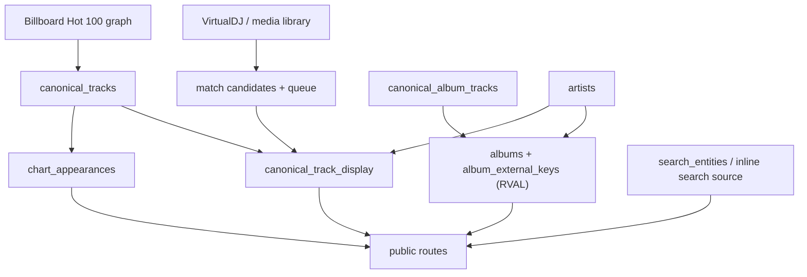
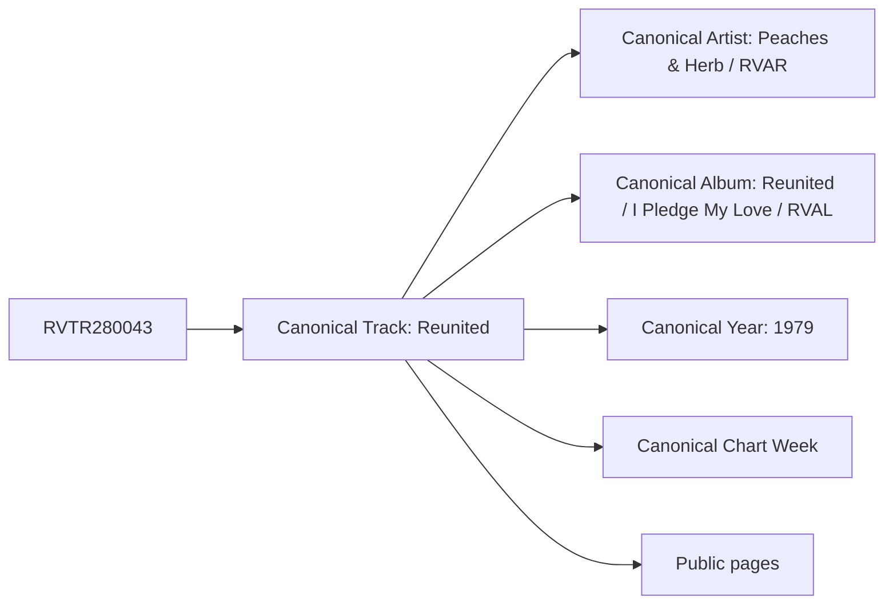

# Canonical Resolution Audit

Generated: 2026-07-15

## Scope

This audit traces the public canonical resolution pipeline without modifying routes, database records, aliases, or duplicate rows. The key finding is that Retroverse has canonical IDs, but the public application does not resolve every page from a single canonical Track. RVTR is strongest on Song V3 and album track links; artist, search, chart, and chronology surfaces still re-enter the graph through names, slugs, or graph IDs.

## Current Architecture Diagram

## Public Page Pipelines

| Page | Entry route | Loader / resolver | Alias lookup | Graph lookup | Fallback | Rendered entity |
|---|---|---|---|---|---|---|
| Homepage | `/` | `HomepageDocument`, search overlay, search APIs | Static fuzzy aliases and `search_entities` normalized labels | `canonical_track_display`, albums, artists | Query text and href extraction | Search suggestions and featured public rows |
| Song V3 | `/retroverse-2/song/[rvtr]`, `/song/[rvtr]`, `/track/[id]` | `loadTrackPage()` | None in primary RVTR path | `canonical_track_display`, `canonical_tracks`, `chart_appearances` | Slug/title path if non-RVTR | Canonical track display row |
| Artist V3 | `/artist/[slug]` | `resolveArtistFromSlug()`, `loadArtistPage()` | `ARTIST_SLUGS`, search match keys | `artists`, then name-matched `canonical_track_display` | Slug guess, fuzzy name match, fallback page data | Artist row plus name-derived tracks |
| Album V3 | `/album/[id]` | `resolveAlbumRvalParam()`, `loadAlbumPage()` | Slug/title fallback in route resolver | `album_external_keys`, `albums`, `canonical_album_tracks` | Album title slug/title search | RVAL-backed album row |
| Year V3 | `/rv/[year]` | chronology loaders and chart queries | None found | `chart_appearances`, date-derived links | Date/year derived from chart dates | Chronology year |
| Chart Week V3 | `/week/[date]`, `/rv/[year]/[month]/[week]` | `loadChartWeekContext()` | None found | `chart_appearances`, `tracks`, `canonical_tracks` | Graph track ID or rank focus | Chart date/rank slice |

## Resolver Inventory

| File | Function | Input | Output | Callers / surface |
|---|---|---|---|---|
| `packages/shared/lib/track/load-track-page.ts` | `loadTrackPage()` | RVTR or raw title/id param | `TrackPageData` | Song V3, track pages, review resolver, chart journey API |
| `packages/shared/lib/artist/resolve-artist.ts` | `resolveArtistFromSlug()` | artist slug | artist id/name/slug | Artist V3 shell/page and charted song loaders |
| `packages/shared/lib/artist/resolve-artist.ts` | `resolveArtistForSearchQuery()` | search query and artist hints | artist id/name/slug | search chart history |
| `packages/shared/lib/album/resolve-album-route.ts` | `resolveAlbumRvalParam()` | RVAL or slug/title | RVAL | Album route compatibility |
| `packages/shared/lib/album/load-album-page.ts` | `loadAlbumPage()` | RVAL | `AlbumPageData` | Album V3 and chart journey API |
| `packages/shared/lib/charts/load-chart-week-context.ts` | `loadChartWeekContext()` | chart date, optional RVTR/rank | chart-week portal context | Week and RV chronology routes |
| `packages/shared/lib/search/query-search-entities.ts` | `querySearchEntities()` | query text/scope | typed search entities | Homepage/search suggestions |
| `packages/shared/lib/search/resolve-suggestion-href.ts` | suggestion href resolver | entity type/id/href | public href | Search suggestions |
| `packages/shared/lib/search/resolve-search-destination.ts` | destination resolver | query/suggestion | public route | Search route/navigation |
| `packages/shared/lib/ops/intelligence/vdj-rvtr-resolve.ts` | VDJ RVTR resolver | VDJ/media fields | candidate RVTR | ops/intelligence and media matching |
| `packages/shared/lib/playback/resolve-track-playback.ts` | playback resolver | RVTR | playable media | playback API |
| `packages/shared/lib/sunday-nights/rvtr-aliases.ts` | alias load/lookup | artist/title | RVTR | Sunday Nights/live search |
| `packages/shared/lib/rv/rv-chronology-paths.ts` | RV chronology helpers | year/month/week/date | route path | chart/year route links |

## Alias Inventory

| Alias source | Stored in | Created by | Consumed by | Active | Conflict risk |
|---|---|---|---|---|---|
| Artist slug aliases | `ARTIST_SLUGS` in `artist/slug` | code-maintained | `resolveArtistFromSlug()` and home recovery | Yes | Can override database canonical names |
| Artist match keys | `canonicalize-search.ts` runtime normalization | code | artist search and slug resolver | Yes | Collapses punctuation/articles but not canonical IDs |
| Search aliases/groups | `search-suggestions-server.ts`, `suggestion-entity-grouping.ts` | code | homepage/search | Yes | Can group labels that point to different entity ids |
| `search_entities` normalized labels | Postgres materialized view | refresh script | search APIs | Yes | Same normalized label can map to artist, album, and track |
| Album external keys | `album_external_keys` | ingest/import | album page, search, cover tools | Yes | RVAL is strong but slug fallback can bypass it |
| Album track keys | `canonical_album_tracks.canonical_track_key` | album ingest/healing tools | album pages, song album links | Yes | Broken/multiple keys produce album chain splits |
| Sunday Nights RVTR aliases | ops state JSON | show/live operators | Sunday Nights search and resolve | Yes | Separate from canonical graph; can shadow graph identity |
| VirtualDJ aliases | VDJ XML/media match fields | VDJ bridge/import | match candidates and live resolve | Yes | Can mint VDJ-only RVTR rows when chart canonical exists |

## Duplicate Identity Inventory

| Entity | Duplicate pattern | Likely origin | Canonical status | Where it propagates |
|---|---|---|---|---|
| Artists | punctuation/article variants such as `Peaches`, `Peaches Herb`, `Peaches & Herb` | name-normalized import, VDJ filename parsing, search aliases | Often separate `artists` or display labels, not RVAR-bound | Artist page, search, track cards |
| Albums | same artist/title/year with multiple album rows or RVALs | album ingest, cover healing, external-key staging | RVAL-backed only when `album_external_keys` exists | Album V3, artist albums, cover tools |
| Tracks | same normalized artist/title with multiple RVTRs | Hot 100 + VDJ candidates, suffix variants, match queue ranking | Mixed: `hot100`, `hot100_vdj`, `vdj` rows | Song V3, search, live playback |
| Years | route-derived from dates, not a canonical table | `first_chart_date` and `chart_appearances` | Not canonicalized as entity ID | Year V3 and chronology links |
| Chart Weeks | chart-date/rank rows | chart import duplicates or graph-track splits | No chart-week ID beyond date/rank | Chart Week V3 |

## Breakpoints

1. Artist V3 starts from slug/name and only later finds `artists.id`; it does not start from RVAR or from the RVTR's canonical artist.
2. Chart Week V3 starts from `chart_appearances.track_id`, then attempts to bridge to RVTR through `canonical_tracks`; album links can fail because `canonical_album_tracks` sometimes keys RVTR while chart rows key graph track IDs.
3. Search can return records from `search_entities` or inline fallbacks, so normalized label conflicts can point one search string to multiple entity types or IDs.
4. Song V3 has a non-RVTR title fallback path that bypasses canonical RVTR ordering when the URL is not already an RVTR.
5. Album V3 is mostly RVAL-first, but route resolution accepts slug/title and can bypass RVAL until it finds a candidate.
6. VirtualDJ and Sunday Nights maintain alias layers outside the canonical graph.

## RVTR280043 Trace Target

Expected canonical chain:

Current risk: active public resolvers can re-materialize the artist as three labels because the artist page and search routes use slug/name matching instead of an RVAR bridge from the RVTR chain.

## Recommended Single Pipeline

Use one read model for public pages:

1. Route or search input resolves to RVTR/RVAR/RVAL only.
2. RVTR resolves canonical track plus foreign keys to canonical artist, album, year, and chart-week facts.
3. Artist, album, year, and chart pages accept slugs for display compatibility but immediately map to canonical IDs.
4. Search suggestions display aliases, but every result stores `canonical_entity_type` and `canonical_entity_id`.
5. VirtualDJ aliases become observations attached to existing canonical IDs, not identity candidates unless explicitly promoted.

No repair was performed in this sprint.
