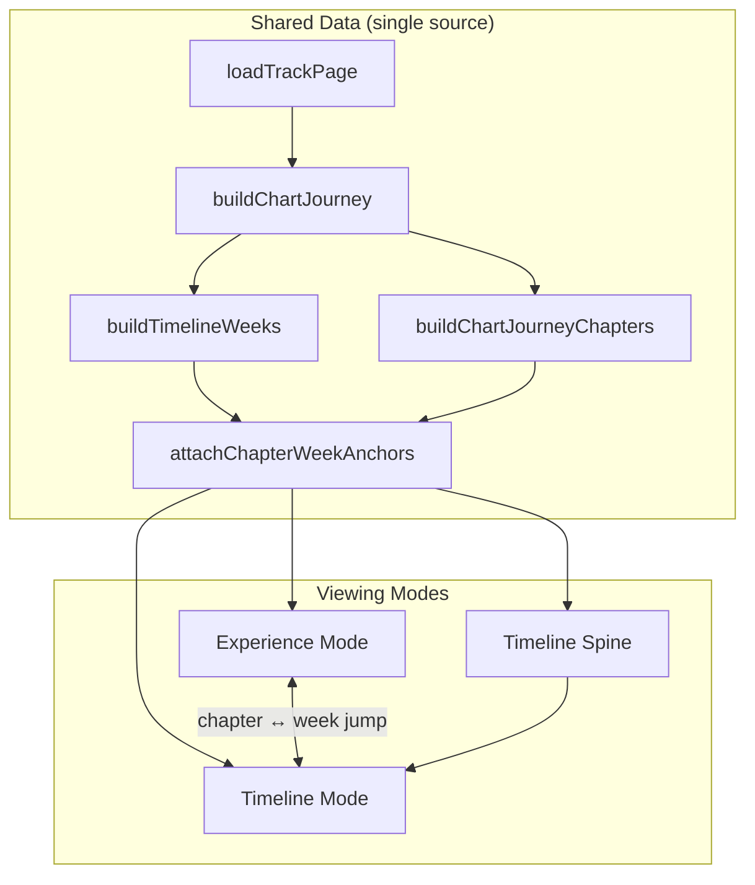

# Chart Journey v1.1 — Foundation

**Experience:** 1.1 — Merge cinematic story with authoritative week-by-week timeline  
**Date:** 2026-06-28  
**Status:** Design workspace — not published to patrons  
**Workspace:** `/ops/studio/experiences/chart-journey/[rvtr]`

---

## Design Principle

> The chart history is the truth. The experience tells the story.

The original week-by-week Chart Journey fingerprint is the **foundation**. Experience Mode elevates it — never replaces it.

---

## Architecture



### Module map

| File | Role |
|---|---|
| `build-timeline-weeks.ts` | Authoritative `ChartJourneyTimelineWeek[]` — every week preserved |
| `build-chapter-anchors.ts` | Links cinematic chapters ↔ week indices |
| `build-chapters.ts` | Experience Mode chapters (now includes Top 40, Top 10) |
| `build-experience.ts` | Assembles v2 experience with timeline + anchors |
| `ChartJourneyWorkspace.tsx` | Mode toggle + unified navigation |
| `ChartJourneyTimelineExplorer.tsx` | Timeline Mode — full historical record |
| `TimelineSpine.tsx` | Mini spine always visible in Experience Mode |

**Experience version:** `2` (adds `timelineWeeks`, `chapterAnchors`)

**Unchanged upstream:** `buildChartJourney()`, `ChartJourneyRowView`, patron `ChartJourney` component — original fingerprint logic intact.

---

## Experience vs Timeline Responsibilities

| Concern | Experience Mode | Timeline Mode |
|---|---|---|
| **Purpose** | Discovery · cinematic walkthrough | Historian-quality explorer |
| **Weeks shown** | Milestone chapters only | **Every** chart week |
| **Collapse weeks?** | Yes — story beats | **Never** |
| **Primary UI** | Chapter nav + beat preview | Heat-map rows + detail panel |
| **Motion** | Vinyl, line draw, confetti, map | Row expand, spine scrub |
| **Data source** | Same `timelineWeeks[]` | Same `timelineWeeks[]` |

### Experience Mode chapters (optional, data-driven)

Opening · Release · Entered Charts · Rapid Rise · **Top 40** · **Top 10** · Peak Week · Competition · Longevity · International · Awards · Legacy

### Timeline Mode fields (every week)

| Field | Source today |
|---|---|
| Week ending date | `issueDate` |
| Billboard position | `rank` |
| Movement from previous week | `movementFromPrevious` |
| Weeks on chart | `weekNumber` |
| Peak to date | Running min rank |
| Badges | NEW, PEAK, RETURN, BIG JUMP, FINAL WEEK |
| Re-entry gaps | `ChartJourneyGap` |

---

## Unified Navigation

Users move naturally between story and history:

```
Experience chapter
  → "View exact chart history — week N →"
  → Timeline Mode (focused week)

Timeline week (milestone)
  → "← Back to peak week"
  → Experience Mode (chapter selected)

Timeline spine (always visible in Experience Mode)
  → tap week → Timeline Mode
  → "Open full timeline →"
```

**Chapter ↔ week anchors (RVTR001341):**

| Chapter | Anchor week |
|---|---|
| Entered Charts | 0 |
| Rapid Rise | 3 |
| Top 40 | 7 |
| Top 10 | 15 |
| Peak Week | 17 (#6) |
| Longevity | 24 |

**Timeline weeks preserved:** 25 (matches Hot 100 trajectory — no collapse)

---

## Progressive Enrichment

Each `ChartJourneyTimelineWeek` carries an `enrichment` object. Slots start empty and populate automatically as Retrograph grows — **no redesign required**.

| Slot | Populates from (future) |
|---|---|
| `billboardCover` | Chart-week media assets |
| `topFiveThatWeek` | Chart date graph |
| `songsAboveBelow` | `ChartWeekContextHooks.neighbors` |
| `historicalEvents` | Retrograph timeline events |
| `tvAppearances` | Performance entities |
| `albumSales` | Collector commerce facts |
| `certifications` | RIAA / award entities |
| `retroverseConnections` | RVAR/RVAL/RVTR graph links |

Timeline Mode UI shows **"Awaiting Retrograph"** vs **"Available"** per slot.

---

## Interaction Model (designed for expansion)

| Capability | v1.1 status | Future |
|---|---|---|
| Toggle Experience / Timeline | ✓ | — |
| Jump chapter → week | ✓ | — |
| Jump week → chapter | ✓ | — |
| Timeline spine scrub | ✓ | — |
| Expand week detail | ✓ | — |
| Jump to any week | ✓ via spine / list | Keyboard shortcuts |
| Scrub chart history | Partial (spine) | Animated scrubber |
| Animate the climb | ✓ line draw in Experience | Synced to timeline |
| Compare US vs UK | — | Multi-market timeline |
| Compare multiple songs | — | Overlay mode |
| Highlight milestone weeks | ✓ spine ticks | Persistent highlights |
| Zoom chart periods | — | Range selector |

---

## Reusable Components

| Component | Reuse |
|---|---|
| `ChartJourneyTimelineExplorer` | Patron Timeline Mode (future) |
| `TimelineSpine` | Embedded in any chart surface |
| `ChartJourneyLineViz` | Rapid Rise / climb animation |
| `ChapterBeatPreview` | Experience Mode beats |
| `buildTimelineWeeks()` | Any chart experience needing authoritative weeks |
| `attachChapterWeekAnchors()` | Any cinematic wrapper over chart data |

Original patron component `components/retroverse/experience/ChartJourney.tsx` remains the public fingerprint — v1.1 workspace wraps it conceptually without modifying it.

---

## RVTR001341 Verification

| Check | Result |
|---|---|
| Experience version | 2 |
| Timeline weeks | 25 (all preserved) |
| Experience chapters | 10 active (+ 2 skipped) |
| New Top 40 / Top 10 chapters | ✓ weeks 7 and 15 |
| Chapter anchors | 6 linked |
| Mode toggle | ✓ Experience / Timeline |
| Timeline spine | ✓ 25 ticks, milestone highlights |
| Typecheck | ✓ pass |
| Studio pipeline untouched | ✓ |

---

## Historical Integrity Checklist

- [x] Timeline Mode shows every chart week from `buildChartJourney().rows`
- [x] Experience Mode never deletes or merges weeks in the data model
- [x] Re-entry gaps preserved in Timeline Mode
- [x] Peak-to-date computed per week (not summarized away)
- [x] Original heat-map bar width/color reused from chart journey pipeline
- [x] Shared `ChartJourneyModel` — one truth, two views

---

## Success Criteria

| Criterion | Status |
|---|---|
| Original week-by-week timeline remains authoritative | ✓ `timelineWeeks[]` |
| Cinematic experience grows from foundation | ✓ chapters anchor to weeks |
| Two complementary modes | ✓ toggle + spine |
| Natural story ↔ history navigation | ✓ bidirectional jumps |
| Progressive enrichment designed | ✓ 8 slots per week |
| Museum-quality story + historian-quality explorer | ✓ |
| Same Retrograph powers both | ✓ `loadTrackPage` + `buildChartJourney` |

**Execution State: COMPLETE**
