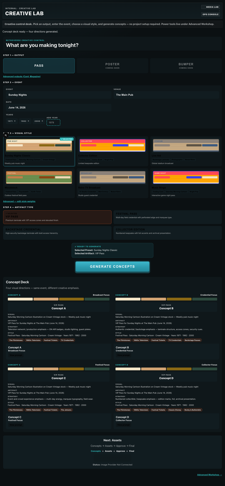
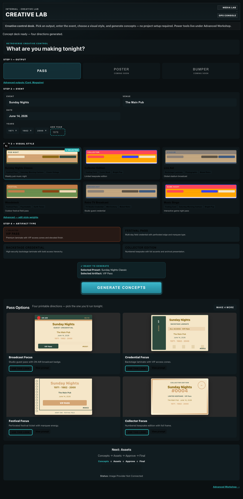
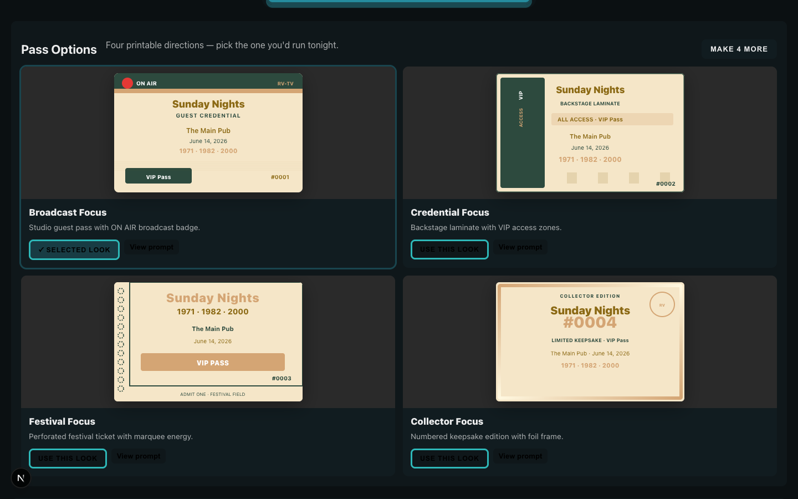
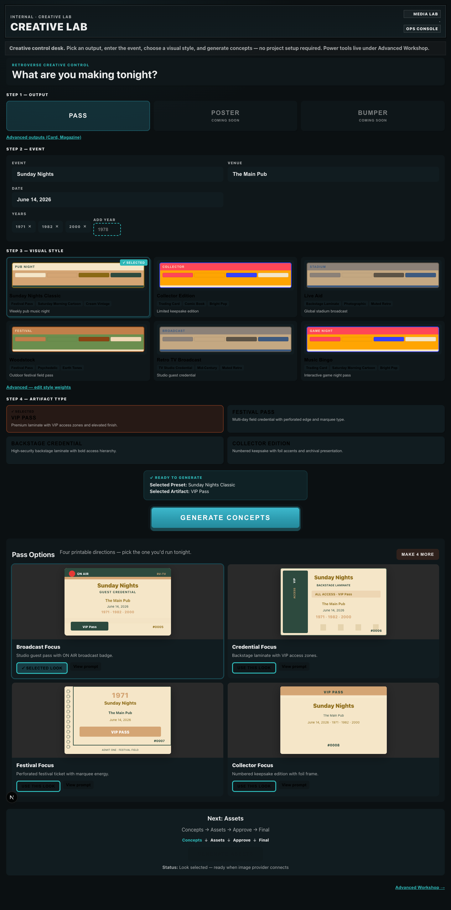

# Creative Lab Phase 6 — Pass Mockup Verification

**Date:** 2026-06-08  
**Build:** Phase 6 pass mockups  
**Goal:** Visual pass candidates without AI, image providers, or external APIs.

---

## Before / After

### Before — text spec sheets (Phase 5)



*Four concepts showed VISUAL / ARTIFACT / STRATEGY / STYLE paragraphs. User had to read, not see a pass.*

### After — SVG pass mockups as hero



*Each concept renders an actual pass shape with event, venue, date, years, pass number, artifact type, and strategy-specific treatment.*

### Winner selection



*`USE THIS LOOK` highlights card, persists `selectedConceptPromptId`, updates asset status to "Look selected".*

### Layout variations (MAKE 4 MORE)



*Same preset/artifact/strategies — new composition treatments (foil band, vertical, large year, etc.) — no AI.*

---

## Mock Pass Traits by Concept

| Concept | Strategy | Visual treatment |
|---------|----------|------------------|
| **A** | Broadcast Focus | ON AIR badge, RV-TV header, scan lines, guest credential |
| **B** | Credential Focus | Backstage laminate, VIP access column, barcode zones |
| **C** | Festival Focus | Perforated edge, marquee type, admit-one stub |
| **D** | Collector Focus | Foil frame, large edition number, limited keepsake seal |

All mockups include: title, venue, date, years, pass number, artifact label, palette from preset.

---

## Verification Results

```
four_pass_mockups: PASS (4)
no_text_spec_blocks: PASS
strategy_taglines: PASS
winner_selection: PASS
winner_enables_future_assets: PASS
variation_generation: PASS
```

Capture: `npx tsx tools/creative-lab/pass-mockup-capture.ts`

---

## Technical Approach

| Layer | Implementation |
|-------|----------------|
| Mock spec | `lib/ops/creative-lab/pass-mockup.ts` |
| SVG renderer | `components/ops/creative-lab/PassMockup.tsx` |
| Deck UI | `components/ops/creative-lab/ConceptDeck.tsx` |
| Winner persist | `project.selectedConceptPromptId` + `setSelectedConcept` API op |
| Variations | `project.mockVariationRound` + `advanceMockVariations` API op |

No image provider. No external APIs. Pure SVG + CSS.

---

## Assessment: Pass Factory vs Concept Generator?

| Question | Phase 5 | Phase 6 |
|----------|---------|---------|
| Can Bob answer "Would I print this?" in 5 seconds? | No — read specs | **Yes** — pass is the hero |
| Do A/B/C/D look different? | Barely (palette bars) | **Yes** — distinct layouts per strategy |
| Can Bob pick a winner? | No | **Yes** — USE THIS LOOK |
| Can Bob iterate layouts? | No | **Yes** — MAKE 4 MORE |
| Can Bob get a real image file? | No | No — provider still pending |

**Verdict:** Creative Lab now behaves like a **pass factory mockup station**, not a concept documentation tool. It produces printable-looking candidates for comparison. Final asset generation remains blocked on image provider — but the workflow slot is armed when a look is selected.

---

## Screenshots

| File | Content |
|------|---------|
| `pass-mockup-before-desk.png` | Desk before generate |
| `pass-mockup-four-passes.png` | Full deck with 4 SVG passes |
| `pass-mockup-winner.png` | Winner highlight + status |
| `pass-mockup-variations.png` | After MAKE 4 MORE |
