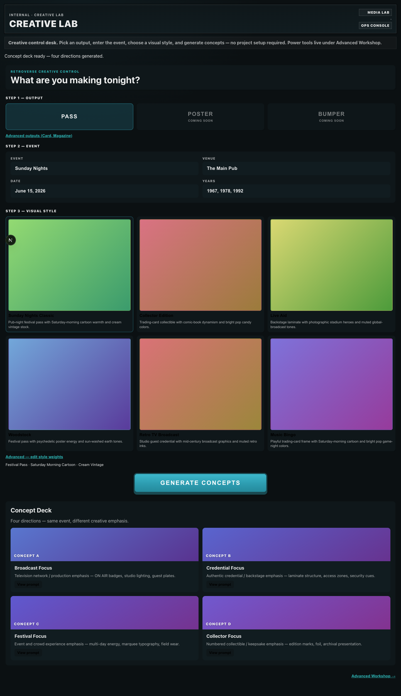
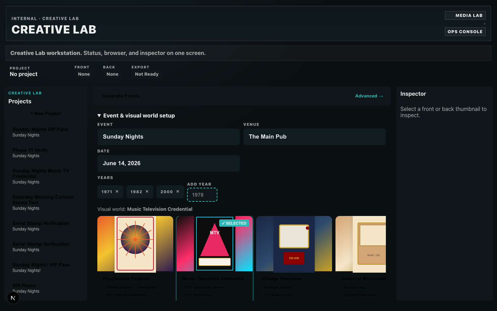
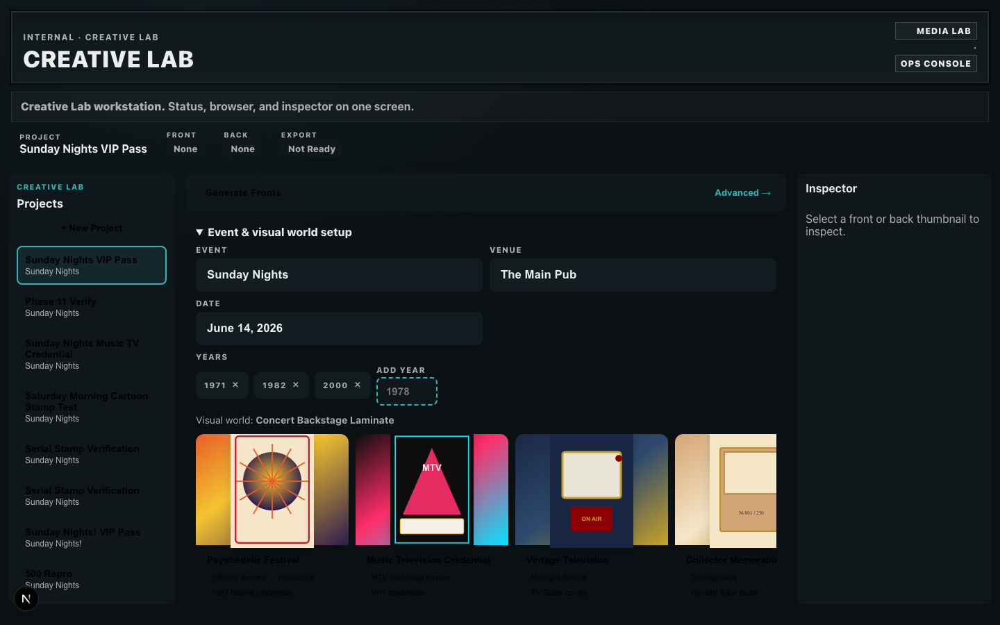
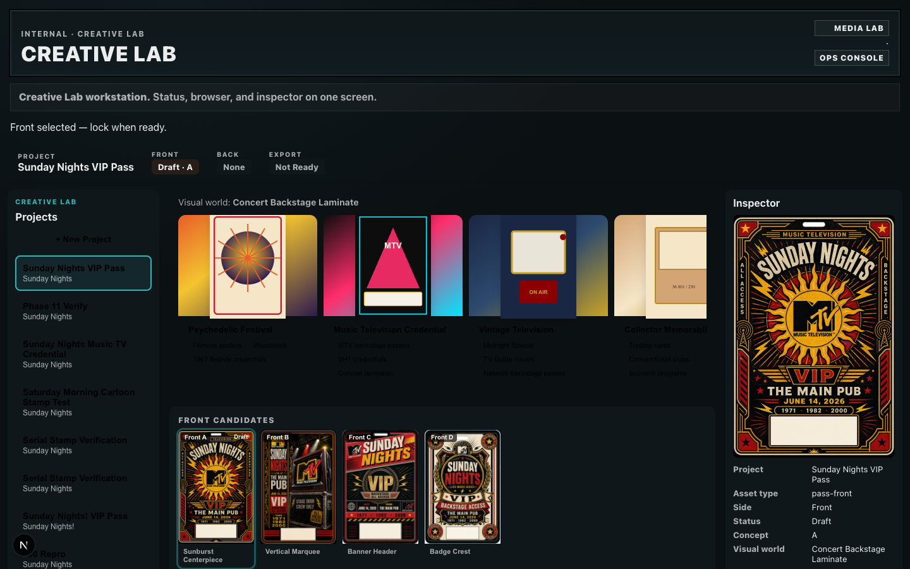

# Creative Lab Phase 12b — Workstation Shell

**Date:** 2026-06-10  
**Scope:** Layout and navigation only — no generation, approval, export, or storage logic changes.

---

## Summary

Replaced the vertical scrolling desk (`cl-desk` + distant `ConceptDeck` sections) with a **three-column workstation shell**:

| Column | Component | Role |
|--------|-----------|------|
| Left | `WorkstationSidebar` | Projects list, New Project |
| Center | Actions + collapsible setup + `WorkstationBrowser` | Thumbnail strips for fronts/backs |
| Right | `WorkstationInspector` | Read-only asset metadata |

**Sticky** `WorkstationStatusStrip` shows project name, front/back/export status at all times.

---

## Layout Diagram

```
┌─────────────────────────────────────────────────────────────────────────────┐
│ STATUS STRIP (sticky)                                                       │
│ Project: Sunday Nights VIP │ Front: Approved·A │ Back: Draft·C │ Export: Ready │
├──────────┬──────────────────────────────────────────────┬─────────────────┤
│ PROJECTS │ [Generate Fronts][Lock Front][Generate Backs][Export]  Advanced → │
│ + New    ├──────────────────────────────────────────────┤ INSPECTOR       │
│ • Proj 1 │ ▼ Event & visual world setup (collapsible)   │ Preview         │
│ • Proj 2 ├──────────────────────────────────────────────┤ Side: Front     │
│          │ FRONT CANDIDATES  [A][B][C][D]               │ Status: Draft   │
│          │ APPROVED FRONT    (label when locked)        │ Export: Ready   │
│          │ BACK CANDIDATES   [A][B][C][D]               │                 │
│          │ SELECTED BACK     (label when chosen)        │                 │
└──────────┴──────────────────────────────────────────────┴─────────────────┘
```

---

## Before / After

### Before (Phase 11 vertical desk)

- Single column: masthead → event → 6 world cards → generate CTA → ConceptDeck far below
- Full workflow ~**4.5 viewport heights** (see `workstation-consolidation-audit.md`)
- No persistent project/status chrome
- Fronts and backs in **sequential distant sections** (lock replaced grid with separate locked preview)



*Reference capture from pre-12b workstation (`workstation-concept-deck.png`, full-page scroll).*

### After (Phase 12b shell)

**Empty workstation** — status strip + sidebar + action bar visible without scrolling:



**Project with assets** — front/back thumbs in one browser panel:



**Inspector** — read-only metadata on thumb click:



### Scroll reduction

| Metric | Before | After |
|--------|--------|-------|
| Status visible without scroll | No | **Yes** (sticky strip) |
| Front + back thumbs same panel | No | **Yes** |
| Generate → see results scroll | ~1.3 viewports | **0** (browser updates in place) |
| Center column max-height | Unlimited page scroll | `calc(100vh - 280px)` internal scroll only |

---

## Success Criteria Check

| Question | Answerable without scroll? |
|----------|---------------------------|
| What project is active? | **Yes** — status strip + sidebar highlight |
| Which front is selected? | **Yes** — strip shows Draft · key; thumb border |
| Which front is approved? | **Yes** — strip shows Approved · key; Approved badge |
| Which back belongs to approved front? | **Yes** — backs row only after lock; hint text links keys |
| Ready for export? | **Yes** — Export pill Ready / Not Ready |

---

## Files Added / Changed

| File | Change |
|------|--------|
| `lib/ops/creative-lab/workstation-state.ts` | Status derivation + prompt/asset helpers (read-only) |
| `components/ops/creative-lab/WorkstationSidebar.tsx` | Left nav |
| `components/ops/creative-lab/WorkstationStatusStrip.tsx` | Sticky status |
| `components/ops/creative-lab/WorkstationBrowser.tsx` | Center thumbnail browser |
| `components/ops/creative-lab/WorkstationInspector.tsx` | Right inspector |
| `components/ops/creative-lab/CreativeWorkstation.tsx` | Shell layout |
| `components/ops/creative-lab/CreativeLabWorkspace.tsx` | Pass projects + nav props |
| `app/ops/creative-lab/creative-lab.css` | `.cl-ws*` styles |
| `app/ops/creative-lab/page.tsx` | Compact banner |
| `tools/creative-lab/phase-12b-capture.ts` | Screenshot script |

**Unchanged:** `ConceptDeck.tsx` (retained for reference), all `projects.ts` ops, API routes, prompts, OpenAI provider.

---

## Remaining Phase 12c Work

1. **Remove `ConceptDeck`** from codebase once browser is proven in production
2. **Prune dead CSS** — `.cl-desk` vertical-only rules, orphaned art-deck classes
3. **Collapse Advanced Workshop** — overflow menu instead of separate navigation universe
4. **Top bar only** — move setup into inspector or modal; world picker as dropdown
5. **Auto-scroll / focus** — center browser scroll-into-view on generation complete (optional polish)
6. **Mobile** — stack columns; keep status strip sticky
7. **Schema cleanup** — replace `workflowRound` with explicit `passPhase` (12f)
8. **Remove legacy paths** — `generateConcept`, refinement API ops, `AssetGenerationPlaceholder`

---

## Verification

```bash
RETROVERSE_OPS=1 npx tsx tools/creative-lab/phase-12b-capture.ts
```

Existing workflow ops unchanged: `generatePasses` → `setSelectedConcept` → `lockFront` → `generateBackPasses` → `setSelectedBack` → `exportPassPair`.

---

## Deploy

**Attempted:** `npx vercel --prod --yes` (commit `dd4baa1`)

**Result:** Build failed on Vercel — unrelated pre-existing error:

```
Module not found: Can't resolve 'fs'
Import trace: OpsMidnightSpecialReview.tsx → midnight-special/clip-mode.ts → paths.ts
```

Creative Lab shell changes compile locally (`tsc --noEmit` pass). Redeploy after media-collections client/fs boundary is fixed.

---

*Phase 12b complete — workstation shell only.*
