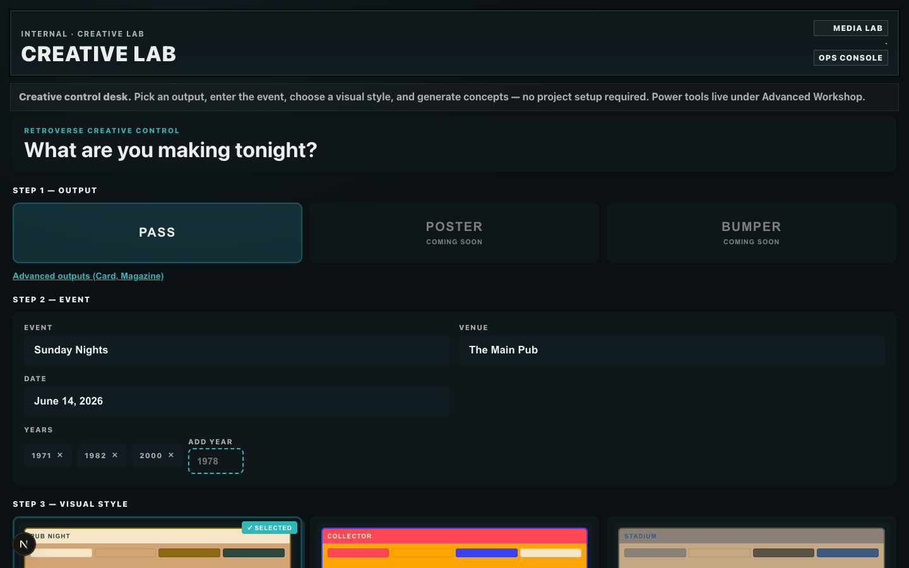
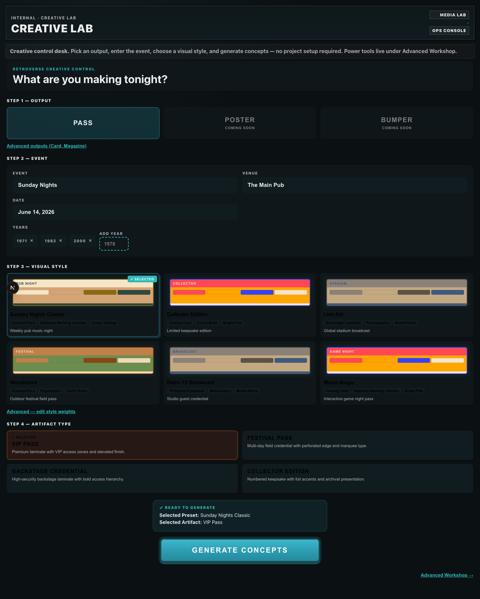
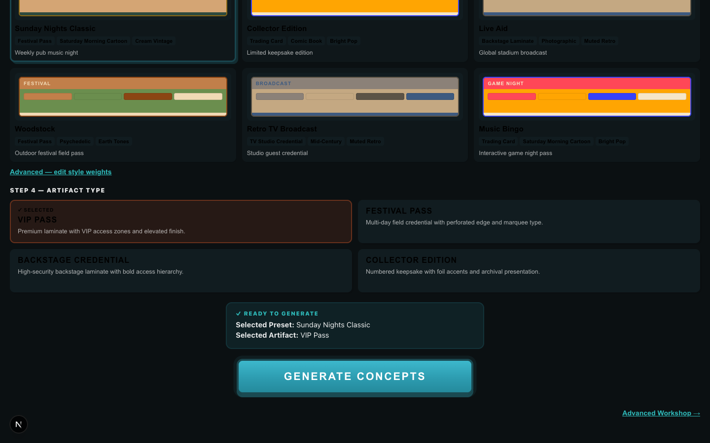
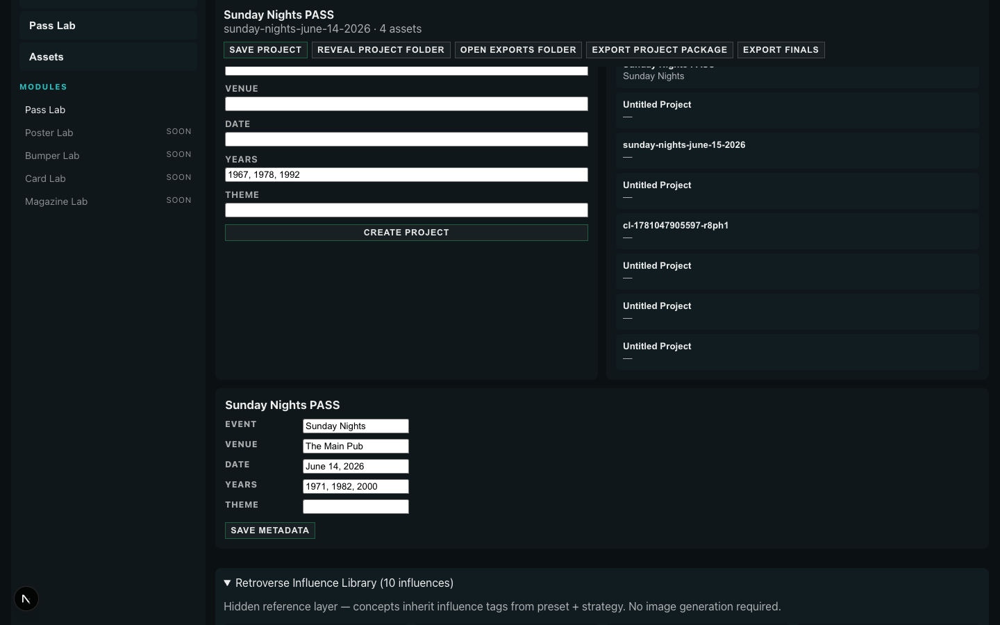

# Creative Lab Phase 5 — Usability Verification

**Date:** 2026-06-08  
**Goal:** Make Creative Lab usable this week for Sunday Nights passes — visual, understandable, ready for asset generation.

## Before / After

### Before (workstation redesign — `02d75dd`)


*Empty venue/date, comma-separated years, color-block preset cards, no artifact type, text-first concept deck.*

### After — Seeded Sunday Nights desk



*Event, venue, date, and year chips pre-filled for the current show.*

### After — Visual preset cards



*Each preset shows mock pass layout, style tags (credential / illustration / color), and intended use.*

### After — Artifact selection + armed generate



*✓ SELECTED state on preset and artifact. Ready panel shows Selected Preset + Selected Artifact. Generate button armed.*

### After — Concept deck with mock panels


*Four concept mock panels: palette, artifact preview, visual/artifact/strategy summaries, influence tags. Prompt hidden behind View prompt. Asset generation placeholder shows pipeline.*

### After — Influence library (Advanced)



*10 seeded Retroverse influences — hidden from main desk, available in Advanced Workshop.*

## Verification Results

```
seeded_event: PASS
year_chips: PASS (3)
preset_visual_cards: PASS (6)
selected_state: PASS
generate_armed: PASS
concept_mock_panels: PASS (4)
influence_tags: PASS (18)
asset_gen_placeholder: PASS
influence_library_ui: PASS
```

Capture: `npx tsx tools/creative-lab/phase5-capture.ts`

## What Changed

| Phase | Deliverable |
|-------|-------------|
| 1 | Seeded defaults: Sunday Nights / The Main Pub / June 14, 2026 / 1971·1982·2000 |
| 2 | Step 4 Artifact Type — VIP / Festival / Backstage / Collector; persisted + in prompts |
| 3 | `PresetWorkstationCard` — mock pass, style tags, palette swatches |
| 4 | `YearTokenInput` — removable chips + Add Year |
| 5 | ✓ SELECTED badges, ready panel, armed generate button |
| 6–7 | `ConceptMockPanel` — visual/artifact/strategy summaries per concept |
| 8 | `AssetGenerationPlaceholder` — disabled GENERATE ASSETS + pipeline |
| 9 | `influences.ts` + `InfluenceLibraryPanel` — 10 starter influences |

## Usability Assessment

**First-time user path (no docs required):**

1. Open Creative Lab → Sunday Nights event already loaded
2. PASS selected → pick visual style card
3. Pick artifact type (VIP Pass default)
4. GENERATE CONCEPTS → four visually distinct concept boards
5. See next step: Concepts → Assets → Approve → Final (provider not connected)

**Selected state:** Obvious — ✓ SELECTED on cards, ready panel, pulsing generate button.

**Concept differentiation:** Each card shows different strategy label, palette, influence tags, and summary copy — not just prompt text.

**Workflow clarity:** Asset generation placeholder teaches the pipeline without implying images exist yet.

## Readiness for Image Generation

| Ready | Item |
|-------|------|
| ✅ | Event context seeded and editable |
| ✅ | Artifact type in project + prompt renderer |
| ✅ | Concept A–D with strategy + influence metadata |
| ✅ | UI slot for GENERATE ASSETS (disabled, labeled) |
| ✅ | Approve / Final pipeline exists in Advanced Workshop |
| ⏳ | Image provider connection (intentionally not built) |
| ⏳ | Wire GENERATE ASSETS → provider when ready |

**Bottom line:** Bob can generate and compare four Sunday Nights pass concepts today. Connecting an image provider is the only blocker to producing real assets.
