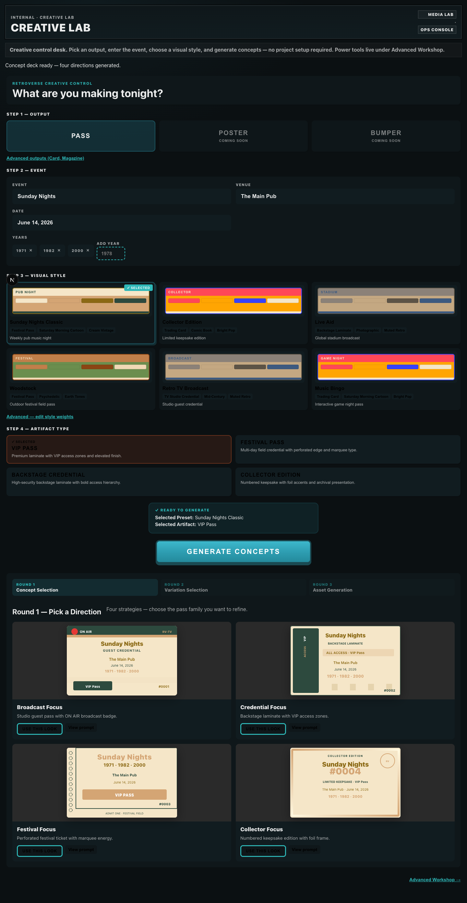
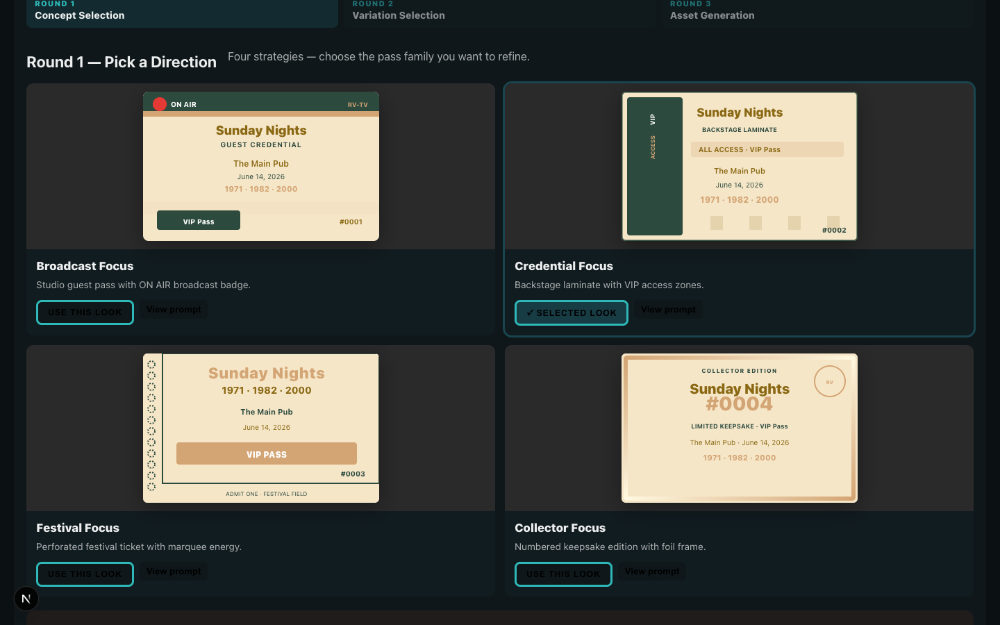
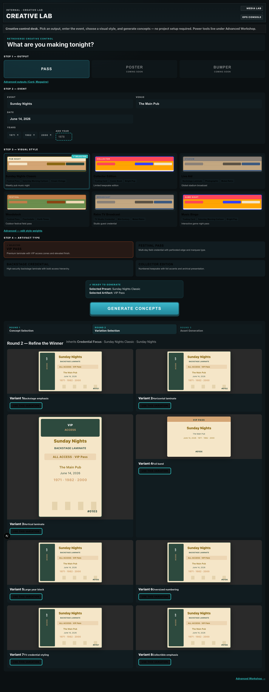
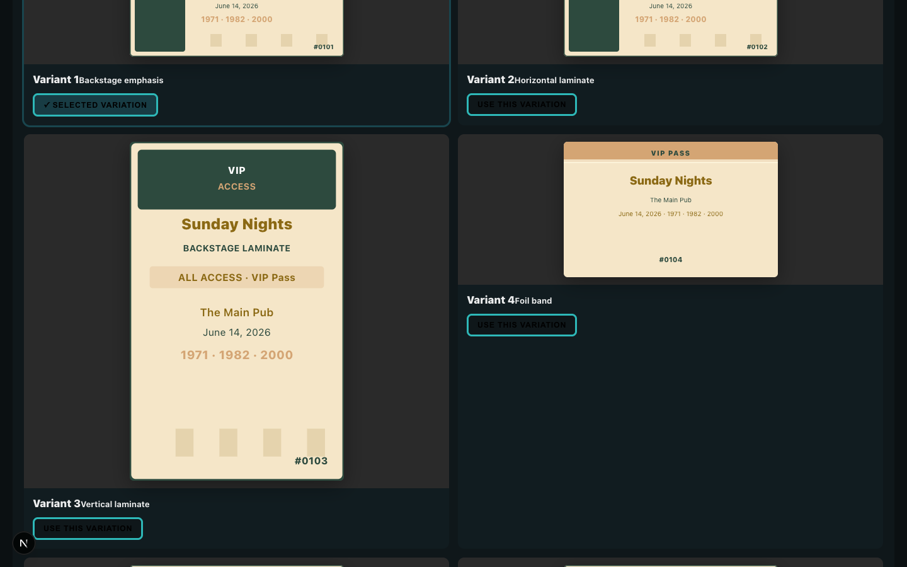

# Creative Lab Phase 7 — Winner Refinement Verification

**Date:** 2026-06-08  
**Goal:** Converge design workflow after winner selection — refine, don't branch.

---

## Before / After

### Before (Phase 6) — branching with MAKE 4 MORE


*MAKE 4 MORE cycled unrelated layout rounds across all four strategies. No convergence.*

### After — Round 1: Concept Selection



*Four strategies (Broadcast / Credential / Festival / Collector). Round indicator visible.*

### After — Winner + REFINE THIS LOOK



*Credential (or any winner) selected → REFINE THIS LOOK → GENERATE 8 VARIATIONS.*

### After — Round 2: Eight Descendants



*All 8 inherit winning strategy, preset, artifact, event, venue, years. Only layout/treatment varies.*

### After — Round 3: Variation Winner



*USE THIS VARIATION → Round 3 Asset Generation section appears (provider still pending).*

---

## Workflow Rounds

| Round | Label | Action |
|-------|-------|--------|
| **1** | Concept Selection | Pick A/B/C/D strategy family |
| **2** | Variation Selection | Generate 8 treatments of winner |
| **3** | Asset Generation | Locked look — future image provider |

---

## Persistence

| Field | Purpose |
|-------|---------|
| `selectedConceptPromptId` | Round 1 winner prompt |
| `selectedConceptKey` | A / B / C / D |
| `refinementVariations` | 8 descendant records |
| `selectedVariationIndex` | Round 2 winner (1–8) |
| `workflowRound` | 1 / 2 / 3 |

---

## Verification Results

```
round1_indicator: PASS
winner_shows_refine_cta: PASS
eight_refinement_variants: PASS (8)
round2_indicator: PASS
inherits_concept_identity: PASS
round3_asset_section: PASS
no_make_4_more: PASS
```

Capture: `npx tsx tools/creative-lab/winner-refinement-capture.ts`

---

## Assessment: Design Tool vs Prompt Tool?

| Criterion | Phase 6 | Phase 7 |
|-----------|---------|---------|
| Workflow converges after pick | No | **Yes** |
| User knows which round | No | **Yes** — indicator |
| Refinement inherits winner | No | **Yes** — 8 descendants |
| MAKE 4 MORE branches wide | Yes | **Removed** |
| Feels like narrowing choices | No | **Yes** |

**Verdict:** Creative Lab now behaves like a **design refinement tool** — pick a family, refine within it, lock a variation. Still no AI credits spent. Asset generation waits on image provider at Round 3.

---

## Screenshots

| File | Content |
|------|---------|
| `refinement-round1.png` | Round 1 concept grid |
| `refinement-winner-selected.png` | REFINE THIS LOOK CTA |
| `refinement-eight-variants.png` | 8 refinement mockups |
| `refinement-variation-winner.png` | Round 3 unlocked |
