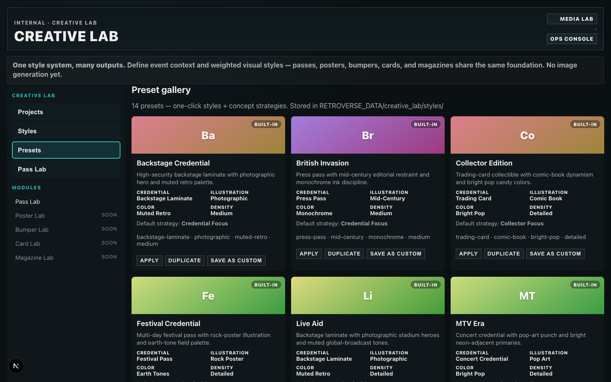
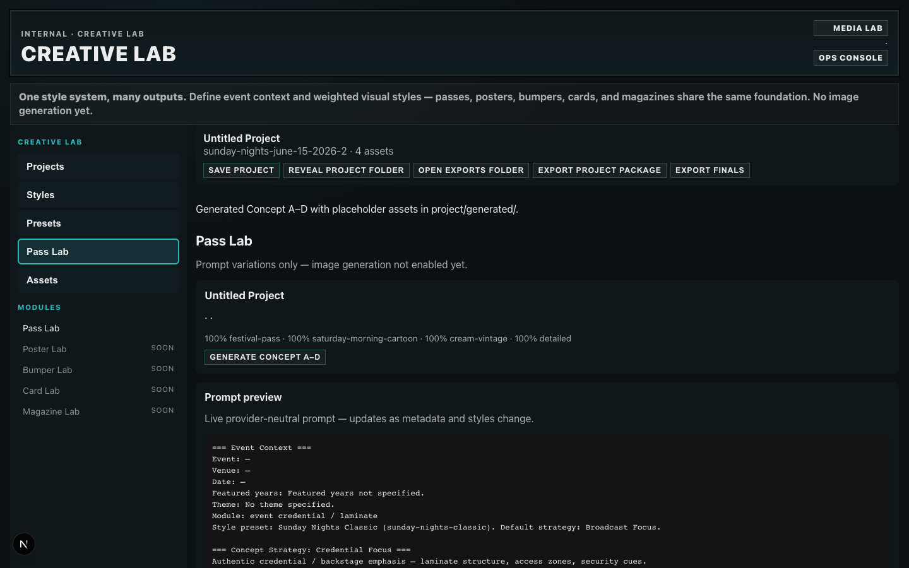
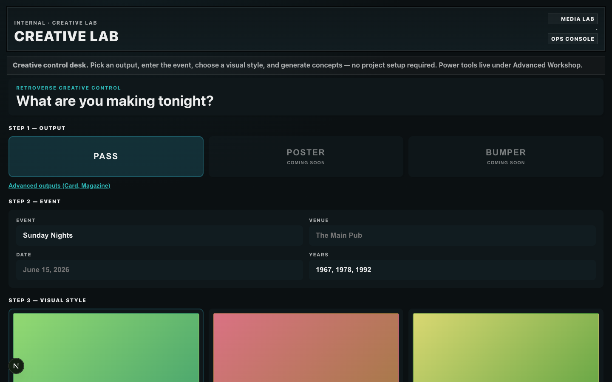
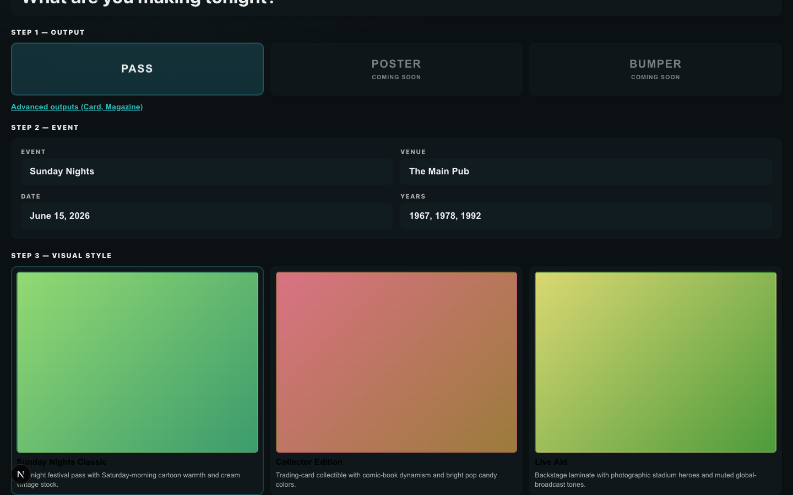
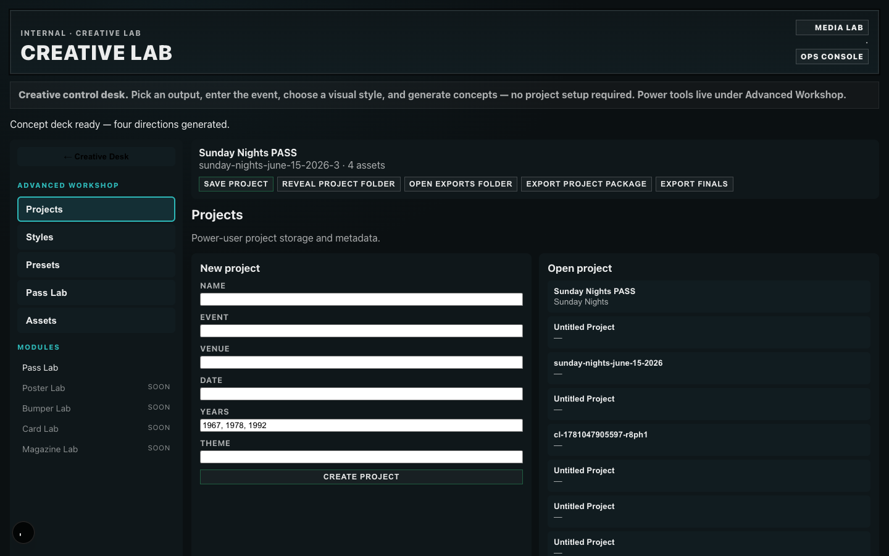

# Creative Lab — Workstation UX Reset

**Date:** 2026-06-08  
**Scope:** Workflow and layout only — no new generators, image providers, or features.

## Problem

The previous Creative Lab exposed implementation concepts upfront:

- Projects, Styles, Presets, Assets, Modules, Exports
- Sidebar navigation felt like an admin panel
- First-time users had to understand project storage before creating anything

## Solution

A guided **Creative Control Desk** replaces the default landing experience. Power-user tools move under **Advanced Workshop**.

### Default flow (4 steps)

1. **Output** — Large PASS / POSTER / BUMPER controls (Card + Magazine under Advanced outputs)
2. **Event** — Event, Venue, Date, Years (large fields; project auto-created on generate)
3. **Visual style** — Six featured preset cards with thumbnail previews
4. **GENERATE CONCEPTS** — Primary action button

After generation, the **Concept Deck** shows four large cards (A–D) with strategy labels. Raw prompts are behind **View prompt**.

### Advanced Workshop

Accessible via footer link. Contains the previous panels:

- Projects, Styles, Presets, Pass Lab, Assets
- Project toolbar (save, reveal, export)
- Prompt renderer and style weight editing

## Before / After

### Before — admin sidebar + project-first workflow



*Phase 3 preset gallery: sidebar exposed Projects / Styles / Presets before any creative action.*



*Phase 4A Pass Lab: user had to create a project, apply a preset, then navigate to Pass Lab to generate.*

### After — creative control desk



*Step 1–3 visible on arrival. No sidebar. No project terminology.*



*Event fields + Sunday Nights Classic preset — ready to generate.*


*Four concept cards with strategy focus labels. Prompts hidden by default.*



*Power tools behind Advanced Workshop — projects, storage, exports unchanged.*

## Verification

```
workstation_landing: PASS
no_admin_sidebar: PASS
event_and_preset: PASS
concept_deck: PASS
concept_card_count: PASS (4)
prompt_hidden_by_default: PASS
view_prompt_toggle: PASS
advanced_workshop: PASS
```

Capture script: `npx tsx tools/creative-lab/workstation-capture.ts`

## Files touched

| Area | Files |
|------|-------|
| Workstation UI | `CreativeWorkstation.tsx`, `ConceptDeck.tsx`, `workstation-presets.ts` |
| Advanced shell | `AdvancedWorkshop.tsx` |
| Orchestration | `CreativeLabWorkspace.tsx`, `workspace/urls.ts` |
| Styles | `app/ops/creative-lab/creative-lab.css` |
| Copy | `app/ops/creative-lab/page.tsx` |

## Success criteria

A first-time user can:

1. Open Creative Lab
2. Select PASS
3. Enter event information
4. Choose a preset
5. Click GENERATE CONCEPTS

…without needing to understand projects, presets, style weights, storage, assets, or exports. Those remain under Advanced Workshop.
