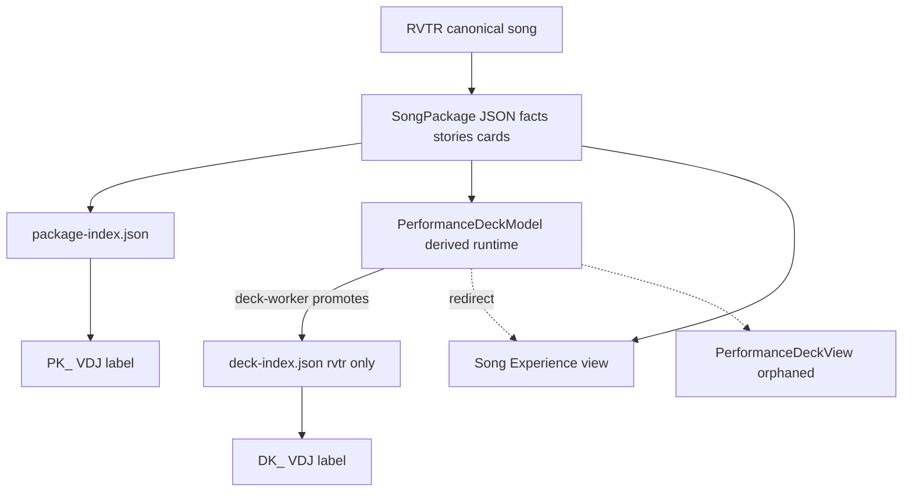

# Retroverse Audit — What Is a DK Actually?

**Scanned:** 2026-06-24  
**Read-only** — no code changes.

---

## Executive summary

**DK is not a separate content artifact.** It is:

1. A **VDJ label prefix** (`DK_RVTR######`) meaning “in deck-index”
2. A **registry entry** in `deck-index.json` (`{ rvtr }` only — no payload)
3. A **derived view model** (`PerformanceDeckModel`) built at runtime from the same `SongPackage` JSON

There is **no standalone deck file**, **no deck generator**, and **no patron-facing page that requires DK**. Public `/rvtr/.../deck` redirects to Song Experience. The swipe-deck UI (`PerformanceDeckView`) exists but is **orphaned**.

### Recommendation: **C → D**

**Stop creating new DK entries** (immediate). **Retire DK entirely** once Browser Plus ops metrics use package/renderability instead of label prefix. Deck is a **legacy workflow/presentation layer**, not a meaningful content artifact under the RVTR → Artifacts → Views model.

---

## 1. Package vs Deck — definitions from code

### Package (`PK_` / `RVTR` + package exists)

| Dimension | Detail |
|-----------|--------|
| **What it is** | Per-RVTR intelligence artifact: `SongPackage` JSON |
| **Key files** | `lib/ops/intelligence/song-package-types.ts`, `song-package-store.ts`, `process-song.ts`, `production-pipeline.ts`, `card-assemble.ts` |
| **Stored** | `{RETROVERSE_DATA}/ops/intelligence/packages/RVTR######.json` + `package-index.json` |
| **Generated** | Research → facts → stories → `storyCards` → publish pipeline |
| **Rendered** | Ops: `/ops/intelligence/package/[rvtr]` · Public: `/retroverse-2/song/[rvtr]` (graph + optional package overlay) |
| **VDJ signal** | `PK_RVTR######` when package exists but RVTR ∉ deck-index |

### Deck (`DK_`)

| Dimension | Detail |
|-----------|--------|
| **What it is** | **Not a file.** Registry + label prefix + runtime projection of Package |
| **Key files** | `deck-index.ts`, `load-performance-deck.ts`, `PerformanceDeckView.tsx` (unused route) |
| **Stored** | `data/ops/intelligence/deck-index.json` only: `{ version: 1, decks: [{ rvtr }] }` |
| **Generated** | **Nothing new.** `video-factory.ts` deck-worker **promotes** RVTR into index if `loadPerformanceDeck()` succeeds |
| **Rendered** | Would be swipe cards via `PerformanceDeckView` — **route redirects to Song Experience** |
| **VDJ signal** | `DK_RVTR######` when package exists **and** RVTR ∈ deck-index |

### Label resolution (write-back)

```typescript
// vdj-label-write.ts → resolveRetroverseLabelForRvtr
if (!packageRvtrs.has(rvtr)) return rvtr;           // bare RVTR######
return deckRvtrs.has(rvtr) ? `DK_${rvtr}` : `PK_${rvtr}`;
```

### Performance deck model (derived, not persisted)

`loadPerformanceDeck()` builds swipe sequence from **existing package**:

`hero` → `story` cards → `chart` → `artist` → `related-artists` → `related-songs` → `bobs-note`

Requires package status `published` or `review`. **No DK check inside loader.**

---

## 2. PK vs DK population comparison

### Label counts (your inventory vs code scan)

| Scope | PK | DK | Notes |
|-------|---:|---:|-------|
| **Your manual count** | 610 | 885 | Likely **file rows** (multiple files per RVTR) |
| **VIDEO folder files** | 415 | 848 | File-level scan |
| **Full library distinct RVTR** | 465 | 797 | Deduplicated by RVTR |

PK and DK RVTR sets are **disjoint** — no RVTR carries both prefixes.

### Distinct RVTR metrics (automated, full library)

| Metric | PK only (465) | DK (797) |
|--------|-------------:|---------:|
| In package-index | 465 (100%) | 797 (100%) |
| In deck-index | 4 (0.9%) | **797 (100%)** |
| Renderable `loadPerformanceDeck()` | 167 (36%) | **797 (100%)** |
| Published packages | 0 | 62 |
| Avg candidate facts | 9.5 | 13.0 |
| Avg candidate stories | 4.3 | 6.1 |
| Avg story cards (in package) | **2.7** | **1.5** |
| Avg package JSON size | 33.6 KB | 43.9 KB |

**Interpretation:** DK population is **selected for deck-index promotion** (renderable packages). PK population includes 298 packages **not renderable** (draft/incomplete). DK does **not** have richer card counts — PK averages **more story cards** in the package file.

### Deck-index vs DK label alignment

| Metric | Count |
|--------|------:|
| DK label → in deck-index | 797 / 797 (100%) |
| Deck-index entries **without** DK label | 36 |
| **PK-only renderable but NOT in deck-index** | **163** |

163 songs could produce a performance deck today but are labeled `PK_` only — deck promotion was never run or failed gate.

---

## 3. What DK has that PK does not

For every DK RVTR, the **only persisted differences** vs a hypothetical PK-only sibling are:

| Unique to DK | Count | Evidence |
|--------------|------:|----------|
| `deck-index.json` entry | 797 | `{ rvtr }` row only |
| VDJ `DK_` label prefix | 797 files | `label.startsWith("DK_")` |
| Browser Plus `deckStatus = "Deck Ready"` | per file | ops UI only |
| Browser Plus `workStatus = "Complete"` | if published + DK | ops UI only |

**NOT unique to DK:**

| Artifact | PK has it? |
|----------|------------|
| `SongPackage` JSON | Yes (100%) |
| candidateFacts / stories | Yes (often fewer than DK avg) |
| storyCards | Yes (PK avg **higher**) |
| Additional files on disk | **No** |
| Unique curation layer | **No** — same package pipeline |
| Unique media | **No** |
| Additional metadata fields | **No** |

`PerformanceDeckModel` cards (hero, chart, artist, bobs-note, story) are **computed from package** — not stored separately. PK-only songs with `loadPerformanceDeck()` success get **identical card types** when computed.

---

## 4. Code paths checking DK / deck

| File | Function / location | Checks | Purpose |
|------|---------------------|--------|---------|
| `load-browser-plus.ts` | row loop | `label.startsWith("DK_")` → `deckReady` | Coverage score, work status, deckStatus |
| `load-browser-plus.ts` | `workStatus()` | `deckReady` | "Complete" vs "Published" |
| `load-browser-plus.ts` | `coverageScore()` | `deckReady` | Score tier 4 vs 3 |
| `load-browser-plus.ts` | `buildStats()` | DK label count | Ops dashboard |
| `VirtualDjBrowserPlus.tsx` | filters | `DK_`, `missing-deck`, `deckStatus` | Grid filters |
| `vdj-label-write.ts` | `resolveRetroverseLabelForRvtr` | deck-index | Writes PK_ vs DK_ |
| `label-vdj-packages.ts` | bulk write | deck-index + PK/DK | Batch label upgrade |
| `deck-index.ts` | load/save | deck-index.json | Registry |
| `video-factory.ts` | queue state | deck-index **OR** DK label | Factory readiness |
| `video-factory.ts` | `runVideoDeckBatch` | `loadPerformanceDeck` | Promote to deck-index |
| `shell-model.ts` | `availability()` | deck-index → `hasDeck` | Live shell tabs/status |
| `live-payload.ts` | `resolveLiveDestination` | loads deck-index | **Always returns EXPERIENCE** |
| `live-control/queue.ts` | enrich/filter | `hasDeck` | Optional queue filter |
| `live-companion/page.tsx` | diagnostic | deck-index | Ops display |
| `load-performance-deck.ts` | `loadPerformanceDeck` | package only | Builds view model — **no DK check** |
| `execution-adapters.ts` | `generate-deck` | — | **adapter-only** (not implemented) |
| `entity-routes.ts` / `resolve-search-destination.ts` | RVTR parse | strips DK_/PK_ | Routing only |

---

## 5. User-facing pages — DK dependency

| Page | Route | Requires DK? | Without DK |
|------|-------|--------------|------------|
| **Song Experience** | `/retroverse-2/song/[rvtr]` | **No** | Works on RVTR + graph; package enriches tabs |
| **Legacy deck route** | `/rvtr/[rvtr]/deck` | **No** | Redirects to Song Experience |
| **Legacy song sheet** | `/rvtr/[rvtr]/song-sheet` | **No** | Redirects to Song Experience |
| **Sunday Nights** | `/sunday-nights` | **Partial** | Destination always EXPERIENCE; shell may show "Package" not "Deck" status; Deck tab disabled if ∉ deck-index |
| **Live / RV2 Live** | `/live`, `/retroverse-2/live` | **No** | Links to Song Experience |
| **Track page** | `/track/[id]` | **No** | Unaffected |
| **Browser Plus** | `/ops/browser-plus` | **Yes (ops)** | Shows "Deck Missing"; filters/stats change |
| **Live Control** | `/ops/live-control` | **Optional** | `hasDeck` filter excludes non-index RVTRs |
| **Package viewer** | `/ops/intelligence/package/[rvtr]` | **No** | Same package data regardless of DK |
| **PerformanceDeckView** | component only | **No** | Orphaned — no active route |

**Patron content does not break without DK.** Ops workflows and label semantics change.

---

## 6. Unique information vs presentation-only

| Layer | Verdict | Evidence |
|-------|---------|----------|
| **Unique persisted data** | **No** | Only `deck-index.json` `{ rvtr }` — no payload |
| **Unique curation** | **No** | Same `SongPackage`; deck-worker selects already-renderable packages |
| **Unique artifacts** | **No** | No deck JSON; cards come from package `storyCards` + intel |
| **Presentation-only** | **Yes** | `PerformanceDeckModel` = reorder/package projection |
| **Workflow signal** | **Yes** | PK/DK label + Browser Plus completeness scoring |

`resolveLiveDestination()` loads `hasDeck` but **all branches return `kind: "EXPERIENCE"`** — DECK/PACKAGE destination kinds are dead code.

---

## 7. Reference classification (`deck` / `DK_` / `deckReady`)

| Reference area | Classification | Examples |
|----------------|----------------|----------|
| `deck-index.json`, deck-worker promotion | **Workflow** | video-factory deck batch |
| `DK_` label, `deckReady`, `deckStatus` | **Workflow** | Browser Plus ops grid |
| `loadPerformanceDeck`, `PerformanceDeckView` | **Presentation** | Swipe card layout from package |
| `shell-model` Deck tab | **Presentation** (disabled when no index) | Sunday Nights nav |
| `resolveLiveDestination` DECK kind | **Legacy** | Unreachable — always EXPERIENCE |
| `/rvtr/.../deck` redirect | **Legacy** | Redirect to Song Experience |
| `generate-deck` execution action | **Legacy** | adapter-only, not built |
| VDJ hardware `deck` in live-bridge | **Unrelated** | OSC sensor deck A/B — not Retroverse DK |
| Collector deck state | **Unrelated** | content-creator UI metaphor |

---

## 8. If all DK → PK tomorrow — what is lost?

### Lost (concrete)

1. **Browser Plus `deckStatus = "Deck Ready"`** — all package rows show "Deck Missing"
2. **Browser Plus `workStatus = "Complete"`** — drops to "Published" even when package ready
3. **Browser Plus DK stat pill / filters** — DK count, missing-deck health filter
4. **Coverage score tier 4** — max score becomes 3 (package + cover) unless logic changed
5. **VDJ label distinction** — all become `PK_RVTR######` (RVTR unchanged)
6. **Live shell "Deck" status badge** — falls back to "Package" (if deck-index kept but labels change, mismatch worsens)
7. **Live Control `hasDeck` filter** — if tied to deck-index, unchanged; if tied to label, breaks
8. **Video factory `state.deck`** — false unless deck-index retained
9. **Automation factory "missing decks" backlog** — metric inflation

### NOT lost

1. **All SongPackage JSON** — unchanged
2. **Song Experience page** — unchanged
3. **Sunday Nights playback / destination** — already always EXPERIENCE
4. **Package viewer / generation pipeline** — unchanged
5. **Public patron content** — facts, stories, cards, charts on song page
6. **`loadPerformanceDeck()`** — still computable from package without DK
7. **RVTR identity** — substring extract unchanged (`DK_RVTR` → same RVTR)

### Important: converting label only vs removing deck-index

| Action | Effect |
|--------|--------|
| DK label → PK label only | Ops UI regression; deck-index still enables `hasDeck` in live shell |
| Remove deck-index entries too | Live shell Deck tab disabled; queue filter affected |
| Remove both DK label + deck-index | Full workflow regression; **zero content loss** |

---

## 9. Final recommendation

### **C. Stop creating new DK entries** → migrate to **D. Retire DK entirely**

| Option | Verdict |
|--------|---------|
| A. Keep DK as separate concept | **Reject** — no separate content; dual signals (label vs index) diverge |
| B. Rename/redefine DK | **Weak** — underlying issue is redundant layer |
| **C. Stop creating new DK** | **✓ Immediate** — deck-worker / label promotion pause |
| **D. Retire DK entirely** | **✓ Target** — package + `loadPerformanceDeck()` gate replaces both PK/DK |

### Evidence summary

1. **No deck artifact file** — only `{ rvtr }` in index
2. **No deck generator** — deck-worker comment: *"No standalone deck generator exists yet"*
3. **Public deck route redirects** to Song Experience
4. **163 PK-only songs** already renderable without DK — DK is promotion state, not content
5. **PK averages more story cards** than DK in package files
6. **Patron pages don't gate on DK**
7. **Architecture direction** (RVTR → Artifacts → Views) maps cleanly to **Package = artifact**, **Views = presentation** — Deck duplicates both

### Migration sketch (audit only, not implementation)

1. Replace Browser Plus `deckReady` with `loadPerformanceDeck(rvtr) != null` or package status ≥ `cards_ready`
2. Stop deck-worker promotion; stop writing `DK_` labels
3. Collapse label write to `PK_` when package exists, bare `RVTR` when matched-only
4. Deprecate `deck-index.json` after ops metrics updated
5. Remove dead DECK destination kinds and orphaned `PerformanceDeckView` route wiring

---

## Appendix — data model diagram



---

## Outputs referenced

- `data/ops/intelligence/deck-index.json`
- `lib/ops/intelligence/load-performance-deck.ts`
- `lib/ops/browser-plus/load-browser-plus.ts`
- `lib/ops/browser-plus/vdj-label-write.ts`
- `tools/intelligence/video-factory.ts`
- `app/rvtr/[rvtr]/deck/page.tsx`
