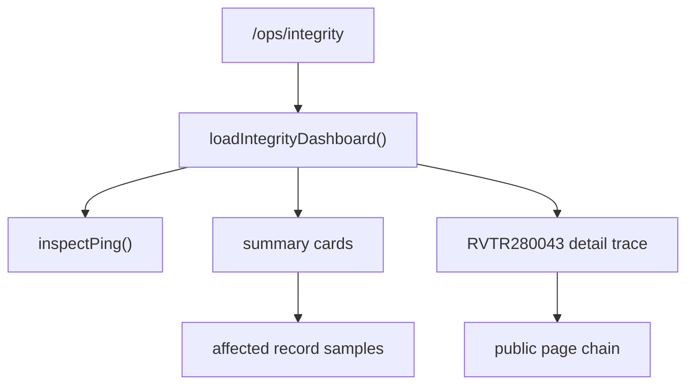
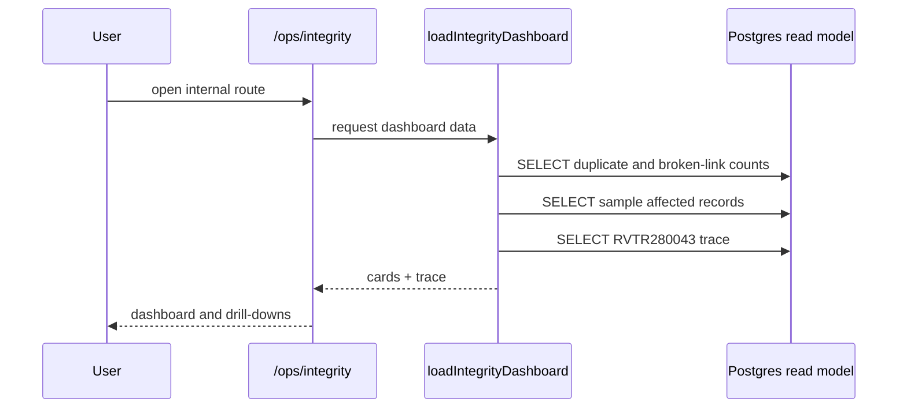

# Integrity Dashboard Design

Generated: 2026-07-15

## Route

The internal BobOS page is implemented at:

`/ops/integrity`

Files:

- `apps/studio/app/ops/integrity/page.tsx`
- `apps/studio/app/ops/integrity/integrity.css`
- `packages/shared/lib/ops/integrity/load-integrity-dashboard.ts`

The page is read-only. It uses SELECT queries through the existing ops inspection database helper and does not write, merge, delete, or repair catalog records.

## Dashboard Model

## Summary Cards

Implemented cards:

| Card | Live signal |
|---|---|
| Duplicate Artists | normalized duplicate `artists.canonical_name` groups |
| Duplicate Albums | same artist/title/year duplicate album groups |
| Duplicate Tracks | duplicate normalized artist/title in `canonical_track_display` |
| Duplicate Years | documented as route-derived, not table-backed |
| Duplicate Chart Weeks | duplicate Hot 100 date/rank rows |
| Broken Artist Links | display artist names that do not resolve to `artists` |
| Broken Album Links | `canonical_album_tracks` RVTR keys missing from track display |
| Broken Track Links | display rows missing `canonical_tracks` bridge |
| Broken Chart Links | Hot 100 rows missing RVTR bridge through `canonical_tracks` |
| Broken Year Links | Hot 100 rows with no `first_chart_date` |
| Alias Conflicts | `search_entities.normalized_label` mapped to multiple targets |
| Missing Covers | RVAL albums with no cover path or artwork link |
| Orphan Records | albums without artists and chart rows without tracks |
| Multiple Canonical Candidates | multiple Hot 100 RVTR candidates for normalized artist/title |
| Unresolved Routes | display rows missing fields required by slug/name fallbacks |

Each card links to its own drill-down section on the same page. Drill-down rows show an affected identifier, display label, and diagnostic reason. Where a public URL is safe and canonical, the row links to that page.

## Record Detail View

The first detail panel traces `RVTR280043` because it is the known failing example from the sprint brief.

Displayed sections:

- Canonical chain: Track → Artist → Album → Year → Chart Week
- Aliases observed through display rows
- Public pages: Homepage, Song V3, Artist V3, Album V3, Year V3, Chart Week V3
- Integrity findings: OK/Warn status with source notes

Important design choice: the panel exposes missing RVAR bridging as a warning instead of inventing an RVAR. This keeps the sprint in audit mode.

## Data Flow

## Non-Goals

This dashboard does not:

- merge duplicates
- rewrite aliases
- modify the database
- create new canonical IDs
- change public routes
- redesign public pages

## Recommended Next Iteration

1. Add a canonical entity bridge view that exposes `rvtr`, `rvar`, `rval`, year, and chart-week identity in one row.
2. Replace name-derived artist page calls with canonical artist ID/RVAR handoff after slug compatibility resolution.
3. Add a route trace API that accepts any RVTR and returns the same detail panel currently shown for `RVTR280043`.
4. Add persisted historical snapshots for dashboard counts so regressions are visible over time.
