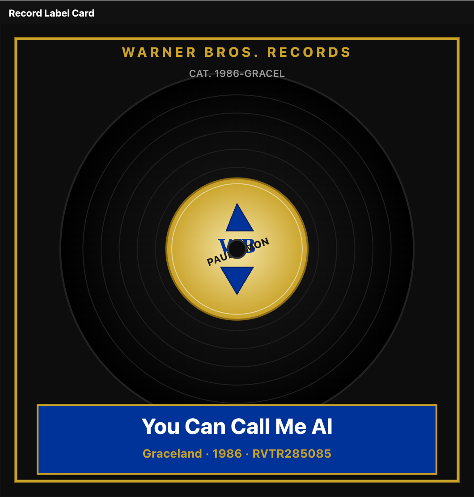
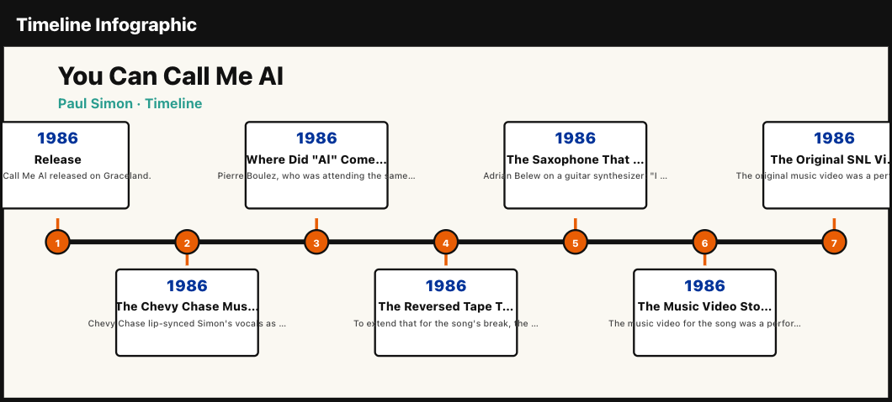
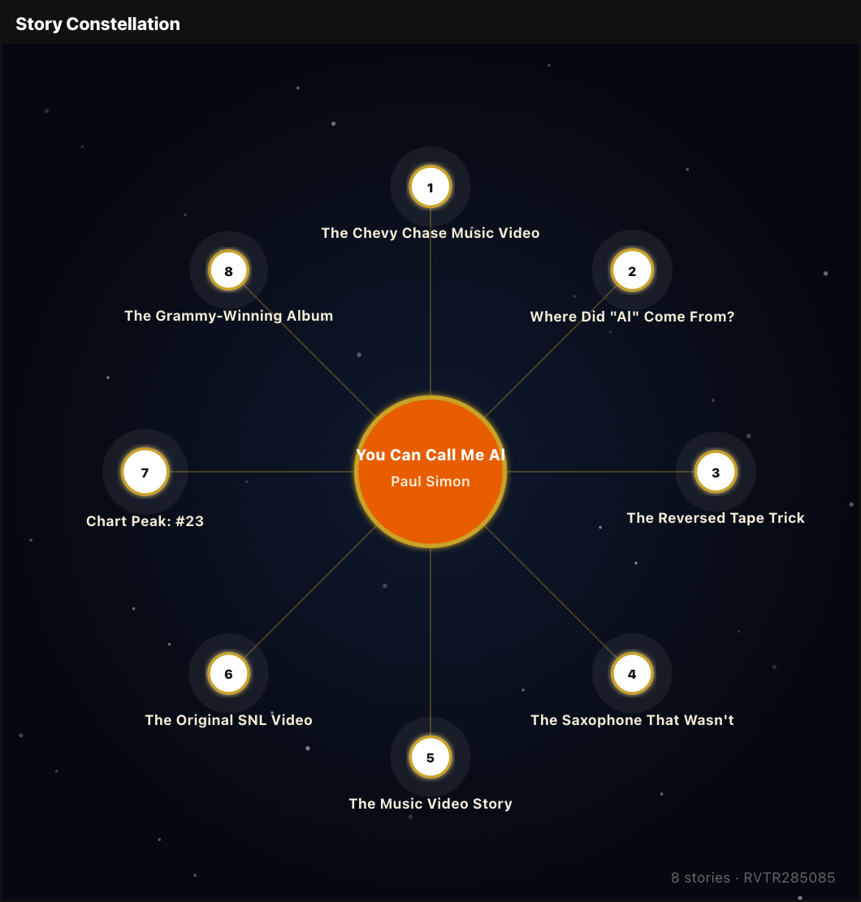
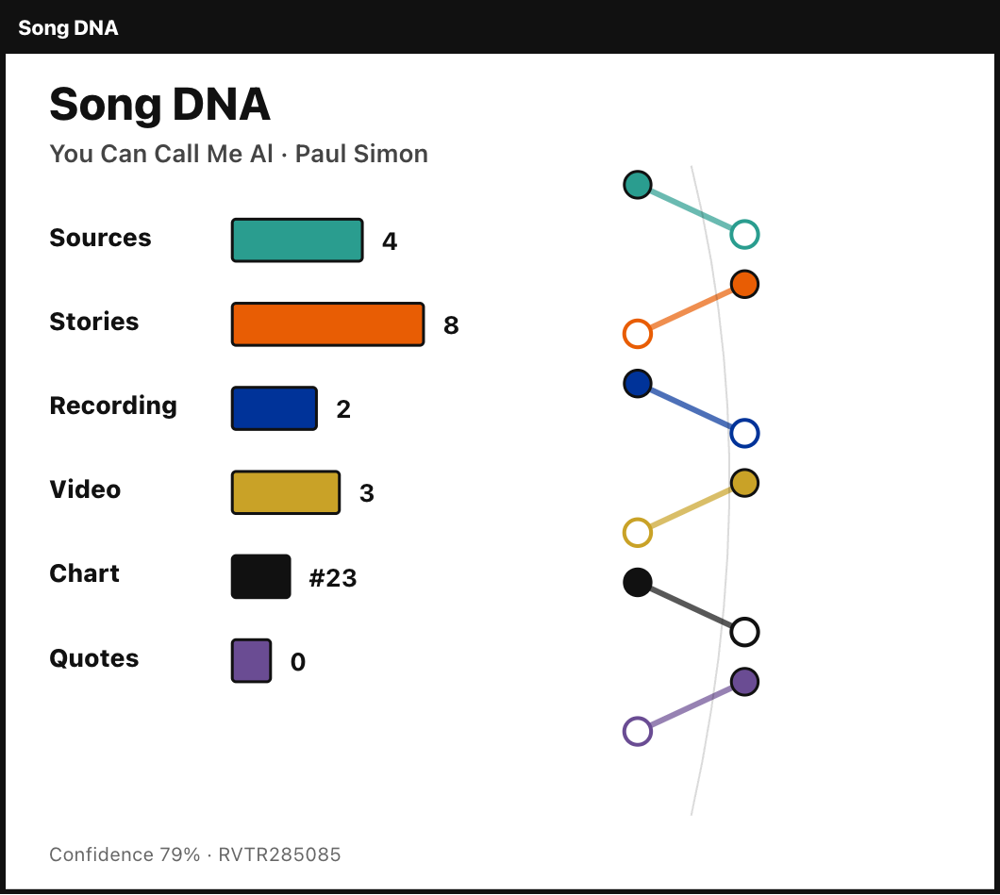
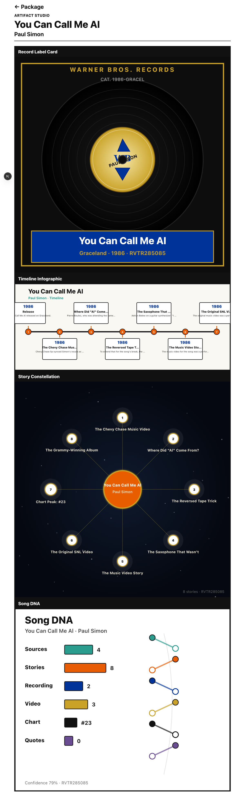

# Artifact Studio Audit — RVTR285085

**Song:** You Can Call Me Al · Paul Simon  
**Route:** `/ops/intelligence/package/RVTR285085/artifacts`  
**Date:** 2026-06-17

## Summary

Artifact Studio renders **four SVG artifacts** directly from existing package JSON. No readiness panels. No new package fields persisted — intel is derived at render time from `researchVault`, `storyCards`, and `metadata`.

---

## 1. Record Label Card

**Source data:**
- `intel.label` → Warner Bros. Records (from Wikipedia research vault excerpt)
- `intel.catalogNumber` → derived catalog
- `metadata.title`, `metadata.artist`, `metadata.albumTitle`, `metadata.year`, `rvtr`

**Styling:** Warner Bros. black vinyl, gold label, blue title strip, WB shield mark.



---

## 2. Timeline Infographic

**Source data:** `intel.timelineEvents` derived from metadata year, chart peak, and story card facts.

**Events rendered (RVTR285085):**
- 1986 — Release
- 1987 — Chart Peak (#23)
- Music video / recording / origin events from story cards



---

## 3. Story Constellation

**Source data:** `stories[]` from `storyCards` (8 discovered stories).

**Headlines in constellation:**
1. The Chevy Chase Music Video
2. Where Did "Al" Come From?
3. The Reversed Tape Trick
4. The Saxophone That Wasn't
5. The Music Video Story
6. The Original SNL Video
7. Chart Peak: #23
8. The Grammy-Winning Album



---

## 4. Song DNA

**Source data:** Package metrics computed at render time (not stored):

| Strand | Value | Source |
|--------|-------|--------|
| Sources | 4 | `researchVault.length` |
| Stories | 8 | story cards |
| Recording | 2 | recording story cards |
| Video | 3 | video/performance cards |
| Chart | #23 | `metadata.peakHot100` |
| Quotes | 0 | quote-category cards |
| Confidence | 79% | avg vault + card confidence |



---

## Full studio page



---

## Changes made (this audit)

- Removed READY/PARTIAL badges and Package Intel status grid from Artifact Studio
- Full-width vertical artifact renders — graphics only
- Warner Bros. styling on Record Label Card
- Timeline shows year + title + description per event
- Story Map renamed to **Story Constellation** (night-sky layout)
- Song DNA uses helix + metric bars from package metrics

## Capture command

```bash
RETROVERSE_OPS=1 npx tsx tools/intelligence/capture-artifact-audit.ts
```
