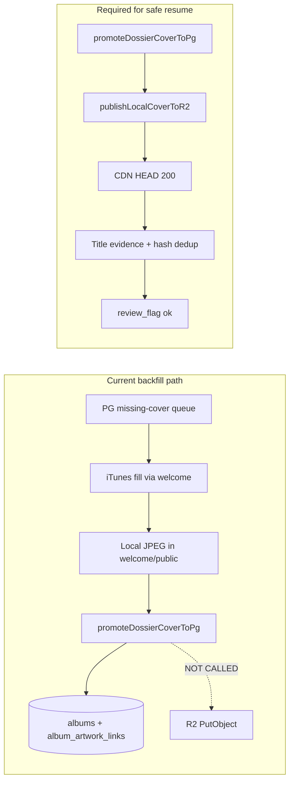

# Cover Backfill Safety Audit

**Generated:** 2026-06-17T13:36:00Z  
**Scope:** Live `npm run cover:backfill` session (`tools/run-cover-backfill.ts`)  
**Mode:** Read-only audit — no process or data changes made

---

## Executive answers

| # | Question | Answer |
| --- | --- | --- |
| 1 | Still actively processing? | **Yes** |
| 2 | Covers assigned in last 24h? | **227** canonical promotions (unique RVALs) |
| 3 | Writing canonical cover assignments? | **Yes** — PG `albums` + `album_artwork_links` |
| 4 | Publishing files to R2? | **No** — not wired into backfill pipeline |
| 5 | Can create Dance/Tango-style duplicates? | **Yes** — proven in corpus; no hash dedup |
| 6 | Should it be paused? | **Yes** — until R2 publish + integrity gates land |

---

## 1. Is it still actively processing?

**Yes.**

| Signal | Value |
| --- | --- |
| Process | `npm run cover:backfill` → `tsx tools/run-cover-backfill.ts` (PID 78948–78993, running since Mon ~20:00 local) |
| `state.json` `running` | `true` |
| `state.json` `paused` | `false` |
| `lastBatchAt` | `2026-06-17T13:33:55.394Z` |
| `lastBatchId` | `0324` (100 processed, 0 success, 100 failure) |
| `updatedAt` | `2026-06-17T13:34:00.813Z` |

The runner loops with a 5s inter-batch pause (`COVER_BACKFILL_BATCH_PAUSE_MS`). State updates within seconds of each batch finish — behavior is consistent with an active long-running session, not a stale lock file.

**Current queue posture:** 4,027 albums still missing covers; main cursor at position 189; retry queue 4,034 RVALs. Recent batches (0320–0321, 0324) are 0% success — the runner is grinding through hard iTunes misses, not idle.

---

## 2. How many covers assigned in the last 24 hours?

**227 successful canonical promotions** (rolling 24h window ending audit time).

| Metric | Last 24h |
| --- | ---: |
| Batches completed | 143 |
| Albums processed | 13,900 |
| Promotions succeeded | **227** |
| Failures | 13,673 |
| Batch success rate | 1.6% |
| Unique RVALs promoted | 227 (no duplicate RVAL in success set) |

**Calendar today (local midnight):** 40 covers acquired (`coversAcquiredToday` from `state.batchHistory`).

**Top failure reasons (24h):**

| Reason | Count |
| --- | ---: |
| `no_catalog_hit:low_album_similarity` | 9,577 |
| `no_catalog_hit:artist_mismatch` | 1,557 |
| `NOT_FOUND` | 1,078 |
| `no_catalog_hit:no_results` | 1,051 |
| `no_catalog_hit:score_below_threshold` | 274 |

Last batch with successes: **0323** (`2026-06-17T13:23:14Z`, 16 ok / 73 fail).

**Lifetime (this run):** 7,170 unique successes / 11,423 unique albums processed (62.8% unique success rate).

---

## 3. Is it writing canonical cover assignments?

**Yes.** On success, `processBackfillAlbum` → `promoteDossierCoverToPg`:

```4:46:lib/covers/backfill/promote-dossier.ts
export async function promoteDossierCoverToPg(input: {
  albumId: number;
  rval: string;
  canonicalCoverPath: string;
}): Promise<void> {
  // ...
  INSERT INTO album_artwork_links (..., source, confidence_score, review_flag)
  VALUES (..., 'dossier', 85, 'ok')
  ON CONFLICT ... DO UPDATE SET ...
  // ...
  UPDATE albums SET canonical_cover_path = $2 WHERE id = $1 AND canonical_cover_path is empty
```

Each promotion:

- Upserts `album_artwork_links` with `source = 'dossier'`, `confidence_score = 85`, `review_flag = 'ok'`
- Sets `canonical_cover_path`, `local_cover_path`, and `r2_cover_key` to the RVAL-scoped relative path
- Updates `albums.canonical_cover_path` when previously empty
- Appends to `staging_album_artwork_link_buffer`

Post-promote verification (`verifyCoverPromotedByRval`) only checks that the RVAL appears in `albums.canonical_cover_path` — **not** CDN delivery, title evidence, or image correctness.

**Corpus totals:** 17,730 `album_artwork_links` rows with `source = 'dossier'`.

---

## 4. Is it publishing files to R2?

**No — not in the cover backfill path.**

`run-batch-core.ts` ends at `promoteDossierCoverToPg` + RVAL verify. It does **not** import or call `publishLocalCoverToR2`.

`publishLocalCoverToR2` exists in `lib/covers/backfill/publish-r2.ts` and is used by the MB-ingest healing path (`lib/healing/mb-ingest/cover-r2-publish.ts`), which documents the gap explicitly:

> *"cover-apply + cover-backfill write local dossier files and promoteDossierCoverToPg only — R2 PutObject … is never called by MB/dossier backfill."*

**Evidence from recent promotions (last batch 0323 successes):**

| RVAL | Local file | CDN HEAD |
| --- | --- | ---: |
| RVAL817743 | exists | **404** |
| RVAL826427 | exists | **404** |
| RVAL959988 | exists | **404** |
| RVAL302034 | exists | **404** |
| RVAL379779 | exists | **404** |

Pattern: PG rows get `r2_cover_key` populated, local JPEG lands under `retroverse-welcome/public/retroverse/covers/RVAL…/`, but **no PutObject** runs — public CDN 404.

This is the same root cause flagged in `reports/intelligence/cover-integrity-audit.md` (`r2_publish_gap`: 12 quarantined albums).

**Counter-example (older promotions):** Fleetwood Mac *The Dance* / *Tango In The Night* both return CDN **200** — those files were published at some earlier point, not by the current backfill loop.

---

## 5. Can it create duplicate-cover situations (The Dance / Tango In The Night)?

**Yes — and the corpus already contains this exact failure mode.**

### Proven case: Fleetwood Mac

| Album | RVAL | Dossier path | Local SHA-256 (16) | Bytes | CDN |
| --- | --- | --- | --- | ---: | ---: |
| The Dance (1997) | RVAL768327 | `…/RVAL768327__fleetwood-mac__the-dance.jpg` | `c8f05ef24cb21849` | 120,209 | 200 |
| Tango In The Night (1987) | RVAL510721 | `…/RVAL510721__fleetwood-mac__tango-in-the-night.jpg` | `c8f05ef24cb21849` | 120,209 | 200 |

Same image bytes, different RVAL-scoped filenames, both `source = dossier`, both `review_flag = ok`, both `confidence_score = 85`. Flagged in cover-integrity audit as `same_artist_different_album_shared_image`.

### Why backfill can reproduce this

1. **Per-RVAL filenames, not per-image identity.** `acquireCoverViaWelcome` invokes iTunes fill with `ITUNES_FILL_RVAL` + artist + album. Each success writes a unique path under `retroverse/covers/RVAL…/` — no cross-album hash comparison.
2. **Fuzzy iTunes matching.** Failures show heavy `low_album_similarity` / `artist_mismatch` filtering, but successes that slip through can still be wrong-album art from iTunes search scoring.
3. **No post-download integrity gate.** Backfill does not run `album-cover-evidence` title checks or shared-hash quarantine before promoting to canonical `ok`.
4. **Verification is RVAL-path only.** `verifyCoverPromotedByRval` confirms the path contains the RVAL string — not that the JPEG depicts the correct album.

**24h duplicate scan:** No shared hashes detected *among the 227 successes in the last 24h* (each promoted file hashed independently). That does not mean the pipeline is safe — it means recent successes happened to get distinct bytes. The Dance/Tango case shows the mechanism works across time.

---

## 6. Should it be paused until cover-integrity fixes are complete?

**Yes — recommended.**

### Alignment with active intelligence hold

`reports/intelligence/cover-integrity-hold.json` is **active** (since `2026-06-17T13:28:41Z`):

> *"Cover integrity audit — album assignment gaps and CDN publish failures"*

That hold blocks **intelligence scaling** (`assertIntelligenceNotBlocked` in overnight build, top-100 validation, production pipeline). It does **not** gate `tools/run-cover-backfill.ts`. The cover backfill continues writing canonical `ok` assignments while intelligence work is paused for the same underlying integrity problems.

### Risks if left running

| Risk | Severity | Mechanism |
| --- | --- | --- |
| **R2 publish gap widens** | High | Every new success adds a canonical row + local file that public CDN cannot serve (404) |
| **Wrong art promoted as canonical** | Medium | iTunes fuzzy match → `review_flag = ok` without title-evidence or visual QA |
| **Duplicate-byte albums** | Medium | Same JPEG copied to multiple RVAL paths (Dance/Tango pattern) |
| **Repair debt compounds** | High | 17,730+ dossier links; each unpublishable assignment needs R2 backfill + possible re-acquire |

### Preconditions before resuming

1. **Wire `publishLocalCoverToR2`** immediately after `promoteDossierCoverToPg` in `run-batch-core.ts` (as already recommended in `cover-r2-publish.ts`).
2. **Enforce album-title evidence** — reuse `lib/cover-integrity/album-cover-evidence.ts` gates; weak matches → `review_needed`, not `ok`.
3. **Cross-album hash dedup** — block or quarantine when same SHA-256 appears on different RVALs for the same artist.
4. **CDN verify before canonical `ok`** — require HTTP 200 on public URL before final promotion (or auto-publish + verify in one transaction).
5. **Extend hold to backfill runner** — `state.paused = true` or runner checks `cover-integrity-hold.json` on each loop iteration.

### Pause mechanism (available, not engaged)

- Runner respects `state.paused` (exits loop when true).
- `npm run cover:backfill:safe` exists as alternate entry.
- **This audit did not pause the process.**

---

## Pipeline diagram (current vs required)



---

## Source files reviewed

| Path | Role |
| --- | --- |
| `tools/run-cover-backfill.ts` | Long-running batch loop |
| `lib/covers/backfill/run-batch-core.ts` | Acquire + promote (no R2) |
| `lib/covers/backfill/promote-dossier.ts` | Canonical PG writes |
| `lib/covers/backfill/publish-r2.ts` | R2 publish (unused by backfill) |
| `lib/covers/backfill/acquire-welcome.ts` | iTunes fill subprocess |
| `lib/covers/backfill/verify-rval.ts` | RVAL-only post-promote check |
| `lib/covers/backfill/queue.ts` | Missing-cover selection |
| `reports/cover_backfill/state.json` | Runner state |
| `reports/cover_backfill/batch_*.json` | Per-batch results |
| `reports/intelligence/cover-integrity-hold.json` | Intelligence pause flag |
| `reports/intelligence/cover-integrity-audit.md` | Related integrity findings |

---

## Bottom line

The cover backfill is **alive and writing canonical dossier assignments** at ~227/day in the current hard-queue phase, but it is **not publishing to R2** and **lacks the integrity gates** that motivated the intelligence hold. It can and has produced **wrong shared artwork across distinct albums** (Fleetwood Mac *The Dance* / *Tango In The Night*). **Pause until R2 auto-publish and cover-evidence quarantine are implemented** — otherwise every success increases invisible (CDN 404) or incorrect canonical cover debt.
