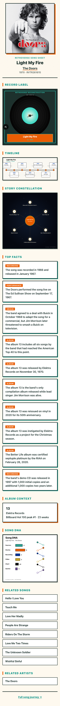
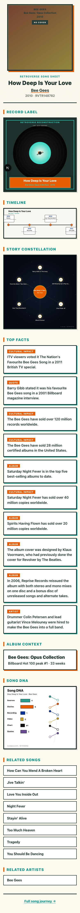
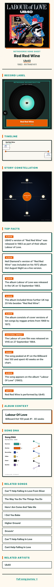
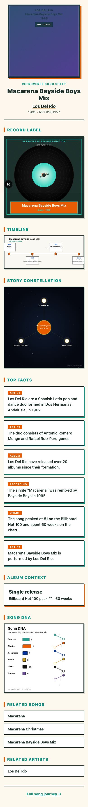
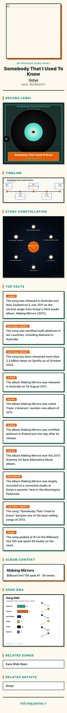
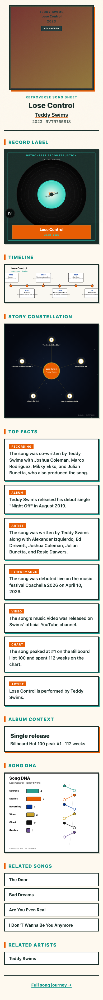

# Intelligence Validation Batch Report

Generated: 2026-06-17T02:22:17Z  
Command: `npm run intelligence:validation`  
Full log: `reports/intelligence/validation-batch/run.log`

## Verdict

**Pipeline scales for packages, facts, and runtime. Artifact label extraction is the blocker.**

| Criterion | Target | Result | Pass |
| --- | --- | --- | --- |
| Package completion | ≥90% | **100%** (9/9 unique songs published) | ✓ |
| Full artifact sets (4/4) | ≥90% | **44%** (4/9) | ✗ |
| Avg runtime | <120s | **42s** | ✓ |
| Fact extraction (≥3/song) | consistent | **9–15 facts/song** | ✓ |
| Manual intervention | none | fully automated | ✓ |

**Overall: FAIL** — safe to scale batch processing; fix record-label intel before new artifact types.

> Note: cohort query returned one duplicate RVTR (`RVTR765818` twice). Metrics below use **9 unique songs**. Query dedup fix is in `validation-batch.ts` for next run.

## Aggregate

| Metric | Value |
| --- | --- |
| Unique songs processed | 9 |
| Published | 9 |
| Failed | 0 |
| Research sources | 33 |
| Facts extracted | 107 |
| Stories generated | 44 |
| Avg runtime | 42s |
| Avg confidence | 83% |

## Per-Artifact Success (9 songs)

| Artifact | Ready | Rate |
| --- | --- | --- |
| Record Label | 6/9 | 67% |
| Timeline | 9/9 | 100% |
| Story Constellation | 9/9 | 100% |
| Song DNA | 7/9 | 78% |
| **All four** | **4/9** | **44%** |

**Bottleneck:** `intel.label` not extracted from research for ~33% of songs. Retroverse Reconstruction fallback still renders, but strict readiness check requires label metadata.

## Per Song

| Era | RVTR | Title | Artist | Runtime | Sources | Facts | Stories | Conf | Label | Time | Stories | DNA |
| --- | --- | --- | --- | --- | --- | --- | --- | --- | --- | --- | --- | --- |
| 1967 | RVTR261615 | Light My Fire | The Doors | 42s | 4 | 15 | 6 | 81% | ✓ | ✓ | ✓ | ✓ |
| 1976 | RVTR189191 | A Fifth of Beethoven | Walter Murphy | 27s | 3 | 12 | 4 | 84% | — | ✓ | ✓ | ✓ |
| 1977 | RVTR148782 | How Deep Is Your Love | Bee Gees | 42s | 4 | 14 | 6 | 81% | ✓ | ✓ | ✓ | ✓ |
| 1984 | RVTR461411 | Red Red Wine | UB40 | 28s | 3 | 9 | 4 | 85% | ✓ | ✓ | ✓ | — |
| 1995 | RVTR961157 | Macarena | Los Del Rio | 9s | 2 | 6 | 3 | 90% | — | ✓ | ✓ | ✓ |
| 2000 | RVTR037060 | All I Want For Christmas Is You | Mariah Carey | 42s | 4 | 12 | 4 | 82% | ✓ | ✓ | ✓ | — |
| 2011 | RVTR563439 | Party Rock Anthem | LMFAO | 57s | 4 | 15 | 6 | 83% | ✓ | ✓ | ✓ | ✓ |
| 2012 | RVTR521711 | Somebody That I Used To Know | Gotye | 50s | 4 | 12 | 6 | 83% | ✓ | ✓ | ✓ | ✓ |
| 2023 | RVTR765818 | Lose Control | Teddy Swims | 83s | 4 | 12 | 5 | 78% | — | ✓ | ✓ | ✓ |

## Song Sheet Screenshots

### Light My Fire — The Doors (1967)

### A Fifth of Beethoven — Walter Murphy (1976)

### How Deep Is Your Love — Bee Gees (1977)

### Red Red Wine — UB40 (1984)

### Macarena — Los Del Rio (1995)

### All I Want For Christmas Is You — Mariah Carey (2000)

### Party Rock Anthem — LMFAO (2011)

### Somebody That I Used To Know — Gotye (2012)

### Lose Control — Teddy Swims (2023)

## Recommendation

1. **Scale batch processing** — 42s avg, 100% publish rate, facts/stories reliable.
2. **Before new artifact types** — improve label extraction in `package-intel.ts` (pattern match from Wikipedia excerpts).
3. **Re-run validation** after label fix: `npm run intelligence:validation`

## URLs

- RVTR261615 → http://localhost:3000/rvtr/RVTR261615/song-sheet
- RVTR189191 → http://localhost:3000/rvtr/RVTR189191/song-sheet
- RVTR148782 → http://localhost:3000/rvtr/RVTR148782/song-sheet
- RVTR461411 → http://localhost:3000/rvtr/RVTR461411/song-sheet
- RVTR961157 → http://localhost:3000/rvtr/RVTR961157/song-sheet
- RVTR037060 → http://localhost:3000/rvtr/RVTR037060/song-sheet
- RVTR563439 → http://localhost:3000/rvtr/RVTR563439/song-sheet
- RVTR521711 → http://localhost:3000/rvtr/RVTR521711/song-sheet
- RVTR765818 → http://localhost:3000/rvtr/RVTR765818/song-sheet
