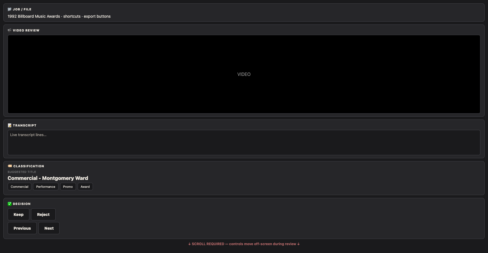
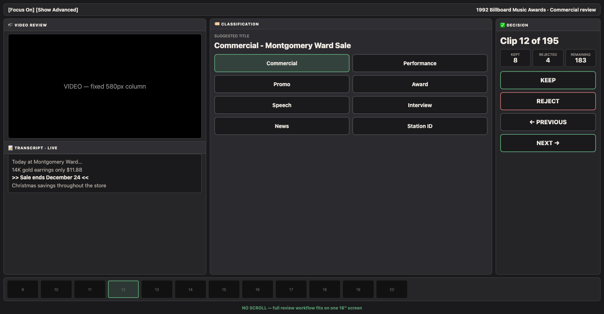

# Media Lab DJ Deck Layout

## Before (stacked vertical focus mode)

Single-column zones stacked vertically. Reviewing 195 clips requires scrolling; Keep/Reject/Next move off-screen.

## After (three-column DJ deck)

Fixed workspace for 16" MacBook Pro (1728×900):

- **Left:** Video (580px) + live transcript
- **Center:** Suggested title + 8 type toggles
- **Right:** Clip progress + Keep/Reject + Previous/Next
- **Bottom:** Horizontal clip filmstrip with thumbnails

Job path, export, metrics, OCR, and merge tools live under **Show Advanced**.

Mockup screenshots (ops PIN blocks live capture). Reload `1992-billboard-music-awards` in Focus Mode to verify in-app.
