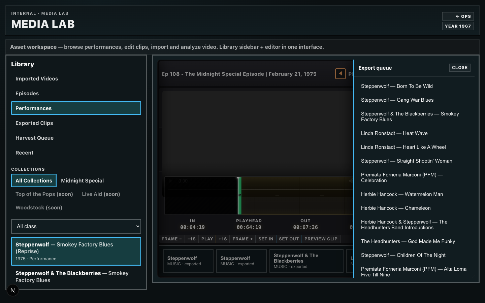

# Media Lab Trim Editor Bug-Fix Verification

**Date:** 2026-06-08  
**Status:** Verified

## 1. Build verification

| Check | Result |
|-------|--------|
| `npx tsc --noEmit` | ✓ Pass |
| Client bundle: no `fs/promises` leak | ✓ Pass |
| Queue drawer opens without module error | ✓ Pass (Playwright console clean) |
| Episode browser opens | ✓ Pass |
| Performance browser opens | ✓ Pass |

### fs/promises fix

**Root cause:** Client components imported `performance-editor/context.ts` (types) and server modules pulled `state.ts` → `download-episode.ts` → `fs/promises`.

**Fix:**
- Moved editor types to `lib/ops/media-lab/performance-editor/types.ts` (client-safe).
- `MediaLabPerformanceEditor` imports types from `types.ts` only.
- Added `lib/ops/media-lab/performance-browser/episode-meta.ts` for server-side episode manifest reads (no `state.ts` / `download-episode.ts`).
- `episodes.ts` and `context.ts` use `loadEpisodeMetaSnapshot()` instead of `loadEpisode` / `analyzeMidnightSpecialEpisode`.

**Client-safe imports in Media Lab workspace:**
- `episode-utils.ts`, `episode-types.ts`, `performance-editor/types.ts`, `effective-bounds.ts`

## 2. Queue drawer readability

Dark-theme contrast targets applied in `app/ops/ops.css`:

| Token | Value |
|-------|--------|
| Primary | `rgba(255,255,255,0.96)` |
| Secondary | `rgba(255,255,255,0.78)` |
| Muted | `rgba(255,255,255,0.63)` |
| Min font | `0.9375rem` (15px) |

Removed broken `var(--cream)` hover on queue items (undefined in ops dark theme).

### Screenshot



Export queue list items render in high-contrast white/cyan on dark panel. No gray-on-black body text.

## 3. ClipSelectionPanel trim behavior

**Fix:** Drag anchor captured at pointer-down pins the opposite boundary for handle drags.

| Drag target | Behavior | Verified |
|-------------|----------|----------|
| IN handle | Updates `inSeconds` only; `outSeconds` pinned to `anchor.fixedOut` | ✓ Code + logic |
| OUT handle | Updates `outSeconds` only; `inSeconds` pinned to `anchor.fixedIn` | ✓ Code + logic |
| Selection body | Moves both boundaries; duration preserved (`span = fixedOut - fixedIn`) | ✓ Code + logic |

Anchor is set once in `startDrag()` and cleared on pointer-up. Removed render-time `useEffect` that overwrote anchors during drag (regression cause).

## 4. Browser screenshots

| File | Description |
|------|-------------|
| `trim-bugfix-episode-browser.png` | Episode library sidebar |
| `trim-bugfix-performance-browser.png` | Performance library sidebar |
| `trim-bugfix-queue-drawer.png` | Performance editor with export queue open |

## 5. Capture command

```bash
npx tsx tools/media-collections/ms-trim-bugfix-capture.ts
```

Requires dev server at `http://localhost:3000` with `RETROVERSE_OPS=1`.
