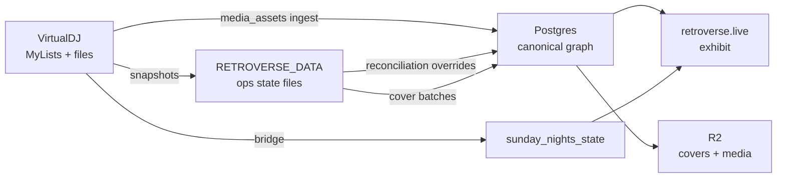

# Retroverse Ops Workflow Audit

**Date:** 2026-06-15  
**Based on:** `reports/ops-architecture-audit.md`, operating board, code paths, git activity  
**Method:** Workflow-first analysis — ignores current navigation labels and directory cards  
**Operator model:** Bob — DJ at the console; VirtualDJ + local media are source of truth; Retroverse is exhibit + reconciliation layer

---

## Executive summary

Retroverse operator work falls into **five real workflows**, not thirty-seven feature pages:

| Workflow | Cadence | Canonical entry (today) |
|----------|---------|-------------------------|
| **Live show** | Daily (event nights) | `/ops/sunday-nights` + VDJ bridge |
| **Library health** | Weekly | `/ops/media-sync` → `/ops#year-match` |
| **Show prep** | Weekly before SN | `/ops/show-builder` → `/ops/year/{y}` → `/ops/sunday-nights` |
| **Graph enrichment** | Weekly / monthly | Cover backfill → review → fix (ops + CLI) |
| **Event marketing** | Monthly / per event | Event Control → Content Creator → Passes |

Current navigation **scatters each workflow across many routes** and lists **6 broken destinations** that cannot be steps in any workflow. This report maps tasks, data, dependencies, and proposes workflow-shaped ops IA.

---

## Operator truth (evidence)

From `docs/RETROVERSE_PROJECT_CONTEXT.md` and operating board priority #2:

- **Play path:** VirtualDJ → local MP4/VDJ database → bridge → public now playing
- **Graph path:** Postgres canonical entities (RVTR/RVAL/RVAR) enriched from VDJ exports, cover batches, healing (gated)
- **Public path:** retroverse.live exhibit — judged by `npm run smoke:public-search`, not ops UI
- **Sunday Nights:** recurring live event; 2026-06-15 production incident showed live state must be cleared via `PATCH /api/ops/sunday-nights` — ops is operationally real

---

## Task inventory

### 1. Daily tasks

| Task | Starting page | Next page(s) | Data produced | Dependencies |
|------|---------------|--------------|---------------|--------------|
| **Run Sunday Nights live show** | VirtualDJ + `tools/live-bridge` (or `npm run live-now-playing`) | `/ops/sunday-nights` (monitor/clear/manual go-live) | `sunday_nights_state.live` (RVTR, artist, title, filepath, deck) | PG `sunday_nights_state`, bridge secret, VDJ network control |
| **Clear live state after show** | `/ops/sunday-nights` → Clear | Verify `/sunday-nights` + `/api/sunday-nights/current` | `currentTrackId: null`, `live: null` | Ops PIN cookie |
| **Toggle event mode** (homepage → SN redirect) | `/ops/sunday-nights` (or wrongly split: Event Control) | Public `/` behavior | `sunday_nights_state.eventMode` | Same store as live |
| **Check bridge health** | `/ops/live` (should be panel on SN) | — | Read manifest PID, VDJ port | `RETROVERSE_DATA/live/` manifest |
| **Review pass registrations** | `/ops/pass-registrations` | Export CSV if needed | Read `collector_pass_registrations` | Postgres |
| **Production deploy verify** (not ops UI) | Terminal: `npm run smoke:public-search` | — | Pass/fail smoke report | Production URL |
| **Ops entry** | `/internal/ops-pin` | Any `/ops/*` | `retroverse_ops_gate` cookie | `RETROVERSE_OPS=1` |

**Daily reality:** On non-show days, daily ops may be **zero UI** — only public smoke on deploy. On show nights, **Sunday Nights is the only mandatory daily workflow**.

---

### 2. Weekly tasks

| Task | Starting page | Next page(s) | Data produced | Dependencies |
|------|---------------|--------------|---------------|--------------|
| **VDJ ↔ R2 inventory check** | `/ops/media-sync` | `/ops/acquisition` if gaps | Read counts: missing R2, unmatched media | Postgres `media_assets`, `media_track_links` |
| **Chart ↔ VDJ reconciliation** | `/ops` (`#year-match`) | Modal review → state file | `OpsMatchOverride` → `RETROVERSE_DATA/ops/reconciliation-state.json` | Postgres Hot 100 + media links; loads via `/api/ops/year-match` |
| **Export acquisition worklist** | `/ops/acquisition` | External: YouTube download / VDJ import | CSV / playlist export | Focus year 1967 (`OPS_FOCUS_YEAR`) |
| **Pre-show playlist build** | `/ops/show-builder` | VirtualDJ (import `.vdjplaylist`) | Set state, exported playlist file | VDJ MyLists scan |
| **Match playlist songs to RVTR** | `/ops/sunday-nights` | Match modal → save alias | `rvtr-aliases`, live selection | Sunday playlist snapshots, search/match API |
| **Refresh Sunday Nights inventory** | `/ops/sunday-nights` → System panel → Refresh | Validate → Deploy (local only writes snapshots) | `ops/sunday-nights/snapshots/*`, validation report | Local VDJ MyLists; production read-only snapshots |
| **Classify owned video for event year** | `/ops/year/1967` (or 1978/1992) | — (optional: sorting/rvtags routes) | `year-workspace/{year}/review-state.json` per-row classification + tags | PG + VDJ paths, pilot years |
| **Cover batch review** | `/ops/review/covers` | CLI: `npm run cover:retrain` → `cover:next-batch` | `training_decisions.json`, next `repair_batch_*.csv` | Training batch files on disk |
| **Monitor cover backfill** | `/ops/covers/backfill` | CLI: `npm run cover:backfill:once` | Backfill status, R2 cover keys | Postgres albums, backfill queue |

**Weekly rhythm (evidence):** Operating board describes cover training as **~10 rows per batch**; media sync reads **7-day** new video window; year-match + acquisition share reconciliation model.

---

### 3. Monthly tasks

| Task | Starting page | Next page(s) | Data produced | Dependencies |
|------|---------------|--------------|---------------|--------------|
| **Configure homepage for event** | `/ops/event-control` | Public `/` | `event-control/config.json` (hero, featured years, mode) | File store |
| **Generate event VIP pass art** | `/ops/content-creator/create` | `/ops/content-creator` library | Credential PNGs, library entries, job records | RVBR profiles seeded (`rvbr:seed`) |
| **Print numbered passes** | `/ops/passes` | Physical print at pub | PDF via `POST /api/ops/passes` | Event metadata |
| **Deep year-universe review** | `/ops/year/{pilot}` | `/ops/show-builder` | Review state, performance classes | Sustained pilot work (1967/78/92) |
| **TV archive acquisition** | `/ops/media-collections` | `/ops/media-collections/midnight_special` | Episode manifests, downloads on disk | `RETROVERSE_DATA/media-collections/` |
| **Editorial clip harvest** | `/ops/media-lab` | Export queue | Segment labels, harvest exports | Downloaded episodes |
| **Search index refresh** (CLI) | Terminal: `npm run search:refresh-entities` | — | `search_entities` matview | Postgres |
| **Pre-event system validate + deploy** | `/ops/sunday-nights` System panel | Git push / Vercel | Snapshot bundle in repo, production deploy | Local refresh → commit → deploy hook |

**Monthly reality:** Tied to **Sunday Nights event cycle** (passes, homepage story, credential art) and **slower graph/cover progress**, not daily console use.

---

### 4. Rare tasks

| Task | Starting page | Next page(s) | Data produced | Dependencies |
|------|---------------|--------------|---------------|--------------|
| **Apply album-link healing** | `/ops/healing` | Approve per candidate | Graph edge changes | `RETROVERSE_HEALING_APPLY=1` |
| **Apply cover corrections** | `/ops/covers/corrections` | — | Canonical album cover promotion | `RETROVERSE_COVER_APPLY=1` |
| **Healing review (CLI)** | `npm run healing:review` | `/ops/healing` | Review artifacts | PG graph |
| **MusicBrainz wave apply** | `npm run mb:wave-100:apply` | — | Batch graph fixes | Gated scripts |
| **Creative Lab style experiments** | `/ops/creative-lab` | Export package | Project assets on disk | Parallel to Content Creator |
| **Cross-year artist discovery** | `/ops/crossroads` | — | Read-only insight | PG video universe |
| **Crate Builder AI experiment** | `/ops/crate-builder` | — | Crate piles state | Experimental |
| **Content Creator debug** | `/ops/content-creator/debug/*` | — | POC outputs | Dev only |
| **Producer timeline** (unwired) | — | — | `producer/timeline.json` | `YearWorkspaceProducerView` never mounted |

---

## A. Current workflow diagram

How an operator **actually navigates today** (feature directory drives path — fragmented):

```mermaid
flowchart TB
  subgraph entry [Entry]
    PIN["/internal/ops-pin"]
    OPS["/ops directory"]
    PIN --> OPS
  end

  subgraph daily [Daily - Show Night]
    VDJ["VirtualDJ + live-bridge"]
    SN["/ops/sunday-nights"]
    LIVE["/ops/live"]
    PUB["/sunday-nights public"]
    VDJ -->|POST bridge| SN
    OPS --> SN
    OPS --> LIVE
    SN --> PUB
    LIVE -.->|duplicate read| SN
  end

  subgraph weekly [Weekly - Library]
    OPS --> MS["/ops/media-sync"]
    OPS --> YM["/ops#year-match"]
    OPS --> ACQ["/ops/acquisition"]
    MS --> ACQ
    YM --> ACQ
  end

  subgraph weekly2 [Weekly - Show Prep]
    OPS --> SB["/ops/show-builder"]
    OPS --> YW["/ops/year/1967|1978|1992"]
    OPS --> RT["/ops/rvtags-review/1967"]
    OPS --> SORT["/ops/year/.../sorting"]
    SB --> SN
    YW --> RT
    YW --> SORT
  end

  subgraph weekly3 [Weekly - Covers]
    OPS --> BF["/ops/covers/backfill"]
    OPS --> CR["/ops/review/covers"]
    BF --> CR
    CR --> CLI["CLI cover:retrain / next-batch"]
  end

  subgraph monthly [Monthly - Event]
    OPS --> EC["/ops/event-control"]
    OPS --> CC["/ops/content-creator"]
    OPS --> PASS["/ops/passes"]
    OPS --> REG["/ops/pass-registrations"]
    EC --> CC --> PASS
  end

  subgraph dead [Broken / Non-workflow]
    OPS -->|404| HUB["/ops/hub"]
    OPS -->|404| INFRA["/ops/infrastructure"]
    OPS -->|404| REC["/ops/recovery"]
    OPS -->|404| RVBR["/ops/rvbr"]
    OPS -->|404| CONT["/ops/continuity"]
    OPS -->|404| INT["/ops/integrity"]
    OPS -->|404| TOTP["/ops/media-collections/top-of-the-pops"]
  end

  subgraph orphan [Rare / Orphan]
    OPS --> HEAL["/ops/healing"]
    OPS --> CL["/ops/creative-lab"]
    OPS --> CB["/ops/crate-builder"]
    OPS --> XR["/ops/crossroads"]
    OPS --> DEBUG["/ops/content-creator/debug"]
    OPS --> PROD["YearWorkspaceProducerView - no route"]
  end
```



**Current workflow problems:**

1. **No single "today" screen** — show night touches SN, LIVE, maybe Event Control, public URL.
2. **Show prep split across 5 routes** (show-builder, year workspace, rvtags, sorting, sunday-nights).
3. **Library health starts at directory**, not a checklist.
4. **Broken cards** look like workflow steps but terminate at 404.
5. **Producer / recovery / integrity** documented or listed but not reachable.

---

## B. Recommended workflow diagram

Ops organized by **what Bob is trying to finish**, not tool category:

```mermaid
flowchart TB
  subgraph today [TODAY - Live & Door]
    SN1["Sunday Nights Cockpit\n/live + bridge + playlist + system"]
    REG1["Pass Registrations"]
    PUB1["Public /sunday-nights"]
    SN1 --> PUB1
    SN1 --> REG1
  end

  subgraph health [WEEKLY - Library Health]
    MS1["Media Sync"]
    YM1["Year Match"]
    ACQ1["Acquisition Export"]
    MS1 --> YM1 --> ACQ1
  end

  subgraph prep [WEEKLY - Show Prep]
    SB1["Set Builder"]
    YW1["Year Workspace\ngrid + tags + sorting tabs"]
    SN2["Sunday Nights\nmatch + validate"]
    SB1 --> YW1 --> SN2
  end

  subgraph graph [WEEKLY/MONTHLY - Graph Enrichment]
    BF1["Cover Backfill"]
    CR1["Cover Review"]
    FX1["Cover Fix - gated"]
    BF1 --> CR1 --> FX1
  end

  subgraph event [MONTHLY - Event Marketing]
    EC1["Event Control\nhomepage only"]
    CC1["Content Creator"]
    PS1["Pass Generator"]
    EC1 --> CC1 --> PS1
  end

  subgraph archive [RARE - Archive Acquisition]
    MC1["Media Collections"]
    ML1["Media Lab"]
    MC1 --> ML1
  end

  subgraph gated [RARE - Gated Graph Surgery]
    HL1["Healing Console"]
  end

  health --> prep
  prep --> today
  graph -.->|improves exhibits| today
  event --> today
```

### Recommended landing: workflow switcher (replaces feature directory)

| Mode | Routes | When |
|------|--------|------|
| **Today** | Sunday Nights cockpit, Pass Registrations | Show night ±24h |
| **Library** | Media Sync → Year Match → Acquisition | Weekly maintenance |
| **Show prep** | Set Builder → Year Workspace → Sunday Nights | Before next SN |
| **Graph** | Cover Backfill → Review → Fix | Ongoing enrichment |
| **Event** | Event Control → Content Creator → Passes | New event month |
| **Archive** | Media Collections → Media Lab | Long-form TV work |
| **Surgery** | Healing | Rare, gated |

`/ops` becomes a **workflow dashboard** (status + next action), not a flat tool catalog.

---

## C. Routes that are never part of a workflow

These cannot be a step in any real operator workflow today (broken, duplicate-only, or dead code):

| Route | Reason |
|-------|--------|
| `/ops/hub` | No page — duplicate of `/ops` intent |
| `/ops/infrastructure` | No page |
| `/ops/recovery` | No page — healing is separate |
| `/ops/continuity` | No page — data only inside healing |
| `/ops/integrity` | No page (`app/integrity` also absent) |
| `/ops/rvbr` | No page — RVBR is lib embedded in Content Creator |
| `/ops/media-collections/top-of-the-pops` | 404 — collection not seeded |
| `/ops/live#certification` | Anchor does not exist |
| `/ops/covers` | Redirect only |
| `/ops/covers/train` | Redirect only |
| `/ops/content-creator/generations` | Redirect only |
| `/ops/content-creator/classic` | Redirect to debug |
| `/ops/content-creator/v2-poc` | Redirect to debug |
| `/ops/content-creator/rvbr-validation` | Redirect to debug |
| `/ops/media-lab/performances` | Redirect only |
| `YearWorkspaceProducerView` | Component exists, **no route** — workflow doc (`docs/producer-workspace-concept.md`) describes fiction |

**Public duplicate (not ops, but not a workflow step):**

| Route | Reason |
|-------|--------|
| `/live` | Same payload as `/sunday-nights` — optional alias only |

---

## D. Routes that should become secondary tools

Still useful, but **not workflow entry points** — linked from a primary step or "Advanced" drawer:

| Route | Primary workflow | Secondary role |
|-------|------------------|----------------|
| `/ops/live` | Today | Bridge health panel inside Sunday Nights |
| `/ops/covers/embed` | Graph | Discogs lookup popup from Cover Review/Fix |
| `/ops/rvtags-review/[year]` | Show prep | Tab inside Year Workspace |
| `/ops/year/[year]/sorting` | Show prep | Tab inside Year Workspace (until retired) |
| `/ops/media-collections/midnight-special/review` | Archive | Deep link from Media Lab MS browser |
| `/ops/healing` | Surgery | Linked from Graph when review queue flags continuity |
| `/ops/creative-lab` | Event | Advanced styles until merged into Content Creator |
| `/ops/crossroads` | — | Analytics sidebar for multi-year prep |
| `/ops/crate-builder` | — | Experiment fork of Set Builder |
| `/ops/content-creator/debug/*` | — | Engineering diagnostics |
| `/ops#year-match` | Library | Embedded on Library workflow page (not only hub scroll) |
| CLI scripts (`cover:*`, `healing:*`, `mb:*`) | Graph / Surgery | Power tools beside ops UI — same workflow, no separate route |

---

## E. Candidate routes for archive

Safe to **remove from primary IA** and eventually retire (keep redirects where bookmarks exist):

| Route | Archive rationale |
|-------|-------------------|
| `/ops/crate-builder` | "Experiment B" — superseded by Set Builder |
| `/ops/crossroads` | In `OPS_LIKELY_ABANDONED_ROUTES`; overlaps year workspace |
| `/ops/year/[year]/sorting` | Explicitly temporary; merge into year workspace |
| `/ops/content-creator/debug` + children | Dev-only per page copy |
| `/ops/content-creator/classic`, `v2-poc`, `rvbr-validation` | Redirect chains into debug |
| `/ops/covers`, `/ops/covers/train` | Legacy URLs |
| `/ops/content-creator/generations` | Legacy URL |
| `/ops/creative-lab` | After Content Creator absorbs style desk |
| `/ops/live` | After merge into Sunday Nights cockpit |
| `/ops/healing` | Demote to Surgery — low frequency, last touch 2026-05-26 |
| Directory cards: hub, infrastructure, recovery, rvbr, continuity, integrity, TOTP | Broken — delete from directory |
| `YearWorkspaceProducerView` | Unmounted — delete or rebuild as tab |

**Keep archived URLs as redirects for 1 release** if external links exist.

---

## Workflow → route matrix

| Workflow step | Cadence | Canonical route (recommended) | Current scattered routes |
|---------------|---------|------------------------------|--------------------------|
| Live show | Daily | Sunday Nights cockpit | sunday-nights, live, bridge CLI |
| Clear / event mode | Daily | Same cockpit | sunday-nights (+ duplicate event-control concern) |
| Pass registrations | Daily (event) | pass-registrations | ✓ |
| Media sync | Weekly | Library workflow step 1 | media-sync |
| Year match | Weekly | Library workflow step 2 | ops#year-match |
| Acquisition export | Weekly | Library workflow step 3 | acquisition |
| Set build | Weekly | Show prep step 1 | show-builder |
| Year classify/tag | Weekly | Show prep step 2 | year/*, rvtags-review, sorting |
| Playlist match + validate | Weekly | Show prep step 3 | sunday-nights, system panel |
| Cover backfill | Weekly | Graph step 1 | covers/backfill + CLI |
| Cover review | Weekly | Graph step 2 | review/covers + CLI |
| Cover fix | Rare | Graph step 3 | covers/corrections |
| Homepage story | Monthly | Event step 1 | event-control |
| Credential art | Monthly | Event step 2 | content-creator, create |
| Print passes | Monthly | Event step 3 | passes |
| TV acquisition | Rare | Archive | media-collections, media-lab |
| Graph healing | Rare | Surgery | healing + CLI |

---

## Dependencies graph (data plane)



**Workflow rule:** Any task that **writes** canonical state needs PG (or explicit file store path). Show-night tasks need `sunday_nights_state`. Cover/healing tasks need gating env vars for apply.

---

## Design principles (workflow-first ops)

1. **One cockpit per workflow** — Today has exactly one entry screen.
2. **Tabs over routes** — Year Workspace tags/sorting are tabs, not left-nav siblings.
3. **CLI + UI are one workflow** — Cover review UI and `npm run cover:retrain` are sequential steps, not separate products.
4. **No 404 in workflow** — Directory cards must resolve or be removed.
5. **VDJ is upstream** — Every workflow diagram starts at VirtualDJ or Postgres ingest, not at `/ops`.
6. **Public smoke is not ops** — Deploy verification stays in terminal/CI, not the ops directory.

---

## Next steps (documentation only — no code in this pass)

1. Replace `OPS_DIRECTORY_SECTIONS` with **workflow modes** (Today, Library, Show prep, Graph, Event, Archive, Surgery).
2. Merge `/ops/live` into Sunday Nights cockpit per architecture audit.
3. Collapse year prep to **one route + tabs**.
4. Remove broken cards from directory.
5. Wire workflow dashboard on `/ops` showing: live status, media sync warnings, year-match backlog, cover batch queue, next show date.

---

## Evidence

| Source | Path |
|--------|------|
| Architecture audit | `reports/ops-architecture-audit.md` |
| Live consolidation | `reports/live-integration/live-consolidation-plan.md` |
| Cover batch workflow | `docs/RETROVERSE_OPERATING_BOARD.md` § Batch-learning |
| Producer concept (unwired) | `docs/producer-workspace-concept.md` |
| Sunday Nights system ops | `components/ops/sunday-nights/SundayNightsSystemPanel.tsx` |
| Reconciliation hub | `components/ops/OpsConsoleClient.tsx`, `lib/ops/load-ops-data.ts` |
| Creative Lab duplication | `reports/creative-lab/workstation-consolidation-audit.md` |

*End of workflow audit — no code was modified.*
