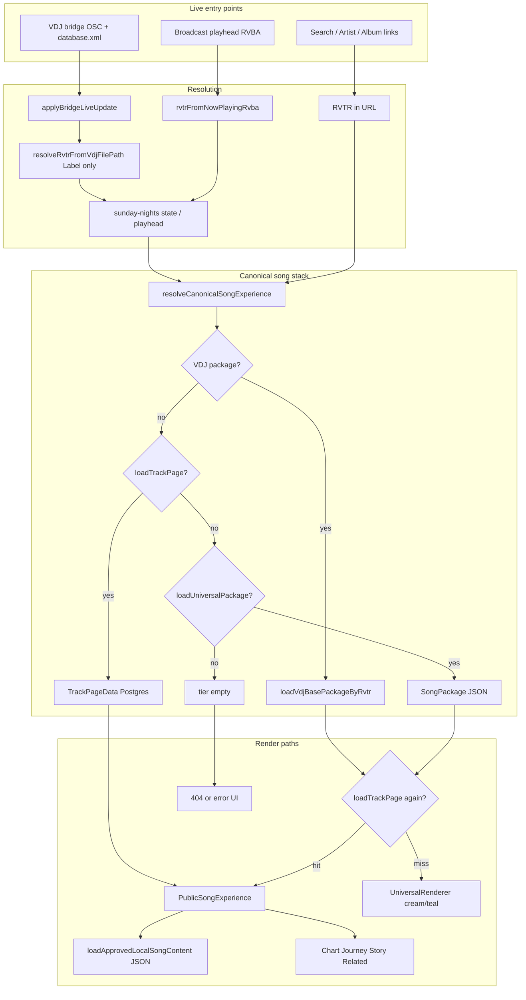

# Public Experience Stabilization — Phase 0 Audit

**Project:** Retroverse Public (`apps/live`, package `retroverse-live`)
**Date:** 2026-07-29
**Scope:** Inspection only — no files modified during this audit.

---

## 1. Executive Summary

The public site already has a canonical song destination (`/retroverse-2/song/[RVTR]`), a graph-backed track loader (`loadTrackPage`), and an Explorer design token system (`explorer-layout-v1-tokens.css`). However, **the same RVTR can render through three different UI stacks** depending on resolver tier and entry route: `PublicSongExperience` (full graph page), `UniversalRenderer` (VDJ/package card stack), or error/empty states.

The root cause of “more data from Artist page than Song page” is **not different Postgres data** — artist shelves use the same canonical IDs and link to `/retroverse-2/song/{RVTR}` — but **tier selection and render-path branching** in `resolveCanonicalSongExperience` plus **conditional section visibility** in `PublicSongExperience`.

VirtualDJ live resolution on the bridge path is **Label-only** (`RVTR######` in VDJ `<Tags Label>`). Richer matchers (path link, title+artist, chart-orbit, alias store) exist in ops code but are **not wired into the live bridge**.

External discovery exists for **YouTube and Wikipedia only**, and is currently **hidden when the graph has artist + album links** — the inverse of the product direction.

The smallest stable path forward: **one public song payload assembler** (`loadTrackPage` + VDJ metadata + approved local JSON + optional package cards), **one render component** (`PublicSongExperience` with empty-section gating), **always-on external discovery**, and **homepage composition from existing `RetroverseLive2View` + Event Control config** — without touching Broadcast Mixer architecture.

---

## 2. Current Route Map

| Route | Route file | Page component | Primary loader(s) | Identifier | Resolver | Fallback |
|-------|------------|----------------|-------------------|------------|----------|----------|
| **Home** `/` | `apps/live/app/page.tsx` | `HomePage` | `buildPlayheadPayload`, `rvtrFromNowPlayingRvba`, `resolveCanonicalSongExperience`, `loadTrackPage` | Playhead RVTR (no URL param) | Broadcast RVBA → RVTR | `UniversalRenderer` → error main → `RetroverseLivePlayer` |
| **Song** `/retroverse-2/song/[rvtr]` | `apps/live/app/retroverse-2/song/[rvtr]/page.tsx` | `Retroverse2SongPage` | `resolveCanonicalSongExperience`, `loadTrackPage` | `RVTR######` | Same | `PublicSongExperience` if graph; else `UniversalRenderer`; else `notFound()` |
| **Artist** `/artist/[slug]` | `apps/live/app/artist/[slug]/page.tsx` | `ArtistPage` → `ArtistPageView` | `resolveCanonicalArtist`, `loadArtistPage`, `loadArtistCoverageSummary` | `RVAR######` (numeric ID redirects) | Postgres `artists.rvar` | `notFound()` or sparse empty shelves |
| **Album** `/album/[id]` | `apps/live/app/album/[id]/page.tsx` | `AlbumPage` → `AlbumPageView` | `resolveCanonicalAlbum`, `loadAlbumPage` | `RVAL######` | `album_external_keys` | `notFound()` |
| **Year** `/rv/[year]` | `apps/live/app/rv/[year]/page.tsx` | `RvYearPage` → `RvYearView` | `resolveCanonicalYear`, `loadRvYearChartHistory`, `enrichRvYearDestination` | 4-digit year (1950–2035) | Sync normalize | `notFound()` if no chart history |
| **Charts hub** `/retroverse-2/charts` | `apps/live/app/retroverse-2/charts/page.tsx` | `Retroverse2ChartsPage` → `ChartsHubClient` | None (static) | — | — | Static featured years |
| **Charts redirect** `/charts` | `apps/live/app/charts/page.tsx` | redirect only | `chartsQueryToRvPath` | `?year=&month=&week=` | — | → `/retroverse-2/charts` or `/rv/...` |
| **Search** `/search` | `apps/live/app/search/page.tsx` | `SearchPage` → `SearchClient` | API: `querySearchEntities`, `curateCatalogSearch` | Free text (≥2 chars) | Postgres entity index | Empty groups / 503 |

**Legacy aliases (redirect only):**

| Alias | File | Target |
|-------|------|--------|
| `/song/[rvtr]` | `apps/live/app/song/[rvtr]/page.tsx` | `/retroverse-2/song/{RVTR}` |
| `/track/[id]` | `apps/live/app/track/[id]/page.tsx` | `trackPageHref(rvtr)` after `loadTrackPage` |
| `/song/vdj/[key]` | `apps/live/app/song/vdj/[key]/page.tsx` | **Standalone** `UniversalRenderer` (no graph upgrade) |
| `/experience/[rvtr]` | `apps/live/app/experience/[rvtr]/page.tsx` | Published museum renderer; falls back to canonical song |

**Shared shell / theme imports:** Most routes use `Rv2PublicShell` → `components/retroverse-2/rv2-public-shell.css` (imports `components/explorer/explorer-layout-v1-tokens.css`). Root layout: `apps/live/app/layout.tsx`, `globals.css`, `public-mobile-width.css`.

**Route allowlist:** `lib/runtime/site-mode.ts` → `PUBLIC_ROUTE_PREFIXES`

---

## 3. Current Song-Data Flow Diagram



**Answer to “What does Retroverse know about this RVTR?”**

There is **no single assembler**. Data is gathered ad hoc across:

| Source | Loader / path | Used on public routes |
|--------|---------------|----------------------|
| Postgres graph | `lib/public/canonical-public-resolver.ts` → `resolveCanonicalTrack`; `lib/track/load-track-page.ts` → `loadTrackPage` | Song, Home, Artist/Album/Year enrichment |
| VDJ `database.xml` | `lib/ops/intelligence/vdj-database.ts`; `lib/universal-renderer/load-vdj-base.ts` | Song tier 1, `/song/vdj/[key]`, bridge |
| Bundled VDJ index | `lib/ops/intelligence/vdj-rvtr-index.ts` | VDJ fallback when XML unavailable |
| SongPackage JSON | `lib/universal-renderer/load-package.ts`; `lib/ops/intelligence/song-package-store.ts` | Song tier 3; ops/Collector/Editor/Director output |
| Approved local editorial | `lib/retroverse/song-content.ts` → `loadApprovedLocalSongContent` | `PublicSongExperience` only |
| Published experience | `lib/retroverse/renderer/load-public-experience.ts` | `/experience/[rvtr]` only |
| Patron experience (rich) | `lib/retroverse/experience/load-patron-experience.ts` | `loadHomepageDocument` (not mounted at `/`) |
| Bridge / playhead | `lib/bobos/presentation/store.ts`, `lib/home/public-current-song.ts` | Home, APIs |

---

## 4. Loader and Resolver Inventory

### Canonical resolvers (`lib/public/canonical-public-resolver.ts`)

| Function | Returns | Consumers |
|----------|---------|-----------|
| `resolveCanonicalTrack` | RVTR identity, artist, albums, chart relationships | `loadTrackPage` |
| `resolveCanonicalTracksBatch` | Batch track metadata + covers | Year, Artist, Search |
| `resolveCanonicalArtist` | RVAR identity | Artist page |
| `resolveLegacyArtistId` | Numeric → RVAR redirect | Artist page |
| `resolveCanonicalAlbum` | RVAL identity | Album page |
| `resolveCanonicalYear` | Normalized year | Year page |

### Song experience resolver (`lib/retroverse/experience/resolve-canonical-song.ts`)

```typescript
resolveCanonicalSongExperience(rvtr) →
  1. loadVdjBasePackageByRvtr(rvtr)  → tier "vdj"
  2. loadTrackPage(rvtr)             → tier "graph"
  3. loadUniversalPackage(rvtr)      → tier "package"
  4. tier "empty"
```

**Note:** File header comment and `Retroverse2SongPage` comment say “graph → package → VDJ”; **code executes VDJ first**.

### Track page payload (`loadTrackPage` → `TrackPageData`)

Fields: `rvtr`, `title`, `artistName`, `artistHref`, `releaseYear`, `peakHot100`, `chartWeeks`, `firstChartDate`, `coverUrl`, `primaryAlbum`, `albums[]`, `trajectoryWeeks[]`, `relatedTracks[]`, `chartRunLabel`, `rvYearHref`, `hasHot100`, `hasVdjMedia`, `resolverPath`, `loaderTimings`.

### Artist page (`lib/artist/load-artist-page.ts`, `load-artist-coverage-summary.ts`)

Coverage summary includes per-song: `rvtr`, `title`, `peakHot100`, `chartWeeks`, `firstChartYear`, `trackHref` (`trackPageHref`), `coverageStatus`. Song rows on artist page link to the **same canonical song URL** as search.

### Package / ops loaders (not on default public song path)

| Loader | Path | Role |
|--------|------|------|
| `loadSongPackage` | `lib/ops/intelligence/song-package-store.ts` | Collector/Editor/Director/Publisher pipeline |
| `loadPatronSongExperience` | `lib/retroverse/experience/load-patron-experience.ts` | Rich patron UI (homepage document) |
| `loadPublicExperience` | `lib/retroverse/renderer/load-public-experience.ts` | Published RVBR museum |
| `loadHomepageDocument` | `lib/home/load-homepage-document.ts` | Featured experience document model |

---

## 5. Route-Dependent Data Inconsistency — Likely Technical Cause

**Observed symptom:** A song appears sparse on the Song page but looks richer when reached from an Artist page.

**Likely causes (code-verified):**

1. **Multiple render stacks for the same RVTR**
   - Artist page shows **coverage summary** (peak, weeks, year) from `loadArtistCoverageSummary` — always visible on the artist shelf.
   - Song page may render **`UniversalRenderer`** (hero + credits cards only) when `resolveCanonicalSongExperience` returns `vdj` or `package` tier and `loadTrackPage` returns null (DB blip, or track not in `canonical_track_display`).
   - `/song/vdj/[key]` **never** upgrades to graph.

2. **VDJ tier wins over graph in resolver**
   - If VDJ Label has RVTR and a minimal VDJ package exists, resolver returns `tier: "vdj"` even when Postgres has full chart data.
   - `Retroverse2SongPage` mitigates by calling `loadTrackPage` again in the vdj/package branch — but Home and any caller that skips this upgrade see thinner content.

3. **Section gating is partial**
   - Chart Journey: hidden when `trajectoryWeeks.length === 0`.
   - Defining Moment + The Story: **always rendered**; `chartStory()` emits placeholder copy when no weeks (“Its chart record is still taking shape…”).
   - External links: **only shown when** `!track.artistHref || !primaryAlbum?.href` — so **complete graph songs hide external discovery**.

4. **Local editorial content is path-specific**
   - `loadApprovedLocalSongContent` runs only inside `PublicSongExperience`.
   - `UniversalRenderer` path never loads `data/public-content/songs/{RVTR}.json`.

5. **Not a different RVTR**
   - Artist `trackHref` uses `trackPageHref(rvtr)` → `/retroverse-2/song/{RVTR}` (`lib/search/entity-routes.ts`).

**Fix direction:** One assembler + one renderer; graph-first tier order; always-on external discovery; hide empty sections.

---

## 6. VirtualDJ Matching Inventory

### Live bridge path (production current song)

| Step | File | Behavior |
|------|------|----------|
| OSC + filepath | `tools/live-bridge/index.ts`, `osc-sensor.ts` | Active deck artist/title/filepath |
| POST bridge | `apps/live/app/api/sunday-nights/bridge/route.ts` | → `applyBridgeLiveUpdate` |
| RVTR extract | `lib/sunday-nights/apply-bridge-update.ts` | `resolveRvtrFromVdjFilePath(filepath)` |
| Label parse | `lib/ops/intelligence/experience-inspector/vdj-rvtr-entries.ts` | `rvtrFromVdjLabel` — regex `RVTR\d{6}` on VDJ Label |
| Valid RVTR | | `resolution: "vdj-library"`, RVTR stored in live state |
| Absent/invalid | | `rvtr: null`, `resolution: "unresolved"` — still publishes artist/title via `setLiveTrack` |
| Public playhead | `lib/bobos/presentation/store.ts` | `buildPlayheadPayload` → Home `/` |
| VDJ takeover | `lib/bobos/presentation/vdj-takeover.ts` | `vdj:{songKey}` when no RVTR on now-playing RVBA |

**VDJ XML location:** `~/Library/Application Support/VirtualDJ/database.xml` (`vdjDatabasePath()`, override `RETROVERSE_VDJ_DATABASE`).

### Matchers that exist but are NOT on the live bridge

| Matcher | File | Strategy | Fields |
|---------|------|----------|--------|
| Path link | `lib/sunday-nights/resolve-live-track.ts` | Postgres `media_assets.source_path` | filepath |
| Alias store | `lib/sunday-nights/rvtr-aliases.ts` | normalized `artist::title` key | artist, title |
| Chart orbit | `lib/ops/chart-orbit/resolve-track.ts` | title ILIKE + artist ILIKE | title, artist |
| Title+artist SQL | `lib/ops/intelligence/vdj-rvtr-resolve.ts` | exact title + artist LIKE, ORDER BY chart peak | title, artist |
| Ops match engine | `lib/ops/match-engine-scoring.ts` | containment buckets | artist, title |

**Album/year:** Not used in live bridge or `resolveByTitleArtist`.

**Persistence:**

| Mechanism | File | Storage |
|-----------|------|---------|
| Alias file | `lib/sunday-nights/rvtr-aliases.ts` | `{opsStateDir}/sunday-nights/rvtr-aliases.json` |
| VDJ Label writeback | `lib/ops/browser-plus/vdj-label-write.ts` | Writes Label on `database.xml` |
| Path links | Postgres | `media_assets` / `media_track_links` |
| Bundled index | `tools/prepare-vdj-rvtr-index.mjs` | `vdj-rvtr-index.json` |

**Silent acceptance:** Unresolved bridge tracks are published without RVTR. `resolveByTitleArtist` takes first SQL row (`LIMIT 1`) with no confidence threshold. `resolveLiveTrack` fallback sets `resolution: "fallback"` without score gate.

---

## 7. Song-Page Section Inventory

**Component:** `components/retroverse/PublicSongExperience.tsx`
**Styles:** `components/retroverse/public-song-experience.css`
**Shell:** `components/retroverse-2/Rv2PublicShell.tsx` (graph tier only)

| Section | Data source | Visibility condition | Hidden when empty? | Published output? | Legacy styling? |
|---------|-------------|----------------------|--------------------|-------------------|-----------------|
| GraphHeader | `TrackPageData` | `!embedded` | N/A | No | Explorer via shell |
| Song overview (title, artist, album, year) | `loadTrackPage` | Always | Partial (album/year optional) | No | `--rv2-cyan` / aqua accents |
| Explore links nav | graph fields | `!embedded` | Journey link if no weeks | No | Aqua accent links |
| Song Journey / ChartJourney | `trajectoryWeeks` | `journeyWeeks > 0` | **Yes** | No | `ChartJourney` variant rv2 |
| Defining Moment | derived from weeks | **Always** | **No** — weak fallback | No | `.rv-exp-chapter` |
| The Story | `chartStory(track)` | **Always** | **No** — placeholder without chart | No | Same |
| Related Music | `relatedTracks` | `length > 0` | **Yes** | No | Discover rail |
| Overview | `loadApprovedLocalSongContent` | approved text | **Yes** | No | Editorial |
| Why It Mattered | local JSON | approved text | **Yes** | No | Editorial |
| Credits | local JSON | approved items | **Yes** | No | Editorial |
| Watch or Listen | local JSON media | approved URLs | **Yes** | No | Editorial |
| Sources | local JSON | approved sources | **Yes** | No | Editorial |
| External search | `ExternalSearchLinks` | `!artistHref \|\| !primaryAlbum?.href` | **Inverted** — hidden when graph complete | No | Separate CSS file |
| Canonical trace | dev only | `traceEnabled` | — | No | Dev |

**Alternate path — `UniversalRenderer`** (`components/universal-renderer/UniversalRenderer.tsx`):

| Section | Source | Shell | Theme |
|---------|--------|-------|-------|
| Hero, album, library stats, credits cards | VDJ tags or SongPackage | **No** `Rv2PublicShell` | `RVBR_RENDERER_DEFAULT_VARS` cream/teal (`lib/retroverse/rvbr/renderer-theme-defaults.ts`) |
| No chart journey, story, related, external links | — | — | Reads as “old blue/teal” vs Explorer purple |

**Smallest change for Song page goals:**

1. Reorder resolver to **graph-first** (or always prefer `loadTrackPage` when non-null).
2. Merge VDJ metadata into graph payload when graph fields missing (title/artist/album/year from VDJ tags).
3. Gate Defining Moment + Story when no chart weeks.
4. Always render external discovery (extend helpers first).
5. Wrap `UniversalRenderer` fallback in `Rv2PublicShell` + VDJ metadata block + external links.

---

## 8. Theme Inconsistency Findings

### Approved Explorer tokens

**File:** `components/explorer/explorer-layout-v1-tokens.css`
**Key tokens:** `--ex-purple` (#a855ff), `--ex-aqua-accent` (#22e7ff), `--ex-magenta` (#ff44aa), dark surfaces `--ex-bg` (#050814).

**Shell mapping:** `components/retroverse-2/rv2-public-shell.css` maps `--rv2-*` → `--ex-*`.

### Why Song page reads as “blue”

| Cause | File | Detail |
|-------|------|--------|
| Aqua-forward song CSS | `components/retroverse/public-song-experience.css` | Heavy `--rv2-cyan` / `--ex-aqua-accent` on links, borders, panels; dark panel gradient uses `rgba(6, 19, 38, …)` (navy read) |
| UniversalRenderer fallback | `lib/retroverse/rvbr/renderer-theme-defaults.ts` | Cream paper + teal `#0f6b66` — **no** Explorer shell |
| Missing shell on fallback | `apps/live/app/retroverse-2/song/[rvtr]/page.tsx` | `UniversalRenderer` branch skips `Rv2PublicShell` |
| Body default | `apps/live/app/globals.css` | Cream `#f7edd8` when page lacks `.rv2-live` wrapper |

### Studio blue (not on public Live)

`apps/studio/app/ops/studio/studio-design-tokens.css` — `#061326` — **not imported** on Live routes.

### Pages using Explorer shell

Home (graph branch), Song (graph branch), Search, Artist, Album, Year, Charts — via `Rv2PublicShell`.

### Smallest theme unification

1. Always wrap song routes in `Rv2PublicShell` (including UniversalRenderer fallback).
2. Tune `public-song-experience.css` to use purple/magenta for accents; reserve aqua for “owned/live” signals only.
3. Map UniversalRenderer fallback vars to Explorer tokens or embed as a card inside `PublicSongExperience` instead of separate renderer.

**Verification tooling:** `tools/experience/verify-explorer-layout.mjs`, `tools/experience/verify-public-theme.mjs`

---

## 9. Homepage Findings

### Production `/` today

**File:** `apps/live/app/page.tsx`

| Behavior | Detail |
|----------|--------|
| Current song source | `buildPlayheadPayload()` → `rvtrFromNowPlayingRvba` (Broadcast Mixer published output) |
| Render | Graph → `Rv2PublicShell` + full `PublicSongExperience` (duplicates Song page) |
| Fallback | `UniversalRenderer` for vdj/package-only |
| Off-air | `RetroverseLivePlayer` attract UI |
| Refresh | `AudiencePlayheadRefresh` polls playhead |
| Fixed six-panel layout | **Not present** |

### Alternate homepage (exists, not mounted at `/`)

| Component | File | Features |
|-----------|------|----------|
| `RetroverseLive2View` | `apps/live/app/retroverse-2/live/retroverse-live-2-view.tsx` | Hero, explore nav (Song/Artist/Album/Year/Charts), polls `/api/sunday-nights/current` |
| `HomeDirectory` | `apps/live/app/components/home-directory.tsx` | Search trigger, featured years, archive cards, event hero card |
| `HomeSearchInput` / `HomeSearchOverlay` | `apps/live/app/components/home-search-input.tsx`, `home-search-overlay.tsx` | Fullscreen search |
| `RegistrationBar` | `components/retroverse-2/RegistrationBar.tsx` | Persistent bottom banner |
| Event hero | `lib/ops/event-control/homepage-hero.ts` → `buildHomepageHero` | Manual config from Event Control |
| Featured experience doc | `lib/home/load-homepage-document.ts` | RVTR-based patron experience document |
| Homepage RVTR rotation | `lib/home/homepage-rvtr.ts` | Manual/rotation selection (not used by production `/`) |

**Dev preview:** `apps/live/app/review/public-v3/home/page.tsx` mounts `RetroverseLive2View`.

### Smallest fixed six-panel homepage

Compose on `/`:

1. **Search** — existing `HomeSearchInput` / overlay from `HomeDirectory`.
2. **Song / Artist / Album / Year panels** — derive from `loadTrackPage(currentRvtr)` using panel extractors already in `RetroverseLive2View.displayFromTrack`.
3. **Featured Experience** — `loadHomepageDocument(manualRvtr)` or static Event Control featured RVTR field.
4. **Event or Action** — `buildHomepageHero(eventControlConfig)` from existing JSON config.
5. **Banners** — `RegistrationBar` (persistent) + optional headline from Event Control `homepage.headline`.

Keep playhead-driven **Song panel** as primary; do not require Broadcast Mixer layout builder.

---

## 10. Existing Reusable Components

| Component / helper | Path | Reuse for |
|--------------------|------|-----------|
| `PublicSongExperience` | `components/retroverse/PublicSongExperience.tsx` | Unified song render |
| `Rv2PublicShell` | `components/retroverse-2/Rv2PublicShell.tsx` | Public chrome + nav |
| `ChartJourney` | `components/retroverse/experience/ChartJourney.tsx` | Chart section |
| `ExternalSearchLinks` | `components/retroverse/ExternalSearchLinks.tsx` | Extend for 4 providers |
| `externalSearchHref` | `lib/public/external-search.ts` | URL builder (YouTube, Wikipedia today) |
| `GraphHeader` | `components/public/GraphHeader.tsx` | Canonical identity strip |
| `RetroverseLive2View` | `apps/live/app/retroverse-2/live/retroverse-live-2-view.tsx` | Homepage panels |
| `HomeDirectory` | `apps/live/app/components/home-directory.tsx` | Search + year stacks |
| `SearchClient` | `apps/live/app/search/search-client.tsx` | Search UI |
| `RegistrationBar` | `components/retroverse-2/RegistrationBar.tsx` | Persistent banner |
| `buildHomepageHero` | `lib/ops/event-control/homepage-hero.ts` | Event/Action panel |
| `loadTrackPage` | `lib/track/load-track-page.ts` | Graph payload |
| `resolveCanonicalSongExperience` | `lib/retroverse/experience/resolve-canonical-song.ts` | Tier selection (needs reorder) |
| `trackPageHref` | `lib/search/entity-routes.ts` | Canonical song URLs |
| `discoveryShelf` | `lib/public/discovery-contract.ts` | Shelf labels / trace |

### Recommended shared external discovery component (not implemented)

**Name:** `PublicExternalDiscovery` (extend `ExternalSearchLinks`)

**Props:**

```typescript
type PublicExternalDiscoveryProps = {
  entityType: "song" | "artist" | "album" | "year";
  title: string;
  artist?: string | null;
  album?: string | null;
  year?: number | string | null;
};
```

**URL builders (no API):**

| Provider | URL pattern |
|----------|-------------|
| Wikipedia | `https://en.wikipedia.org/w/index.php?search={query}` (exists) |
| YouTube | `https://www.youtube.com/results?search_query={query}` (exists) |
| Spotify | `https://open.spotify.com/search/{query}` (add to `external-search.ts`) |
| Apple Music | `https://music.apple.com/us/search?term={query}` (add to `external-search.ts`) |

Query assembly: reuse `publicSearchQuery(title, artist, album, year)` with entity-appropriate parts.

---

## 11. Exact Files Likely to Change (Implementation Sprint)

| Priority | File | Change |
|----------|------|--------|
| P0 | `lib/retroverse/experience/resolve-canonical-song.ts` | Graph-first tier order |
| P0 | `components/retroverse/PublicSongExperience.tsx` | Empty-section gating; always-on discovery |
| P0 | `lib/public/external-search.ts` | Spotify + Apple Music kinds |
| P0 | `components/retroverse/ExternalSearchLinks.tsx` | Four links; remove “not fully available” gate |
| P1 | `apps/live/app/retroverse-2/song/[rvtr]/page.tsx` | Single render path; shell on all branches |
| P1 | `lib/retroverse/experience/load-public-song-payload.ts` | **New** unified assembler (merge graph + VDJ + local) |
| P1 | `apps/live/app/page.tsx` | Fixed homepage layout composition |
| P1 | `apps/live/app/retroverse-2/live/retroverse-live-2-view.tsx` | Extract panel subcomponents for homepage |
| P2 | `components/retroverse/public-song-experience.css` | Purple/magenta accent balance |
| P2 | `apps/live/app/song/vdj/[key]/page.tsx` | Redirect to canonical song or upgrade to graph |
| P2 | `lib/sunday-nights/apply-bridge-update.ts` | Optional: wire alias/path fallback before unresolved |
| P3 | `apps/live/app/components/home-directory.tsx` | Wire Event Control hero + featured experience |

**Explicitly out of scope:** Broadcast Mixer UI, new Postgres migrations, runtime AI enrichment, new data pipelines.

---

## 12. Minimal Implementation Sequence

1. **Graph-first resolver** — Change `resolveCanonicalSongExperience` to prefer `loadTrackPage` when non-null; use VDJ/package only to fill gaps.
2. **Unified payload** — Add `loadPublicSongPayload(rvtr)` merging `TrackPageData`, VDJ tag metadata (`loadVdjBasePackageByRvtr`), and approved local JSON.
3. **Section gating** — In `PublicSongExperience`, hide Defining Moment, Story, Chart Journey when no chart data; always show hero + external discovery.
4. **External discovery** — Extend `external-search.ts` + `ExternalSearchLinks`; render on every public entity page (Song, Artist, Album, Year).
5. **Theme pass** — Always use `Rv2PublicShell`; reduce aqua-heavy overrides in `public-song-experience.css`.
6. **Homepage** — Replace broadcast-full-page duplicate with `RetroverseLive2View`-style six-panel grid + search + Event Control hero; keep playhead for Song panel only.
7. **VDJ unresolved** — When RVTR missing, show VDJ artist/title/year from bridge state + external links (no blank page).
8. **Verify** — Same RVTR from Home, Search, Artist, direct URL renders identical sections; unresolved live track still usable.

---

## 13. Risks

| Risk | Mitigation |
|------|------------|
| Reordering resolver tiers breaks VDJ-only songs | Merge VDJ metadata into payload when graph fields empty |
| Homepage layout change affects live show | Keep playhead polling; Song panel updates without full-page swap |
| External links with wrong query strings | Entity-type-specific query assembly; manual spot-check 5 RVTRs |
| `loadTrackPage` DB latency | Already cached via React `cache()`; homepage panels can share one call |
| Event Control config missing | Sensible defaults; hide Event panel when `buildHomepageHero` null |
| Artist search hrefs use numeric ID | Keep legacy redirect; optional cleanup to RVAR hrefs later |

---

## 14. Acceptance Criteria (Implementation Sprint)

- [ ] Same RVTR shows the same sections from `/`, `/search`, Artist shelf, and `/retroverse-2/song/[RVTR]`.
- [ ] Songs without Hot 100 data render a useful page (hero, VDJ/graph metadata, external links).
- [ ] Empty sections (chart journey, story, related) are hidden — not placeholder prose.
- [ ] Wikipedia, YouTube, Spotify, Apple Music links appear on every Song, Artist, Album, and Year page.
- [ ] Unresolved live track (no RVTR) shows VDJ metadata + external links — not a blank error.
- [ ] Homepage shows fixed panels: Search, Song, Artist, Album, Year, Featured Experience, Event/Action, plus existing persistent banner.
- [ ] All public song routes use Explorer shell + tokens (no cream/teal UniversalRenderer-only page).
- [ ] No Broadcast Mixer changes; no paid runtime AI; no new migrations required for MVP.
- [ ] `tools/experience/verify-public-theme.mjs` passes on Song + Home.

---

## Recommendation

**Adopt a single public song payload and a single render path:** implement `loadPublicSongPayload(rvtr)` that always starts with `loadTrackPage`, enriches missing fields from VDJ tags and approved local JSON, and feeds one updated `PublicSongExperience` wrapped in `Rv2PublicShell`. Reorder `resolveCanonicalSongExperience` to graph-first, extend `external-search.ts` to four providers and show them unconditionally, gate empty chart sections, and compose the homepage from existing `RetroverseLive2View` + `HomeDirectory` + Event Control config rather than rendering the full Song page at `/`.

This is the smallest change set that fixes route inconsistency, unresolved-song blanks, missing external discovery, and theme drift **without** new pipelines, AI, migrations, or Broadcast Mixer work.

---

**Audit status:** COMPLETE — all findings cite inspected source paths; no repository files were modified.
