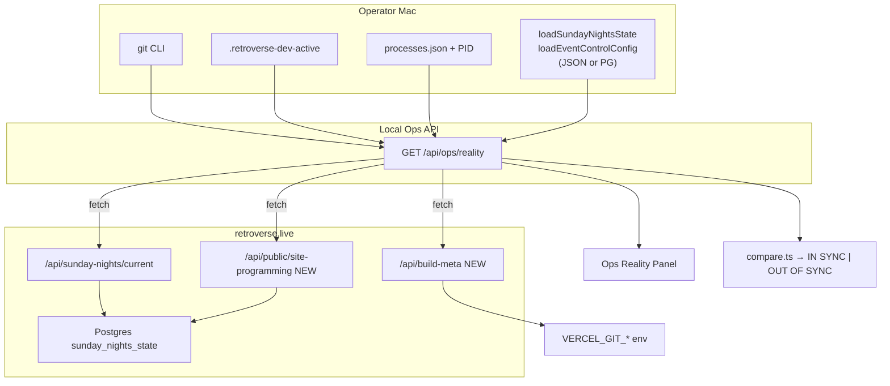

# Local vs Production Reality Dashboard — Feasibility

**Date:** 2026-06-15  
**Status:** Investigation only — do not build yet  
**Goal:** Side-by-side LOCAL vs PRODUCTION truth with `IN SYNC` / `OUT OF SYNC` verdict

---

## Executive summary

| Verdict | Detail |
|---------|--------|
| **Feasible?** | **Yes, with caveats** — ~70% of fields are available today; production commit/timestamp and homepage programming need small additions |
| **Complexity** | **Medium** — one new ops API aggregator + optional public meta endpoints + UI panel |
| **Biggest trap** | Local dev defaults to **JSON state files**; production uses **Postgres** (`sunday_nights_state`). Comparing “local app” vs “production HTTP” will often show **OUT OF SYNC** even when that is expected |
| **Bridge** | Bridge runs on **operator Mac**, not Vercel. “Bridge status” belongs in the **LOCAL** column only; production can show **last bridge write time** from live payload |

---

## Target dashboard (mockup)

```
┌─────────────────────────────────────────────────────────────────────────────┐
│  REALITY CHECK                                    Overall: ● OUT OF SYNC    │
├──────────────────────────────┬──────────────────────────────────────────────┤
│  LOCAL                       │  PRODUCTION                                  │
├──────────────────────────────┼──────────────────────────────────────────────┤
│  Git branch    main          │  Deployed commit   a1b2c3d (Vercel)          │
│  Git commit    f4e5d6c *     │  Deployed at       2026-06-15T17:42:00Z      │
│  Dev server    ● running :3000│  Site              retroverse.live           │
│  Bridge        ● pid 4412    │  Last bridge POST  2026-06-15T06:57:30Z      │
│  Live track    —             │  Live track        RVTR525618 · Tiny Dancer    │
│  Event mode    OFF           │  Event mode        OFF                         │
│  Homepage mode YEARS         │  Homepage mode     YEARS                       │
│  Featured years 1967·1978·1992│ Featured years    1967·1978·1992             │
├──────────────────────────────┴──────────────────────────────────────────────┤
│  CODE        OUT OF SYNC   local f4e5d6c ≠ deployed a1b2c3d                │
│  LIVE        IN SYNC       both idle (null)                                   │
│  PROGRAMMING IN SYNC       years + homepage mode match                        │
│  STORAGE     ⚠ LOCAL JSON  production uses PG (comparison context)          │
└─────────────────────────────────────────────────────────────────────────────┘
```

---

## Field-by-field feasibility

### LOCAL column

| Field | Available today? | Data source | Notes |
|-------|------------------|-------------|-------|
| **Git branch** | ✅ Yes | `git rev-parse --abbrev-ref HEAD` from ops API route (`child_process`) | Only meaningful when cwd is repo root on dev machine |
| **Git commit** | ✅ Yes | `git rev-parse HEAD` (+ optional `git status --porcelain` for dirty) | Uncommitted changes → show `*` dirty flag |
| **Dev server status** | ✅ Yes | `.retroverse-dev-active` marker (`tools/next-dev.mjs`) + `pidAlive()` + optional `lsof` on `PORT` | Same pattern as `tools/guard-no-concurrent-dev.mjs` |
| **Bridge status** | ✅ Yes | `lib/sunday-nights/bridge-status.ts` → `RETROVERSE_DATA/live/processes.json` + PID probe | Also in `tools/live/diagnose-live-now-playing.ts` |
| **Live track** | ✅ Yes | `loadSundayNightsState()` → `buildSundayNightsCurrentPayload()` | **Backend depends on storage mode** (see below) |
| **Featured years** | ✅ Yes | `loadEventControlConfig().featuredYears` | JSON file locally unless `SUNDAY_NIGHTS_STATE_PG=1` |
| **Homepage mode** | ✅ Yes | `loadEventControlConfig().homepage.mode` | `YEARS` \| `EVENT` \| `COLLECTION` \| `CUSTOM` |
| **Event mode** (recommended add) | ✅ Yes | `loadSundayEventMode().enabled` | Separate from homepage mode — drives `/` → `/sunday-nights` redirect |

### PRODUCTION column

| Field | Available today? | Data source | Notes |
|-------|------------------|-------------|-------|
| **Deployed commit** | ⚠️ Partial | `VERCEL_GIT_COMMIT_SHA` exists **inside** Vercel runtime but **not exposed** to clients | `fetchDeployPreview()` uses **GitHub `main` HEAD** — that is *intent*, not *deployed* (operating board warns of lag) |
| **Deployment timestamp** | ❌ No | Not in repo | Vercel injects build time only at build; no public endpoint |
| **Live track** | ✅ Yes | `GET https://retroverse.live/api/sunday-nights/current` | Public, no auth; proven 2026-06-15 |
| **Featured years** | ❌ No (public) | `loadEventControlConfig()` on server | Ops API `GET /api/ops/event-control` is gated; not callable cross-origin without production ops cookie |
| **Homepage mode** | ❌ No (public) | Same as event control | Could infer from HTML class `home-directory--mode-*` — **fragile** |
| **Event mode** | ⚠️ Partial | `isSundayEventModeEnabled()` | Infer: `GET /` → 307 to `/sunday-nights` = ON; else OFF. Works but indirect |
| **Bridge status** | N/A | Bridge is local | Use `live.bridgeTimestamp` from current API as **last remote write** |

---

## Storage-mode trap (critical)

From `lib/sunday-nights/storage-mode.ts`:

```ts
// Default: VERCEL=1 → Postgres; local dev → JSON files
usePostgresSundayNightsState()
```

| Environment | Live + event control storage |
|-------------|------------------------------|
| **Production (Vercel)** | Postgres `sunday_nights_state` keys: `live`, `eventMode`, `eventControl` |
| **Local dev (default)** | `RETROVERSE_DATA/ops/sunday-nights/state.json`, `event-mode.json`, `event-control/config.json` |
| **Local dev + `SUNDAY_NIGHTS_STATE_PG=1`** | Same Postgres as production (if `RETROVERSE_PG_HOST` points to Neon) |

**Implication:** A honest dashboard must show **storage backend** per side. Otherwise live/programming comparisons are meaningless when local uses JSON and production uses PG.

**Recommended label:**

```
LOCAL storage:  JSON | POSTGRES (neon)
PROD storage:   POSTGRES (vercel)
```

When local uses JSON, **OUT OF SYNC for live track is expected** unless operator intentionally mirrors production via API.

---

## Available data sources (inventory)

### Already in codebase

| Source | Path / API | Used for |
|--------|------------|----------|
| Git (local) | shell `git` | branch, commit, dirty |
| Dev marker | `.retroverse-dev-active` | dev server PID + `startedAt` |
| Port listen check | `lsof -ti tcp:${PORT}` | dev server fallback |
| Bridge manifest | `RETROVERSE_DATA/live/processes.json` | bridge PID, `startedAt`, `baseUrl` |
| Sunday Nights state | `lib/sunday-nights/state.ts` | local live track |
| Event mode | `lib/sunday-nights/event-mode.ts` | local event redirect flag |
| Event control | `lib/ops/event-control/store.ts` | featured years, homepage mode |
| Production live | `GET /api/sunday-nights/current` | prod live track + `updatedAt` + `live.bridgeTimestamp` |
| Deploy preview | `lib/sunday-nights/system/deploy.ts` → GitHub API | **main HEAD only** (not deployed SHA) |
| Live diagnose CLI | `npm run live-diagnose` | precedent for aggregated local checks |
| Sunday validate | `lib/sunday-nights/system/validate.ts` | snapshot/PG/hook checks (related, not comparison) |

### Vercel env vars (available on production server, not yet exposed)

| Variable | Purpose |
|----------|---------|
| `VERCEL_GIT_COMMIT_SHA` | Actual deployed commit |
| `VERCEL_GIT_COMMIT_REF` | Deployed branch |
| `VERCEL_GIT_COMMIT_MESSAGE` | Commit message |
| `VERCEL_DEPLOYMENT_ID` | Deployment ID (for Vercel API lookup) |
| `VERCEL_ENV` | `production` \| `preview` \| `development` |

### Unavailable without new work

| Need | Gap |
|------|-----|
| Production deployed commit (from browser/local ops) | No public endpoint returns SHA |
| Production deployment timestamp | Not stored or exposed |
| Production featured years / homepage mode (HTTP) | Ops-gated only |
| Production bridge process status | Process does not run on Vercel |
| Accurate “deployed = GitHub main” | Deploy can lag push; hook triggers async build |

---

## IN SYNC / OUT OF SYNC — recommended rules

### Dimensions (independent)

| Dimension | Compare | IN SYNC when |
|-----------|---------|--------------|
| **Code** | `localCommit` vs `productionCommit` | Full SHA match (or same 7-char prefix **and** production SHA from Vercel, not GitHub) |
| **Live** | `currentTrackId` (+ optional artist/title) | Both `null` OR same RVTR |
| **Event mode** | `eventMode.enabled` | Equal boolean |
| **Programming** | `featuredYears[]` + `homepage.mode` | Deep-equal years (order matters) + same mode enum |
| **Bridge freshness** (optional) | `live.bridgeTimestamp` age | &lt; N minutes during show; informational only |

### Overall verdict

```
IN SYNC     = Code IN SYNC
              AND Live IN SYNC
              AND Event mode IN SYNC
              AND Programming IN SYNC
              AND (storage backends compatible OR operator acknowledges JSON-local)

OUT OF SYNC = any critical dimension fails

DEGRADED    = optional: Code OUT OF SYNC but all runtime dimensions IN SYNC
              (unpushed commit on main — deploy pending)
```

### What NOT to include in overall sync

- Dev server running (local-only concern)
- Local bridge PID (local-only)
- Dirty git working tree (show warning, not sync fail)

---

## Implementation complexity

| Piece | Effort | Risk |
|-------|--------|------|
| `lib/ops/reality/local-probe.ts` — git, dev, bridge, local state | **S** | Low — reuse existing libs |
| `lib/ops/reality/production-probe.ts` — fetch `retroverse.live` APIs | **S** | Low — server-side fetch, no CORS |
| `GET /api/ops/reality` — aggregate + diff | **S** | Low — ops middleware gated |
| `GET /api/build-meta` on production — expose `VERCEL_GIT_COMMIT_SHA` + `builtAt` | **S** | Low — add build step or runtime route |
| `GET /api/public/site-programming` — years, homepage mode, event mode | **S** | Low — no secrets in payload |
| Ops UI panel (Sunday Nights system or `/ops` widget) | **M** | Low |
| Storage-mode banner + sync semantics | **S** | **High if omitted** — false alarms |
| Vercel API deployment timestamp (token) | **M** | Medium — needs `VERCEL_TOKEN` secret |
| Poll / auto-refresh UI | **S** | Low |

**Total estimate:** 1–2 focused sessions for MVP (without Vercel API token path).

---

## Recommended architecture

### 1. Probe layer (pure functions)

```
lib/ops/reality/
  types.ts           # RealitySnapshot, SyncVerdict, DimensionStatus
  local-probe.ts     # git, dev, bridge, loadSundayNightsState, loadEventControlConfig, loadSundayEventMode
  production-probe.ts # fetch PRODUCTION_ORIGIN + /api/sunday-nights/current + /api/build-meta + /api/public/site-programming
  compare.ts         # dimension diff + overall verdict
  constants.ts       # PRODUCTION_ORIGIN = https://retroverse.live
```

### 2. API

```
GET /api/ops/reality
  → { local, production, sync, warnings, probedAt }
```

Server-side only (ops cookie). Production fetches use `cache: 'no-store'`.

### 3. New public endpoints (minimal)

**`GET /api/build-meta`** (public, cacheable short)

```json
{
  "commit": "a1b2c3d",
  "branch": "main",
  "builtAt": "2026-06-15T17:42:00.000Z",
  "deploymentId": "dpl_…"
}
```

Implement via runtime `process.env.VERCEL_GIT_COMMIT_SHA` + `Date` at cold start OR `tools/touch-production-build.mjs` extended to write `public/build-meta.json` at `next build`.

**`GET /api/public/site-programming`** (public)

```json
{
  "eventMode": { "enabled": false, "updatedAt": "…" },
  "featuredYears": [1967, 1978, 1992],
  "homepageMode": "YEARS",
  "eventControlUpdatedAt": "…"
}
```

Read from same stores as homepage (`loadEventControlConfig`, `loadSundayEventMode`) — no RVBR secrets required.

### 4. UI placement

**Recommended:** Panel inside **`SundayNightsSystemPanel`** or top of **`/ops`** — operators already go there before deploy.

Not a new top-level nav item. Collapsed by default: “Reality check”.

### 5. CLI parity (optional)

```
npm run ops:reality
```

Prints same JSON as API — matches `live-diagnose` precedent.

---

## Data flow diagram



---

## Comparison matrix (build vs buy)

| Approach | Pros | Cons |
|----------|------|------|
| **A. HTTP fetch production only** | True production runtime | Needs 2 new public endpoints for commit + programming |
| **B. Read production PG from local** | Accurate state if same DB | Does not verify Vercel deploy; conflates DB with site |
| **C. GitHub main as “production commit”** | Already in `fetchDeployPreview` | **Wrong** — not deployed reality |
| **D. Vercel API + token** | Exact deployment time + SHA | Extra secret, API rate limits |

**Recommended:** **A** for runtime truth + **`/api/build-meta`** for code truth. Avoid C alone.

---

## Warnings to surface in UI

1. **Storage mismatch** — “Local uses JSON; production uses Postgres. Live/programming comparison may not reflect deploy.”
2. **Dirty working tree** — “Local commit does not include uncommitted changes.”
3. **GitHub vs Vercel** — if fallback used: “Showing GitHub main, not verified deployment.”
4. **Bridge is local** — “Production shows last bridge write, not process status.”
5. **Same PG** — if `SUNDAY_NIGHTS_STATE_PG=1`: “Local writes go to production database immediately.”

---

## MVP scope recommendation

### Phase 1 (ship first)

- Local: git, dev server, bridge, live, event mode, featured years, homepage mode, storage backend
- Production: live (`/api/sunday-nights/current`), event mode (redirect probe or new endpoint), **`/api/build-meta`**
- Sync: code, live, event mode
- UI: compact panel in Sunday Nights system section

### Phase 2

- **`/api/public/site-programming`**
- Sync: featured years + homepage mode
- `DEGRADED` verdict (code behind, runtime OK)

### Phase 3

- Vercel API deployment timestamp
- Auto-refresh every 30s on show night
- `npm run ops:reality` CLI

---

## Conclusion

| Question | Answer |
|----------|--------|
| Can we display the requested side-by-side? | **Yes**, with 2 small public endpoints and storage-mode honesty |
| Can we compute IN SYNC / OUT OF SYNC? | **Yes**, with clear per-dimension rules |
| Biggest blocker? | Production **programming** and **deployed commit** not publicly readable today |
| Build now? | **No** — this report only; MVP is ~1–2 sessions when approved |

---

## Evidence

| Item | Location |
|------|----------|
| Storage mode split | `lib/sunday-nights/storage-mode.ts` |
| Bridge manifest | `lib/sunday-nights/bridge-status.ts` |
| Dev marker | `tools/next-dev.mjs` |
| Deploy preview (GitHub, not Vercel) | `lib/sunday-nights/system/deploy.ts` |
| Public live API | `app/api/sunday-nights/current/route.ts` |
| Event control store | `lib/ops/event-control/store.ts` |
| Event mode | `lib/sunday-nights/event-mode.ts` |
| Live diagnose precedent | `tools/live/diagnose-live-now-playing.ts` |
| Production live clear (2026-06-15) | ops PATCH + `GET /api/sunday-nights/current` |

*Investigation only — no code was modified.*
