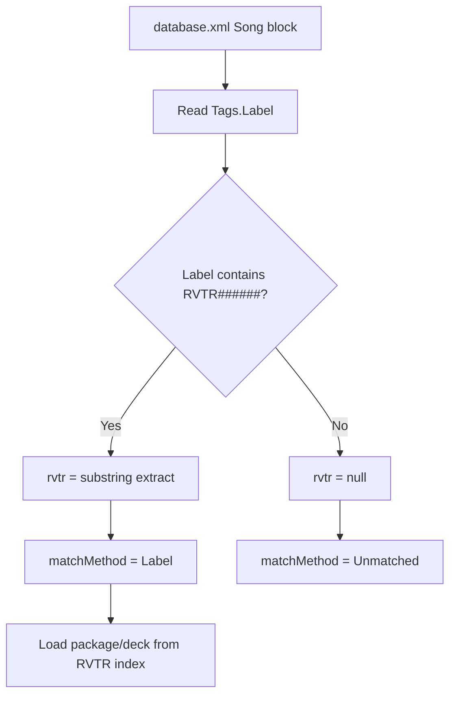
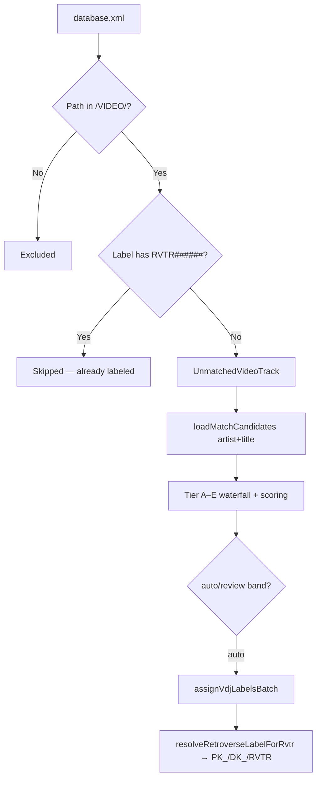
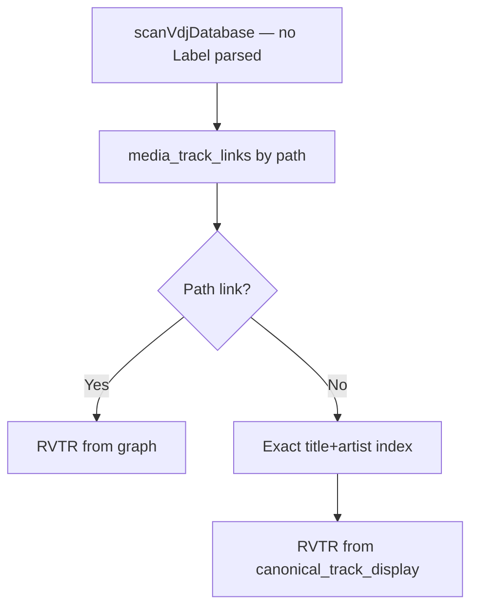
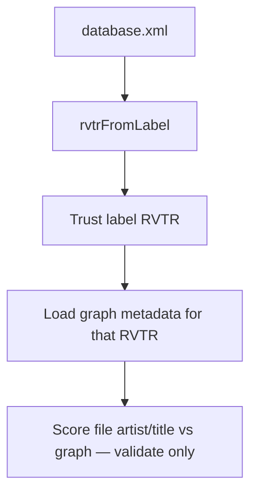
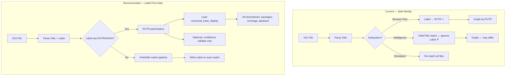

# Retroverse Architecture Audit — RVTR Usage vs Matching Engine

**Scanned:** 2026-06-24  
**Read-only** — no code changes.

Your label inventory (full VDJ library): **PK_ 610 · DK_ 885 · RVTR 8,996 · Blank 361** (~10,852 labeled rows). VIDEO folder scope in code is **`/VIDEO/` only** (excludes `/MUSIC/` and `/VIDEO VAULT/`). That filter drives match-agent, Browser Plus queue, and coverage audits.

---

## 1. Actual identity resolution order (VIDEO ingestion)

Retroverse does **not** have one global ingestion pipeline. Resolution depends on which subsystem touches the file.

### A. Browser Plus grid (primary ops view)



**No artist/title matching** in `loadBrowserPlusModel()`. Label is the only RVTR source for the grid.

### B. Match Agent / Browser Plus queue (assignment)



**Label is checked first.** Matching runs only when label has **no** `RVTR######` substring.

### C. Intelligence / package pipeline audits



**Label is never read.** Path and title/artist graph matching run even when the file already has `PK_/DK_/RVTR` on the label.

### D. Audits on labeled inventory



No candidate search. Label RVTR is ground truth; scoring is confidence validation.

---

## 2. PK_ / DK_ / RVTR — extraction and trust

**Extraction:** Substring regex `/RVTR\d{6}/i` — works on all three forms:

| Label | Extracted RVTR |
|-------|----------------|
| `RVTR759486` | `RVTR759486` |
| `PK_RVTR759486` | `RVTR759486` |
| `DK_RVTR759486` | `RVTR759486` |

Evidence from actual `database.xml`:

```xml
<Song FilePath="..." FileSize="10098567" Flag="64">
  <Tags Author="Michael Jackson" Title="The Way You Make Me Feel"
        Label="DK_RVTR759486" Remix="Official Video" Year="1987" ... />
```

Evidence from parser (`lib/ops/load-video-library-tracks.ts`):

```typescript
function rvtrFromLabel(label: string): string | null {
  const match = label.match(RVTR_RE);
  return match?.[0]?.toUpperCase() ?? null;
}
```

**PK_/DK_ are metadata prefixes**, not separate IDs. Browser Plus sets `deckReady = label.startsWith("DK_")`. Write-back adds prefix from package/deck indexes (`lib/ops/browser-plus/vdj-label-write.ts` → `resolveRetroverseLabelForRvtr`).

**Does matching still run when RVTR exists?**

| Workflow | Re-matches? |
|----------|-------------|
| Match Agent / queue | **No** — labeled files excluded |
| Browser Plus grid | **No** — label only |
| Confidence / coverage audits | **No** — validates assigned RVTR |
| Match-engine simulation | **Yes** — simulates alternate RVTR for all files |
| Intelligence `video-identification` | **Yes** — ignores label entirely |
| Sunday Nights `resolveRvtrForSongs` | **Yes** — path/alias/chart, no label |

---

## 3. Subsystem matrix — how each gets RVTR

| Subsystem | Entry point | RVTR from Label | Artist/title match | DB path links | Other |
|-----------|-------------|-----------------|-------------------|---------------|-------|
| Browser Plus grid | `loadBrowserPlusModel` | **Primary** | No | No | Package index |
| Browser Plus queue | `resolveQueueItem` | Gate only (unmatched) | **Yes** | No | — |
| Match Agent Phase 2 | `runMatchAgentPhase2` | Gate only | **Yes** | No | — |
| Label write-back | `assignVdjLabelsBatch` | Writes | No | No | PK/DK from package index |
| VIDEO library loader | `loadAllVideoLibraryTracks` | **Primary** | No | No | — |
| Matched/coverage audits | `loadMatchedVideoTracks` | **Primary** | No | No | — |
| Confidence audit | `runVideoMatchConfidenceAudit` | **Primary** | Validates only | No | — |
| Match-engine simulation | `runMatchEngineSimulation` | Current state | **Yes (parallel)** | No | — |
| Video identification | `resolveVideoIdentity` | **Not read** | **Yes** | **Yes** | `media_assets.rvtr` |
| VDJ RVTR resolve | `resolveRvtrsForVdjLibrary` | **Not read** | **Yes** | **Yes** | — |
| Package pipeline audit | `auditPackagePipeline` | **Not read** | Via video-ID | Via video-ID | — |
| Package priority/completion | same pattern | **Not read** | Via video-ID | Via video-ID | — |
| Backfill queue | `buildVideoBackfillQueue` | **Not read** | Via video-ID | Via video-ID | — |
| Intelligence batch | `runIntelligenceBatch` | No | No | No | CLI/graph RVTR list |
| Browser Plus execution | `runExecutionJob` | **Required on row** | No | No | — |
| Sunday Nights live | `resolveRvtrForSongs` | **Not read** | Chart orbit | Path link | Alias store |
| Search destination | `resolve-search-destination` | Query RVTR | No | No | — |
| Playback resolve | `resolve-track-playback` | No | No | **Yes** | Graph by RVTR param |

---

## 4. Places that artist/title match when RVTR may already exist

### Always / often re-match (label ignored or parallel sim)

| File | Function |
|------|----------|
| `lib/ops/match-engine-simulation.ts` | `simulateMatch`, `runMatchEngineSimulation` |
| `lib/ops/intelligence/video-identification.ts` | `resolveVideoIdentity`, `auditVideoIdentification`, `loadTitleArtistIndex` |
| `lib/ops/intelligence/vdj-rvtr-resolve.ts` | `resolveRvtrsForVdjLibrary`, `resolveByTitleArtist` |
| `lib/ops/package-pipeline-audit.ts` | via `auditVideoIdentification` |
| `lib/ops/package-priority-audit.ts` | via `auditVideoIdentification` |
| `lib/ops/package-completion-audit.ts` | via `auditVideoIdentification` |
| `lib/ops/intelligence/backfill-coverage.ts` | via `auditVideoIdentification` |
| `lib/ops/intelligence/top-played-backfill.ts` | via `auditVideoIdentification` |
| `lib/sunday-nights/resolve-rvtr.ts` | `resolveRvtrForSongs` |
| `lib/sunday-nights/resolve-live-track.ts` | `resolveLiveTrack` |
| `lib/ops/chart-orbit/resolve-track.ts` | `resolveChartOrbitTrack`, `loadByTitle` |

### Re-score labeled RVTR (no alternate search, but similarity runs)

| File | Function |
|------|----------|
| `lib/ops/video-match-confidence-audit.ts` | `runVideoMatchConfidenceAudit` |
| `lib/ops/graph-integrity-audit.ts` | `runGraphIntegrityAudit` |
| `tools/run-rvtr-identity-audit.ts` | conflict analysis on labeled assignments |

### Match only if called directly (no label gate in function itself)

| File | Function |
|------|----------|
| `lib/sunday-nights/match-candidates.ts` | `loadMatchCandidates`, `searchMatchManual` |
| `lib/ops/browser-plus/browser-plus-artist-match.ts` | `combinedMatchScore`, `loadBrowserPlusMatchPanel` |
| `lib/ops/browser-plus/match-queue.ts` | `resolveQueueItem` (gated upstream) |
| `app/api/ops/sunday-nights/match/route.ts` | manual search API |

### Correctly skip matching when label RVTR exists

| File | Function |
|------|----------|
| `lib/ops/browser-plus/load-unmatched-video-tracks.ts` | `loadUnmatchedVideoTracks` — `if (rvtrFromLabel(label)) continue` |
| `lib/ops/browser-plus/match-agent.ts` | uses unmatched loader only |
| `components/ops/browser-plus/VirtualDjBrowserPlus.tsx` | queue filter `!row.rvtr` |

---

## 5. Is RVTR canonical identity today?

**Answer: Split — label RVTR is canonical in ops/coverage, but not system-wide.**

### Evidence RVTR **is** treated as canonical (Browser Plus ops layer)

- `load-browser-plus.ts`: `matchMethod: rvtr ? "Label" : "Unmatched"`
- `canonical-coverage-audit.ts`: `loadMatchedVideoTracks` — label is the only RVTR source; coverage audit treats label as ownership signal

### Evidence RVTR is **one signal among many** (intelligence layer)

- `video-identification.ts` → `resolveVideoIdentity`: `VdjLibraryEntry` has no Label field; resolves via path link → title/artist index → `media_assets.rvtr`
- `scanVdjDatabase()` never parses `Tags Label`

### Verdict

| Layer | RVTR role |
|-------|-----------|
| Browser Plus / match-agent / coverage | **Authoritative** (from Label) |
| Intelligence / backfill / pipeline audits | **Graph-derived** (label-blind) |
| Simulation / conflict audits | **Hypothesis** (proposes alternates) |

Retroverse currently operates as **two parallel identity models** that can disagree.

---

## 6. Can labeled files bypass matching entirely?

**Yes — and most ops paths already do.** ~8,996+ labeled VIDEO rows need only:

1. Parse `Tags.Label` → `RVTR######`
2. Load `canonical_track_display` by RVTR
3. Done

### Blockers to full bypass

| Blocker | Where | Impact |
|---------|-------|--------|
| Intelligence ignores Label | `video-identification.ts`, `vdj-database.ts` | Pipeline audits re-match; may disagree with label |
| Simulation always re-matches | `match-engine-simulation.ts` | Read-only; not a runtime blocker |
| Confidence validation | `video-match-confidence-audit.ts` | Scores label vs metadata; doesn't change RVTR |
| Non-Retroverse labels | `vdj-label-write.ts` `canWriteLabel` | Blocks overwrite of foreign labels |
| `RV_PACKAGE` placeholder | label has no RVTR substring | Treated as unmatched |
| Path scope mismatch | `isUnmatchedVideoTrackPath` | `/VIDEO VAULT/` excluded from VIDEO ops |
| Package audits comment vs code | `package-priority-audit.ts` | Says "label RVTR" but calls label-blind video-ID |

**No technical blocker** prevents direct RVTR resolution for `PK_/DK_/RVTR` labels in Browser Plus, coverage, execution, or playback-by-RVTR paths. The gap is **intelligence/backfill** not reading Label.

---

## 7. VirtualDJ XML — fields read vs ignored

### Actual Song structure (from `database.xml`)

```xml
<Song FilePath="..." FileSize="10098567" Flag="64">
  <Tags Author="..." Title="..." Genre="..." Album="..."
        Label="DK_RVTR759486" Remix="Official Video" Year="1987"
        User1="..." Bpm="..." Key="..." Flag="1" />
  <Infos SongLength="..." LastModified="..." FirstSeen="..." FirstPlay="..."
          LastPlay="..." PlayCount="15" Bitrate="679" Cover="2" />
  <Scan Version="801" Bpm="..." Phase="..." AltBpm="..." Volume="..."
         Key="..." AudioSig="iaN4l4aVeZmHpZemd8rL2WYM" Flag="32772" />
  <Poi Pos="..." Type="..." Point="..." />
  <Link ... />
</Song>
```

### Fields read by Retroverse (union across parsers)

| Source | Fields read |
|--------|-------------|
| `<Song>` | `FilePath` only |
| `<Tags>` | `Author`, `Title`, `Album`, `Year`, `Genre`, `Remix`*, `Label`†, `Grouping`, `User1`, `User2`, `Key`, `Bpm` |
| `<Infos>` | `PlayCount`, `Rating`, `FirstSeen`, `FirstPlay`, `LastPlay`/`LastPlayed`, `SongLength`, `Cover` |
| `<Scan>` | `Bpm`, `Key` (browser-plus only) |
| `<Poi>` / `<Link>` | Count only; `Link Cover=` presence (browser-plus, video-factory) |

\* `Remix` only in `vdj-database.ts` scan, not browser-plus grid  
† `Label` not read by `scanVdjDatabase()` / intelligence scan

### Synthetic identifiers (not from XML)

| ID | Format | Used in |
|----|--------|---------|
| Row id | `{index}:{normVdjPath(filePath)}` | Browser Plus rows, unmatched loader |
| Path key | `normVdjPath()` lowercase normalized path | All path lookups |

**No VDJ internal Song ID is parsed anywhere** — zero reads of `FileSize`, `AudioSig`, `LastModified`, `Flag` on Song/Tags in `.ts` files.

### Parser files (direct XML read)

| File | Role |
|------|------|
| `lib/ops/intelligence/vdj-database.ts` | Central full-library scan |
| `lib/ops/browser-plus/load-browser-plus.ts` | Browser Plus UI model (richest parse) |
| `lib/ops/browser-plus/load-unmatched-video-tracks.ts` | Match-agent input |
| `lib/ops/load-video-library-tracks.ts` | All VIDEO tracks |
| `lib/ops/canonical-coverage-audit.ts` | Matched VIDEO audit |
| `lib/ops/browser-plus/vdj-label-write.ts` | Label write-back |
| `app/ops/live-companion/page.tsx` | Live label lookup |
| `tools/intelligence/video-factory.ts` | Video factory queue |

---

## 8. Stable VDJ identifiers Retroverse is not using

From **actual XML** (not speculation):

| XML attribute | Present on Song? | Read by Retroverse? |
|---------------|------------------|---------------------|
| `FilePath` | Yes | **Yes** — primary key |
| `FileSize` | Yes | **No** |
| `Flag` (Song/Tags/Scan) | Yes | **No** |
| `AudioSig` | Yes (Scan) | **No** |
| `LastModified` | Yes (Infos) | **No** |
| `Bitrate` | Yes (Infos) | **No** |
| Song `Id` / UUID attribute | **Not present** on sampled blocks | N/A |

Retroverse's de facto stable identifier is **normalized `FilePath`**. No evidence of an unused VDJ-native row ID in parsed XML.

---

## 9. Simplest path to RVTR-authoritative architecture (no implementation)

**Principle:** One resolution gate at the VDJ boundary. Label RVTR wins when present; matching is fallback for blank/`RV_PACKAGE` only.

### Current vs recommended



### Minimal-change steps (existing code only)

1. **Extend `scanVdjDatabase()` / `VdjLibraryEntry`** to parse `Tags.Label` and extract RVTR — same `rvtrFromLabel()` used everywhere else.
2. **Update `resolveVideoIdentity()`** — if label RVTR exists, use it first (`rvtrSource: "vdj_label"`), skip title/artist search.
3. **Point package pipeline audits** at label-based loaders (`loadMatchedVideoTracks`) instead of label-blind video-ID for ownership metrics.
4. **Keep match-agent/queue unchanged** — already label-gated for unmatched only.
5. **Keep simulation/confidence as audit-only** — validate labels, don't drive runtime identity.
6. **Single shared parser module** — 7 duplicated XML parse loops today; one gate reduces drift.

**What not to change:** Label write format (`PK_/DK_/RVTR`), path normalization, graph RVTR IDs, match tier waterfall (fallback only).

---

## Summary

| Question | Answer |
|----------|--------|
| Ingestion order | **Label first** in Browser Plus/ops; **matching first** in intelligence; **parallel sim** in audits |
| PK_/DK_/RVTR trust | **Extracted and trusted** via substring; prefixes are package/deck metadata |
| Canonical identity? | **Yes in ops**, **no in intelligence** — dual model |
| Bypass matching? | **Already works** for labeled files in ops; blocked only in intelligence/backfill |
| Unused VDJ ID | **None found** — `FilePath` is the key; `AudioSig`/FileSize/Flag unread |

Your **361 blank** labels are the only population that should hit the matching engine at runtime. Everything else should resolve in one hop: **Label → RVTR → graph**.
