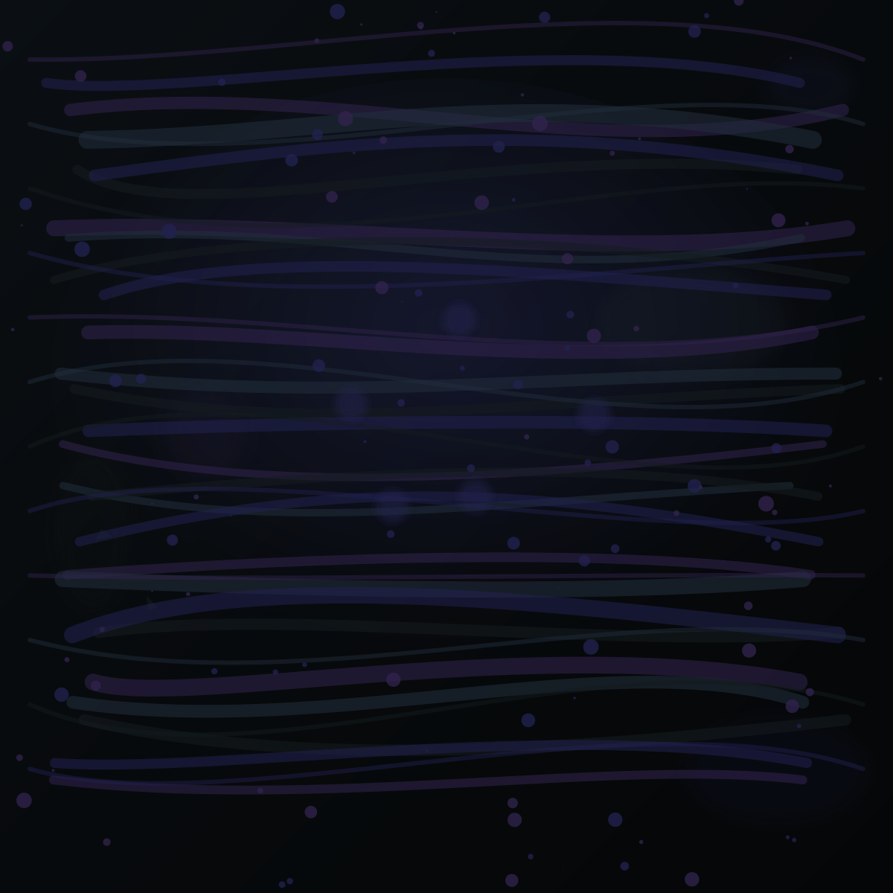
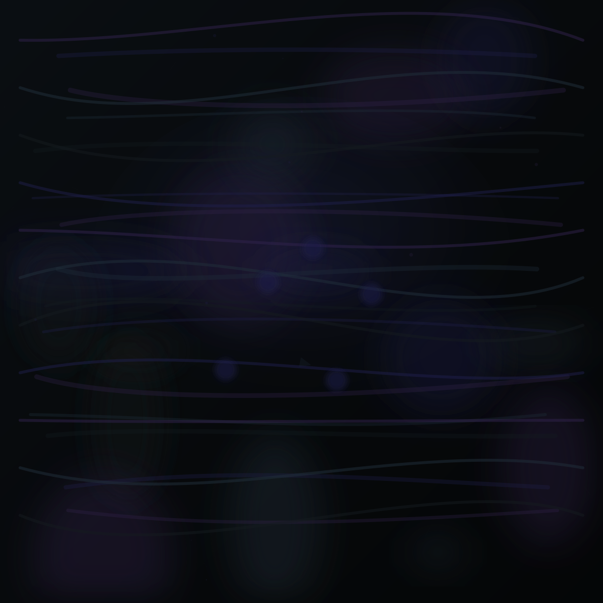

# Song DNA Proof of Concept — Real Acoustic Data

Standalone experiment. Algorithmic layered PNGs from Retroverse acoustic metrics only.
**No AI imagery. No prompts. No Spotify online.** RVTR seeds deterministic output.

## Step 1 — Master metrics table

| Song | Danceability | Energy | Valence | Acousticness | Instrumentalness | Speechiness | Liveness | Tempo | Loudness | Key | Mode | Time Sig |
|---|---:|---:|---:|---:|---:|---:|---:|---:|---:|---|---|---:|
| Fleetwood Mac — Dreams | 0.485 | 0.643 | 0.343 | 0.174 | 0.00294 | 0.042 | 0.966 | 127.8 | -8.96 | — | — | — |
| Michael Jackson — Billie Jean | 0.930 | 0.602 | 0.849 | 0.019 | 0.01650 | 0.040 | 0.044 | 117.1 | -4.43 | — | — | — |
| AC/DC — Back In Black | 0.310 | 0.700 | 0.763 | 0.011 | 0.00965 | 0.047 | 0.083 | 188.4 | -5.68 | — | — | — |
| Simon & Garfunkel — The Sound of Silence | 0.538 | 0.217 | 0.310 | 0.870 | 0.00000 | 0.030 | 0.108 | 108.3 | -13.92 | — | — | — |
| Frankie Goes To Hollywood — Relax (substituted: Eurythmics — Sweet Dreams) | 0.692 | 0.711 | 0.875 | 0.227 | 0.00000 | 0.032 | 0.120 | 125.1 | -7.50 | — | — | — |

## Step 5 — Five-song montage


### Visual identity spread (acoustic-only)

- **Brightest valence wash:** Frankie Goes To Hollywood — Relax (substituted: Eurythmics — Sweet Dreams) (0.875)
- **Darkest valence wash:** Simon & Garfunkel — The Sound of Silence (0.310)
- **Heaviest brush field:** Frankie Goes To Hollywood — Relax (substituted: Eurythmics — Sweet Dreams) (0.711)
- **Most watercolor diffusion:** Simon & Garfunkel — The Sound of Silence (0.870)
- **Most splatter:** Fleetwood Mac — Dreams (0.966)

Each song maps the same 10-layer stack; metric deltas should produce distinguishable silhouettes without AI or prompts.

## Summary

- Songs rendered: **5**
- Determinism check: **PASS**
- Output: `reports/song-dna-proof/images/`

### Layer stack (bottom → top)

1. Black background
2. Canvas texture ← Instrumentalness
3. Glow ← Loudness
4. Color wash ← Valence
5. Harmonic watercolor blooms ← Acousticness
6. Primary brush field ← Energy
7. Motion ribbons ← Danceability + Tempo
8. Splatter ← Liveness
9. Fine detail ← Speechiness
10. Signature highlights ← Key + Mode

## Fleetwood Mac — Dreams

### Acoustic metrics (Retroverse source)

| Metric | Value |
|---|---|
| RVTR | RVTR569927 |
| Source | canonical_album_track_display |
| Danceability | 0.4850 |
| Energy | 0.6430 |
| Valence | 0.3430 |
| Acousticness | 0.1740 |
| Instrumentalness | 0.002940 |
| Speechiness | 0.0422 |
| Liveness | 0.9660 |
| Tempo (BPM) | 127.76 |
| Loudness (dB) | -8.96 |
| Key | — |
| Mode | — |
| Time Signature | — |



### Layer-by-layer — how metrics shaped the artwork

**Background** (— black)
→ Canvas starts completely black (#000000).

**Canvas Texture** (Instrumentalness 0.0029)
→ Minimal grain — vocal-led track, almost smooth canvas.

**Glow** (Loudness -8.96 dB)
→ Broad hot bloom — loud master pushes a wide radial glow.

**Color Wash** (Valence 0.3430)
→ Cool violet/charcoal wash — low valence shadows.

**Harmonic Watercolor Blooms** (Acousticness 0.1740)
→ Tight blooms — electronic production, minimal bleed.

**Primary Brush Field** (Energy 0.6430)
→ Medium paint density across the field.

**Motion Ribbons** (Danceability + Tempo 0.4850 / 127.8 BPM)
→ Moderate ribbon curvature with tempo-driven spacing.

**Splatter** (Liveness 0.9660)
→ Heavy live-room splatter — crowd/room energy visible.

**Fine Detail** (Speechiness 0.0422)
→ Smooth surface — negligible speech texture.

**Signature Highlights** (Key + Mode unknown unknown)
→ Neutral highlight placement from pitch class (mode unknown).

- Deterministic hash: `36a7c1b7`

## Michael Jackson — Billie Jean

### Acoustic metrics (Retroverse source)

| Metric | Value |
|---|---|
| RVTR | RVTR573791 |
| Source | canonical_album_track_display |
| Danceability | 0.9300 |
| Energy | 0.6020 |
| Valence | 0.8490 |
| Acousticness | 0.0192 |
| Instrumentalness | 0.016500 |
| Speechiness | 0.0401 |
| Liveness | 0.0437 |
| Tempo (BPM) | 117.09 |
| Loudness (dB) | -4.43 |
| Key | — |
| Mode | — |
| Time Signature | — |


### Layer-by-layer — how metrics shaped the artwork

**Background** (— black)
→ Canvas starts completely black (#000000).

**Canvas Texture** (Instrumentalness 0.0165)
→ Minimal grain — vocal-led track, almost smooth canvas.

**Glow** (Loudness -4.43 dB)
→ Broad hot bloom — loud master pushes a wide radial glow.

**Color Wash** (Valence 0.8490)
→ Warm gold + teal wash dominates — bright emotional palette.

**Harmonic Watercolor Blooms** (Acousticness 0.0192)
→ Tight blooms — electronic production, minimal bleed.

**Primary Brush Field** (Energy 0.6020)
→ Medium paint density across the field.

**Motion Ribbons** (Danceability + Tempo 0.9300 / 117.1 BPM)
→ Wide sweeping ribbons — groove-forward motion.

**Splatter** (Liveness 0.0437)
→ Almost no splatter — studio-clean capture.

**Fine Detail** (Speechiness 0.0401)
→ Smooth surface — negligible speech texture.

**Signature Highlights** (Key + Mode unknown unknown)
→ Neutral highlight placement from pitch class (mode unknown).

- Deterministic hash: `d6c806ed`

## AC/DC — Back In Black

### Acoustic metrics (Retroverse source)

| Metric | Value |
|---|---|
| RVTR | RVTR828046 |
| Source | staging_acoustic_tracks |
| Danceability | 0.3100 |
| Energy | 0.7000 |
| Valence | 0.7630 |
| Acousticness | 0.0110 |
| Instrumentalness | 0.009650 |
| Speechiness | 0.0470 |
| Liveness | 0.0828 |
| Tempo (BPM) | 188.39 |
| Loudness (dB) | -5.68 |
| Key | — |
| Mode | — |
| Time Signature | — |


### Layer-by-layer — how metrics shaped the artwork

**Background** (— black)
→ Canvas starts completely black (#000000).

**Canvas Texture** (Instrumentalness 0.0097)
→ Minimal grain — vocal-led track, almost smooth canvas.

**Glow** (Loudness -5.68 dB)
→ Broad hot bloom — loud master pushes a wide radial glow.

**Color Wash** (Valence 0.7630)
→ Warm gold + teal wash dominates — bright emotional palette.

**Harmonic Watercolor Blooms** (Acousticness 0.0110)
→ Tight blooms — electronic production, minimal bleed.

**Primary Brush Field** (Energy 0.7000)
→ Medium paint density across the field.

**Motion Ribbons** (Danceability + Tempo 0.3100 / 188.4 BPM)
→ Straight, restrained ribbons — stiff rhythmic feel.

**Splatter** (Liveness 0.0828)
→ Almost no splatter — studio-clean capture.

**Fine Detail** (Speechiness 0.0470)
→ Smooth surface — negligible speech texture.

**Signature Highlights** (Key + Mode unknown unknown)
→ Neutral highlight placement from pitch class (mode unknown).

- Deterministic hash: `4fbcae14`

## Simon & Garfunkel — The Sound of Silence

### Acoustic metrics (Retroverse source)

| Metric | Value |
|---|---|
| RVTR | RVTR734474 |
| Source | staging_acoustic_tracks |
| Danceability | 0.5380 |
| Energy | 0.2170 |
| Valence | 0.3100 |
| Acousticness | 0.8700 |
| Instrumentalness | 0.000004 |
| Speechiness | 0.0299 |
| Liveness | 0.1080 |
| Tempo (BPM) | 108.28 |
| Loudness (dB) | -13.92 |
| Key | — |
| Mode | — |
| Time Signature | — |



### Layer-by-layer — how metrics shaped the artwork

**Background** (— black)
→ Canvas starts completely black (#000000).

**Canvas Texture** (Instrumentalness 0.0000)
→ Minimal grain — vocal-led track, almost smooth canvas.

**Glow** (Loudness -13.92 dB)
→ Moderate center bloom anchoring the composition.

**Color Wash** (Valence 0.3100)
→ Cool violet/charcoal wash — low valence shadows.

**Harmonic Watercolor Blooms** (Acousticness 0.8700)
→ Heavy wet-on-wet diffusion — acoustic instrumentation bleeds wide.

**Primary Brush Field** (Energy 0.2170)
→ Thin, sparse strokes — low energy restraint.

**Motion Ribbons** (Danceability + Tempo 0.5380 / 108.3 BPM)
→ Moderate ribbon curvature with tempo-driven spacing.

**Splatter** (Liveness 0.1080)
→ Almost no splatter — studio-clean capture.

**Fine Detail** (Speechiness 0.0299)
→ Smooth surface — negligible speech texture.

**Signature Highlights** (Key + Mode unknown unknown)
→ Neutral highlight placement from pitch class (mode unknown).

- Deterministic hash: `629be1f9`

## Frankie Goes To Hollywood — Relax (substituted: Eurythmics — Sweet Dreams)


> **Substitute note:** Relax (RVTR758008) has no acoustic metrics in Retroverse staging or canonical_album_track_display. Substituted **Eurythmics — Sweet Dreams Are Made Of This** (RVTR481591) — complete acoustic row.

### Acoustic metrics (Retroverse source)

| Metric | Value |
|---|---|
| RVTR | RVTR481591 |
| Source | canonical_album_track_display |
| Danceability | 0.6920 |
| Energy | 0.7110 |
| Valence | 0.8750 |
| Acousticness | 0.2270 |
| Instrumentalness | 0.000000 |
| Speechiness | 0.0317 |
| Liveness | 0.1200 |
| Tempo (BPM) | 125.14 |
| Loudness (dB) | -7.50 |
| Key | — |
| Mode | — |
| Time Signature | — |


### Layer-by-layer — how metrics shaped the artwork

**Background** (— black)
→ Canvas starts completely black (#000000).

**Canvas Texture** (Instrumentalness 0.0000)
→ Minimal grain — vocal-led track, almost smooth canvas.

**Glow** (Loudness -7.50 dB)
→ Broad hot bloom — loud master pushes a wide radial glow.

**Color Wash** (Valence 0.8750)
→ Warm gold + teal wash dominates — bright emotional palette.

**Harmonic Watercolor Blooms** (Acousticness 0.2270)
→ Tight blooms — electronic production, minimal bleed.

**Primary Brush Field** (Energy 0.7110)
→ Thick, high-density paint strokes — high energy attack.

**Motion Ribbons** (Danceability + Tempo 0.6920 / 125.1 BPM)
→ Moderate ribbon curvature with tempo-driven spacing.

**Splatter** (Liveness 0.1200)
→ Almost no splatter — studio-clean capture.

**Fine Detail** (Speechiness 0.0317)
→ Smooth surface — negligible speech texture.

**Signature Highlights** (Key + Mode unknown unknown)
→ Neutral highlight placement from pitch class (mode unknown).

- Deterministic hash: `2786526c`

## Reproduce

```bash
npm run research:song-dna-proof
```
