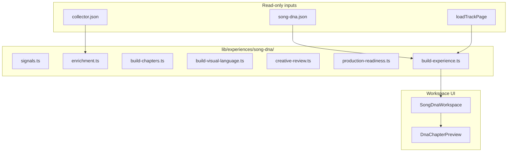

# Song DNA v1 — Design Document (Sprint 3.38)

**Experience:** 2.0 — Second Flagship Retroverse Experience  
**Date:** 2026-06-28  
**Status:** Design workspace — not published to patrons  
**Workspace:** `/ops/studio/experiences/song-dna/[rvtr]`

---

## Vision

Chart Journey answers **what happened**. Song DNA answers **why it feels the way it does**.

Not an audio-analysis page. Not a statistics dashboard. An interactive museum exhibit where the music itself is the artifact.

---

## Pattern (matches Chart Journey)

```
song-dna.json (Collector) + collector hints + related tracks
  → buildSongDnaExperience()
  → Song DNA Workspace (design + review)
  → [future] Patron route
```

**Studio pipeline untouched:** Collector, Editor, Retrograph, Director, Publisher, Chart Journey unchanged.

---

## Architecture



### Module map

| File | Purpose |
|---|---|
| `types.ts` | Unified experience model + enrichment slots |
| `signals.ts` | Signal registry (core + musical + visual + narrative) |
| `enrichment.ts` | Collector hints — studio, vocals, instruments, legacy |
| `build-chapters.ts` | 9 cinematic chapters, data-driven |
| `build-visual-language.ts` | Art direction, visual concepts, preview wall, audience sequence |
| `creative-review.ts` | 7-dimension review |
| `production-readiness.ts` | Publisher integration assessment (local — no Publisher code changes) |
| `build-experience.ts` | Orchestrator |

---

## Experience Structure

| # | Chapter | Included when |
|---|---|---|
| 1 | Identity | Always |
| 2 | Energy | Musical energy signal |
| 3 | Rhythm | Tempo + danceability |
| 4 | Harmony | Key + valence |
| 5 | Instrumentation | Instrumentalness or collector hints |
| 6 | Vocals | Speechiness / vocal-led profile |
| 7 | Production | Studio notes or liveness |
| 8 | Similarities | Related tracks in graph |
| 9 | Legacy | Cultural/historical narrative |

### RVTR001341 (Dr. Hook, 1978)

**All 9 chapters active** — full Song DNA package + Muscle Shoals production context + related tracks.

| Metric | Value |
|---|---|
| Creative Review | 82/100 |
| Production Readiness | 100/100 |
| Signals | 17 |
| Skipped chapters | 0 |

**Personality:** Triumph · warm stage · triumph · Bright · High drive  
**Key:** G# · 110 BPM · High danceability · Vocal-led · Studio

---

## Visual Language (distinct from Chart Journey)

| Dimension | Chart Journey | Song DNA |
|---|---|---|
| Mood | Historical · editorial · cream paper | Experiential · lab cyan · violet |
| Hero | Chart fingerprint · heat bars | DNA spiral · waveforms · color fields |
| Motion | Line draw · confetti · calendar | Helix pulse · orbit · particle flow |
| Typography | Cooper Black / ESPN stats | Scientific museum / humanist sans |
| Palette | Teal · orange · cream | `#4fd5ff` · `#7c4dff` · artwork-derived darks |

---

## Workspace Sections

| Section | Content |
|---|---|
| **Executive Summary** | Headline, personality, one-line, strengths |
| **DNA Overview** | Fingerprint, traits, signal grid, enrichment slots |
| **Experience Chapters** | Cinematic preview with motion graphics |
| **Visual Concepts** | Per-chapter layout, motion, palette swatches |
| **Art Direction** | Museum lab exhibit brief, opening/closing beats |
| **Audience Sequence** | Pacing, dwell time, emotional goals |
| **Preview Wall** | Creative board cards (hero / supporting / closing) |
| **Creative Review** | 7 dimensions, overall score |
| **Production Readiness** | Publisher integration notes (readiness only) |

Open: `/ops/studio/experiences/song-dna/RVTR001341`

---

## Future-Proofing

### Enrichment slots (auto-populate when data arrives)

| Slot | Future source |
|---|---|
| spotifyAudioFeatures | Spotify / audio API |
| acousticFingerprint | Acoustic analysis pipeline |
| chordProgression | Harmonic analysis |
| aiEmbedding | Vector similarity |
| instrumentRecognition | ML instrument ID |
| moodCluster | Clustering service |
| djMetadata | VirtualDJ tags |
| performanceHistory | Performance entities |
| remixRelationships | Remix graph |

Slots show **"Awaiting data"** today — no redesign when signals arrive.

### Signal registry

`SongDnaSignalSlot` — extensible list with `category`, `available`, `source`. New signals append; chapters consume by id.

---

## Publisher Integration (design only)

`production-readiness.ts` assesses locally:

- Song DNA package present
- ≥ 6 experience chapters
- Visual identity from artwork
- Cover art available
- Identity + Legacy chapters

**Notes for future publish:**
- Visual Producer layout: `museum_dna`
- Publisher dimensions: `experienceQuality`, `assetCoverage`
- Patron overlay via existing `applyVisualProductionToScenes` when route opens

**No Publisher code modified in Sprint 3.38.**

---

## Reusable Pattern for Future Experiences

```
lib/experiences/{name}/
  types.ts
  signals.ts / enrichment.ts
  build-chapters.ts
  build-visual-language.ts
  creative-review.ts
  production-readiness.ts
  build-experience.ts

components/experiences/{name}/
  {Name}Workspace.tsx
  ChapterPreview.tsx
  flagship.css

app/ops/studio/experiences/{name}/
  page.tsx
  [rvtr]/page.tsx
```

Recording Journey, Artist Journey, Album Journey, Performance Journey can follow this template.

---

## Success Criteria

| Criterion | Status |
|---|---|
| Song DNA workspace at `/ops/studio/experiences/song-dna/[rvtr]` | ✓ |
| Unified data model with enrichment slots | ✓ |
| 9 cinematic chapters | ✓ all active on RVTR001341 |
| Visually distinct from Chart Journey | ✓ lab/museum aesthetic |
| No music theory jargon required | ✓ plain language hooks |
| Creative Review integrated | ✓ 82/100 |
| Production Readiness + Publisher notes | ✓ 100/100 |
| Director / Publisher / Chart Journey unchanged | ✓ |
| Typecheck | ✓ pass |

**When someone finishes Song DNA they understand why the song feels the way it does.**

**Execution State: COMPLETE**
