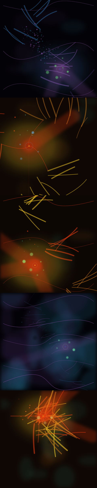
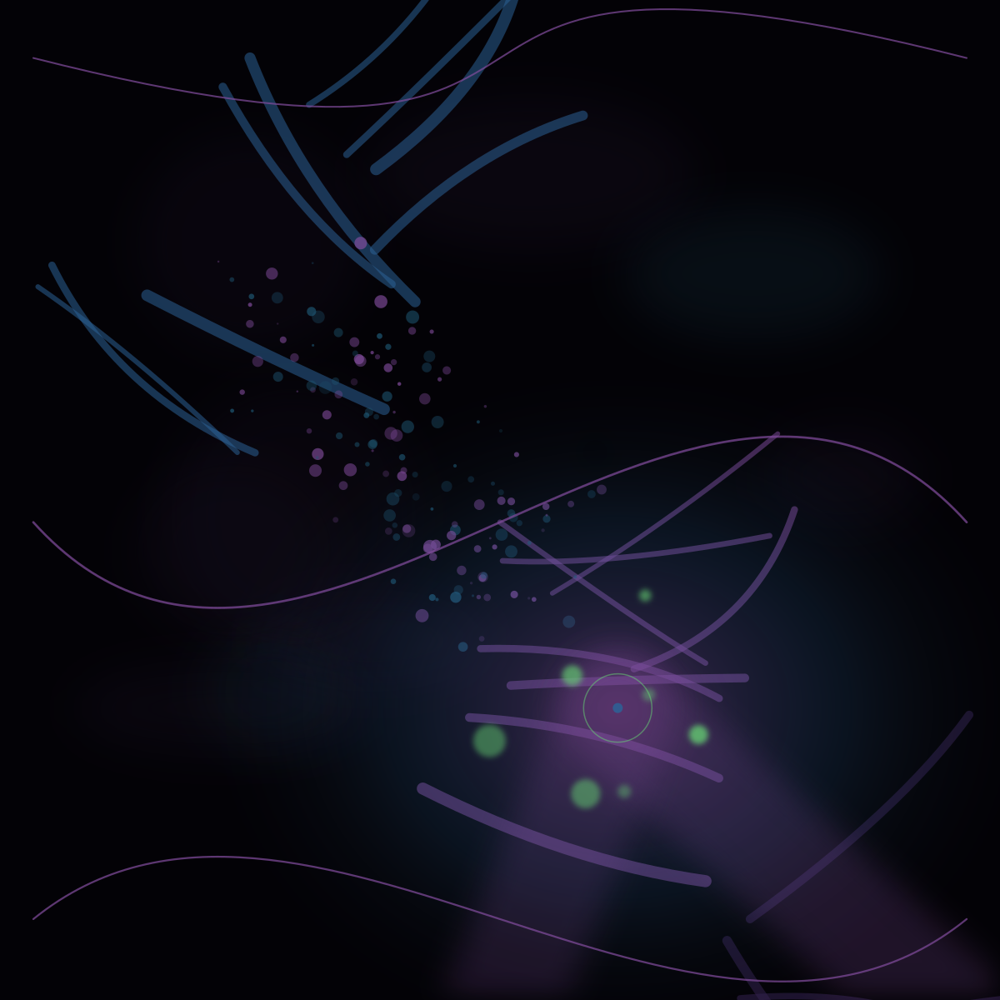
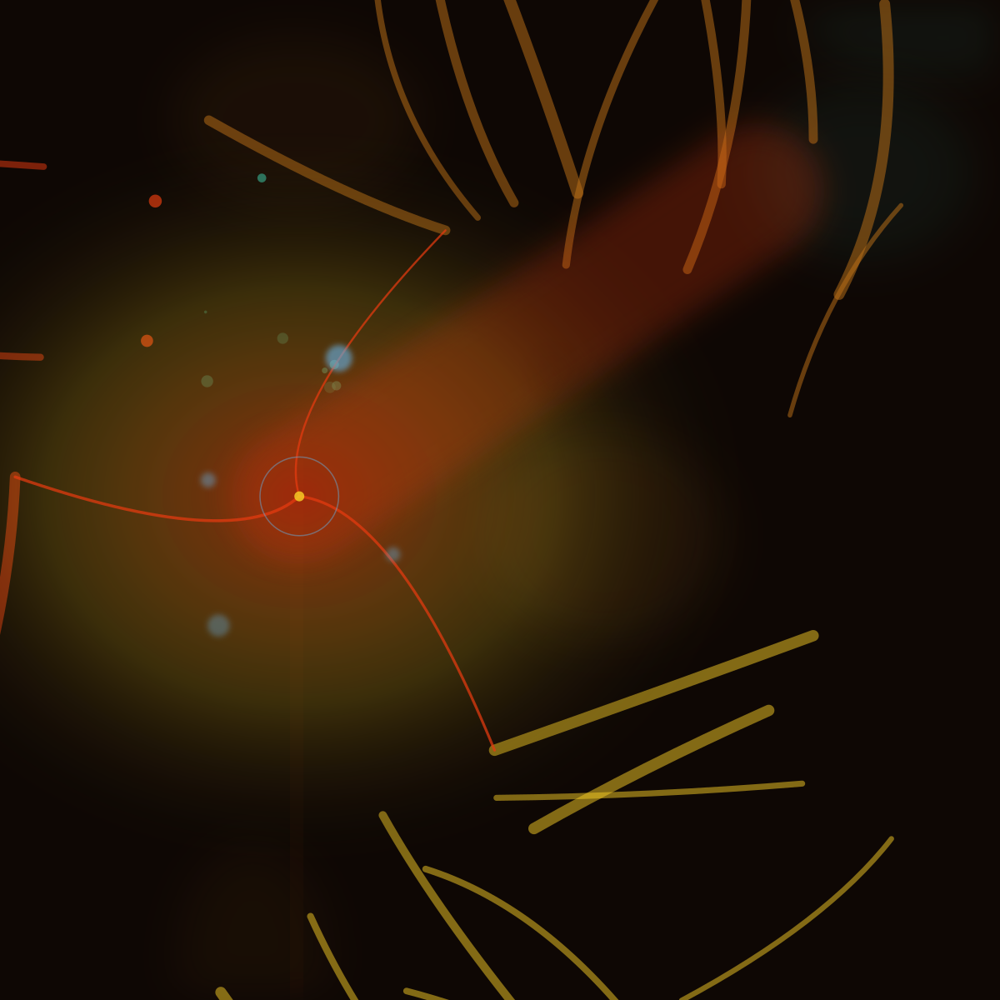
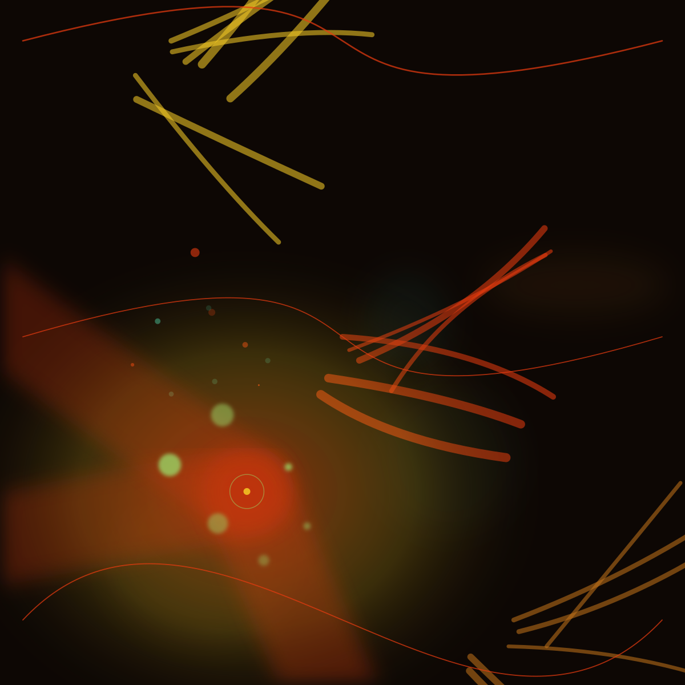
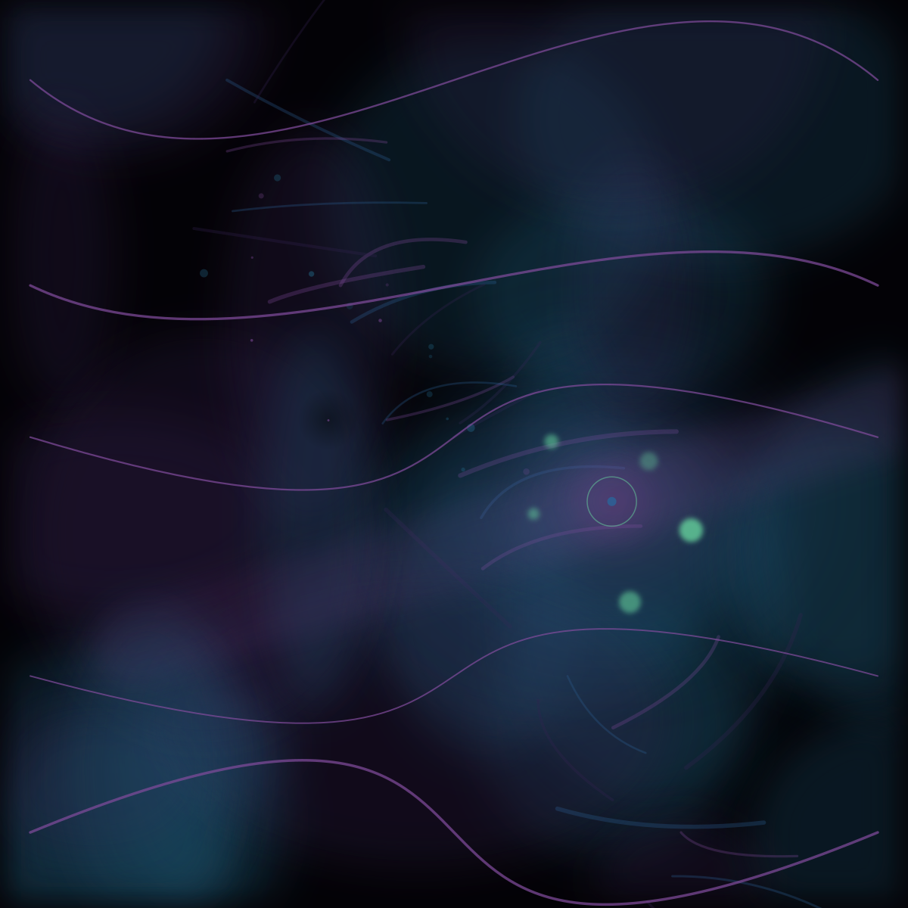
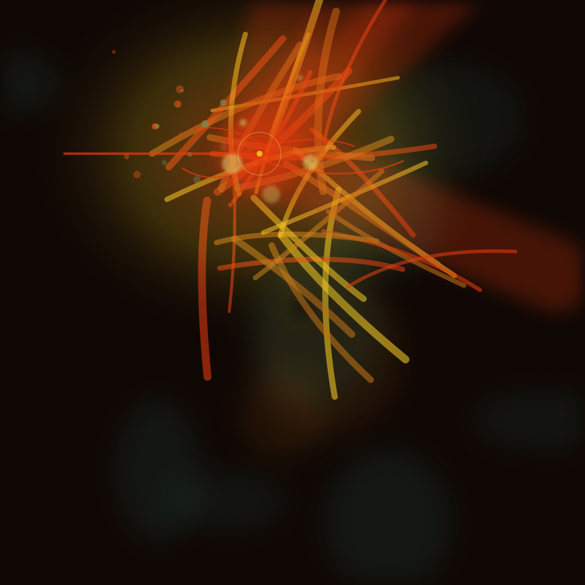

# Song DNA v2 — Independent Seeded Engines

Experimental renderer — **does not modify** Song DNA v1 / proof renderers.

Each engine uses its own deterministic seed: `hash(RVTR + domain)`.
Spotify acoustic metrics **control** engine parameters only.

## Songs

- Fleetwood Mac — Dreams (`RVTR569927`) → `Dreams/`
- Michael Jackson — Billie Jean (`RVTR573791`) → `BillieJean/`
- AC/DC — Back In Black (`RVTR828046`) → `BackInBlack/`
- Simon & Garfunkel — The Sound of Silence (`RVTR734474`) → `SoundOfSilence/`
- Eurythmics — Sweet Dreams (`RVTR481591`) → `SweetDreams/`

## Montage — five finals



## Layer stages (per song)

1. `01-background` — atmosphere + void
2. `02-rhythm` — + rhythm strokes
3. `03-particles` — + sparks
4. `04-lighting` — + halo + beams
5. `05-final` — + composition arcs + signature

## Fleetwood Mac — Dreams

- RVTR: `RVTR569927`
- Composition structure: **diagonal sweep**
- Final hash: `fa3ff243`

### Engine seeds

| Engine | Seed (hex) |
|---|---|
| composition | `dfe26af5` |
| background | `31317ad9` |
| brush | `1091ca87` |
| rhythm | `82ca9825` |
| particle | `7831e85b` |
| lighting | `90833d85` |
| signature | `2b4e48e1` |

### Stage outputs

- [01-background](Dreams/01-background.png)
- [02-rhythm](Dreams/02-rhythm.png)
- [03-particles](Dreams/03-particles.png)
- [04-lighting](Dreams/04-lighting.png)
- [05-final](Dreams/05-final.png)



## Michael Jackson — Billie Jean

- RVTR: `RVTR573791`
- Composition structure: **radial**
- Final hash: `4caf40d6`

### Engine seeds

| Engine | Seed (hex) |
|---|---|
| composition | `8fd0f28f` |
| background | `a8ffb51b` |
| brush | `1d947855` |
| rhythm | `e2ba3f1f` |
| particle | `9813d319` |
| lighting | `c84dc04f` |
| signature | `8d969dcb` |

### Stage outputs

- [01-background](BillieJean/01-background.png)
- [02-rhythm](BillieJean/02-rhythm.png)
- [03-particles](BillieJean/03-particles.png)
- [04-lighting](BillieJean/04-lighting.png)
- [05-final](BillieJean/05-final.png)



## AC/DC — Back In Black

- RVTR: `RVTR828046`
- Composition structure: **diagonal sweep**
- Final hash: `cb454fc0`

### Engine seeds

| Engine | Seed (hex) |
|---|---|
| composition | `ff8180c7` |
| background | `841d6b63` |
| brush | `f0b02a2d` |
| rhythm | `23a7a3f7` |
| particle | `612b831` |
| lighting | `2bc6c2f7` |
| signature | `cd8ee7f3` |

### Stage outputs

- [01-background](BackInBlack/01-background.png)
- [02-rhythm](BackInBlack/02-rhythm.png)
- [03-particles](BackInBlack/03-particles.png)
- [04-lighting](BackInBlack/04-lighting.png)
- [05-final](BackInBlack/05-final.png)



## Simon & Garfunkel — The Sound of Silence

- RVTR: `RVTR734474`
- Composition structure: **diagonal sweep**
- Final hash: `a7ddbf04`

### Engine seeds

| Engine | Seed (hex) |
|---|---|
| composition | `c48be6a8` |
| background | `b3896282` |
| brush | `cd3b8072` |
| rhythm | `ea1610ee` |
| particle | `1fcbd92c` |
| lighting | `7ff116da` |
| signature | `783d6e78` |

### Stage outputs

- [01-background](SoundOfSilence/01-background.png)
- [02-rhythm](SoundOfSilence/02-rhythm.png)
- [03-particles](SoundOfSilence/03-particles.png)
- [04-lighting](SoundOfSilence/04-lighting.png)
- [05-final](SoundOfSilence/05-final.png)



## Eurythmics — Sweet Dreams

- RVTR: `RVTR481591`
- Composition structure: **twin-arc**
- Final hash: `b5790e94`

### Engine seeds

| Engine | Seed (hex) |
|---|---|
| composition | `7c5774eb` |
| background | `3043f6c7` |
| brush | `bf8ff819` |
| rhythm | `64c9f923` |
| particle | `c4ba2b5` |
| lighting | `f4684d7b` |
| signature | `3afafb6f` |

### Stage outputs

- [01-background](SweetDreams/01-background.png)
- [02-rhythm](SweetDreams/02-rhythm.png)
- [03-particles](SweetDreams/03-particles.png)
- [04-lighting](SweetDreams/04-lighting.png)
- [05-final](SweetDreams/05-final.png)



## Reproduce

```bash
npm run research:song-dna-v2
```
