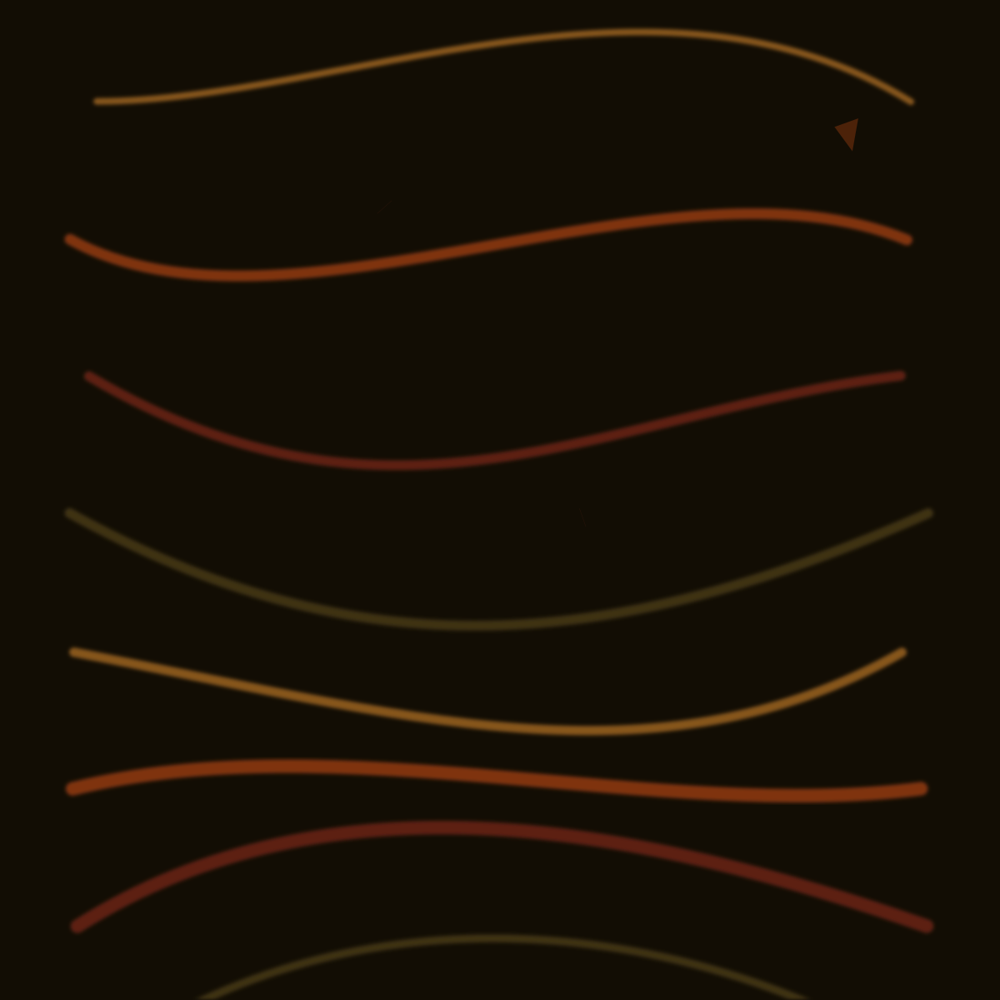
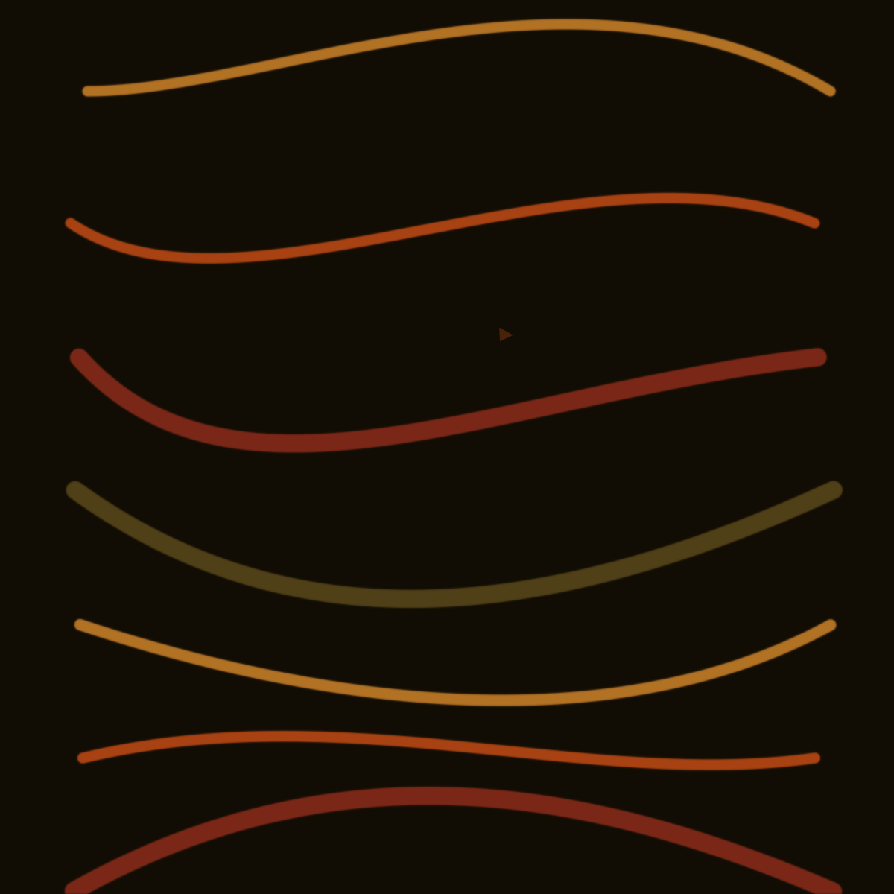

# Song DNA Visual Synthesizer — Proof

Algorithmic artwork derived from Retroverse acoustic metrics.
No AI image generation. No prompts. Deterministic per RVTR seed.

## Summary

- Songs rendered: **5**
- Determinism check (RVTR508702): **PASS**
- Output: `reports/song-dna-visual-synth/images/`

## Side-by-side comparison

### Valence spread
- Brightest palette: **Stevie Wonder — Superstition** (valence 0.884)
- Darkest palette: **Phil Collins — In The Air Tonight** (valence 0.060)

### Energy spread
- Highest energy strokes: **A-ha — Take On Me** (0.902)
- Lowest energy strokes: **Phil Collins — In The Air Tonight** (0.413)

### Tempo spread
- Densest rhythm: **The Outfield — Your Love** (129.5 BPM)
- Sparsest rhythm: **A-ha — Take On Me** (84.4 BPM)

### Expected visual separation
- **Take On Me** should read hottest and brightest (high valence + energy).
- **In The Air Tonight** should read cool, sparse, and shadow-heavy (low valence + tempo).
- **Dreams** liveness (~0.97) should show the most jitter/imperfection in flow paths.
- **Superstition** sits mid-high valence with moderate funk groove (danceability).
- **Your Love** balances moderate metrics — a mid-warm 80s synth-rock wash.

## The Outfield — Your Love

| Metric | Value |
|---|---|
| RVTR | RVTR508702 |
| Source | canonical_album_track_display |
| Danceability | 0.5790 |
| Energy | 0.6540 |
| Valence | 0.6160 |
| Acousticness | 0.1210 |
| Instrumentalness | 0.000004 |
| Speechiness | 0.0553 |
| Liveness | 0.0673 |
| Tempo (BPM) | 129.54 |
| Loudness (dB) | -12.42 |
| Key (pitch class) | unknown |
| Mode | unknown |
| Time signature | unknown |


### Metric → visual mapping
- **valence** — Balanced mid-valence palette between cool and warm.
- **energy** — Moderate brush weight.
- **danceability** — Flowing curved paths with wide sweeps.
- **tempo** — Mid-density stroke rhythm.
- **loudness** — Moderate contrast.
- **acousticness** — Crisp edges with minimal bleed.
- **instrumentalness** — Minimal fine-detail overlay.
- **speechiness** — Smooth continuous curves only.
- **liveness** — Clean, controlled geometry.
- **mode** — Neutral warmth (mode unknown).

### Synthesis notes
- Palette: hsl(32 81% 50%), hsl(18 85% 44%), hsl(8 72% 36%), hsl(45 55% 24%)
- Strokes: 16 · avg brush 12.5px
- Curve amplitude: 167px · blur 3.7px
- Detail strokes: 0 · ink marks: 1
- Deterministic hash: `d14f0e62`

## Fleetwood Mac — Dreams

| Metric | Value |
|---|---|
| RVTR | RVTR569927 |
| Source | canonical_album_track_display |
| Danceability | 0.4850 |
| Energy | 0.6430 |
| Valence | 0.3430 |
| Acousticness | 0.1740 |
| Instrumentalness | 0.002940 |
| Speechiness | 0.0422 |
| Liveness | 0.9660 |
| Tempo (BPM) | 127.76 |
| Loudness (dB) | -8.96 |
| Key (pitch class) | unknown |
| Mode | unknown |
| Time signature | unknown |


### Metric → visual mapping
- **valence** — Cool violet/charcoal palette dominates.
- **energy** — Moderate brush weight.
- **danceability** — Straighter, less undulating motion.
- **tempo** — Mid-density stroke rhythm.
- **loudness** — High opacity and strong contrast.
- **acousticness** — Crisp edges with minimal bleed.
- **instrumentalness** — Minimal fine-detail overlay.
- **speechiness** — Smooth continuous curves only.
- **liveness** — Visible jitter and imperfect control points.
- **mode** — Neutral warmth (mode unknown).

### Synthesis notes
- Palette: hsl(248 46% 17%), hsl(268 42% 29%), hsl(220 28% 22%), hsl(210 18% 10%)
- Strokes: 15 · avg brush 12.3px
- Curve amplitude: 147px · blur 4.8px
- Detail strokes: 0 · ink marks: 1
- Deterministic hash: `38d945a7`

## Stevie Wonder — Superstition

| Metric | Value |
|---|---|
| RVTR | RVTR678114 |
| Source | staging_acoustic_tracks |
| Danceability | 0.6110 |
| Energy | 0.5780 |
| Valence | 0.8840 |
| Acousticness | 0.0598 |
| Instrumentalness | 0.021900 |
| Speechiness | 0.0676 |
| Liveness | 0.0983 |
| Tempo (BPM) | 100.63 |
| Loudness (dB) | -14.17 |
| Key (pitch class) | unknown |
| Mode | unknown |
| Time signature | unknown |



### Metric → visual mapping
- **valence** — Warm gold/orange/red highlights dominate.
- **energy** — Moderate brush weight.
- **danceability** — Flowing curved paths with wide sweeps.
- **tempo** — Fewer strokes with wide spacing.
- **loudness** — Moderate contrast.
- **acousticness** — Crisp edges with minimal bleed.
- **instrumentalness** — Minimal fine-detail overlay.
- **speechiness** — Smooth continuous curves only.
- **liveness** — Clean, controlled geometry.
- **mode** — Neutral warmth (mode unknown).

### Synthesis notes
- Palette: hsl(32 87% 56%), hsl(18 85% 48%), hsl(8 72% 36%), hsl(45 55% 24%)
- Strokes: 12 · avg brush 11.2px
- Curve amplitude: 174px · blur 2.3px
- Detail strokes: 2 · ink marks: 1
- Deterministic hash: `213ebbf0`

## A-ha — Take On Me

| Metric | Value |
|---|---|
| RVTR | RVTR590442 |
| Source | canonical_album_track_display |
| Danceability | 0.5730 |
| Energy | 0.9020 |
| Valence | 0.8760 |
| Acousticness | 0.0180 |
| Instrumentalness | 0.001250 |
| Speechiness | 0.0540 |
| Liveness | 0.0928 |
| Tempo (BPM) | 84.41 |
| Loudness (dB) | -7.64 |
| Key (pitch class) | unknown |
| Mode | unknown |
| Time signature | unknown |



### Metric → visual mapping
- **valence** — Warm gold/orange/red highlights dominate.
- **energy** — Thick, high-intensity brush strokes.
- **danceability** — Flowing curved paths with wide sweeps.
- **tempo** — Fewer strokes with wide spacing.
- **loudness** — High opacity and strong contrast.
- **acousticness** — Crisp edges with minimal bleed.
- **instrumentalness** — Minimal fine-detail overlay.
- **speechiness** — Smooth continuous curves only.
- **liveness** — Clean, controlled geometry.
- **mode** — Neutral warmth (mode unknown).

### Synthesis notes
- Palette: hsl(32 87% 56%), hsl(18 85% 48%), hsl(8 72% 36%), hsl(45 55% 24%)
- Strokes: 12 · avg brush 16.4px
- Curve amplitude: 166px · blur 1.4px
- Detail strokes: 0 · ink marks: 1
- Deterministic hash: `9db2d1fe`

## Phil Collins — In The Air Tonight

| Metric | Value |
|---|---|
| RVTR | RVTR417030 |
| Source | staging_acoustic_tracks |
| Danceability | 0.4920 |
| Energy | 0.4130 |
| Valence | 0.0601 |
| Acousticness | 0.3230 |
| Instrumentalness | 0.000080 |
| Speechiness | 0.0267 |
| Liveness | 0.9850 |
| Tempo (BPM) | 96.16 |
| Loudness (dB) | -9.42 |
| Key (pitch class) | unknown |
| Mode | unknown |
| Time signature | unknown |


### Metric → visual mapping
- **valence** — Cool violet/charcoal palette dominates.
- **energy** — Thin, restrained strokes.
- **danceability** — Straighter, less undulating motion.
- **tempo** — Fewer strokes with wide spacing.
- **loudness** — High opacity and strong contrast.
- **acousticness** — Crisp edges with minimal bleed.
- **instrumentalness** — Minimal fine-detail overlay.
- **speechiness** — Smooth continuous curves only.
- **liveness** — Visible jitter and imperfect control points.
- **mode** — Neutral warmth (mode unknown).

### Synthesis notes
- Palette: hsl(248 39% 13%), hsl(268 42% 23%), hsl(220 28% 19%), hsl(210 18% 10%)
- Strokes: 11 · avg brush 8.6px
- Curve amplitude: 148px · blur 8.1px
- Detail strokes: 0 · ink marks: 0
- Deterministic hash: `a678e4dc`

## Reproduce

```bash
npm run research:song-dna-visual-synth
```
