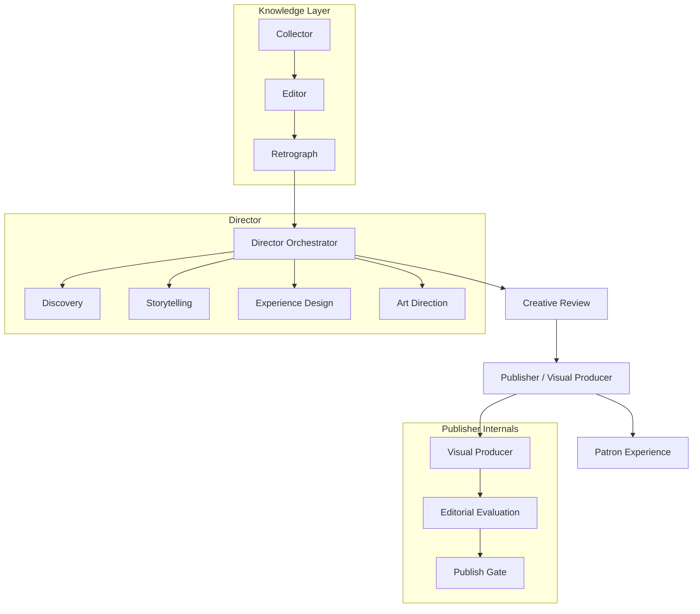

# Studio Production Pipeline v1.0 — Final Audit

**Sprint:** 3.38 — Publisher Stabilization & Studio 1.0 Freeze  
**Date:** 2026-06-28  
**Verification song:** RVTR001341 — Dr. Hook, *When You're In Love With A Beautiful Woman* (1978)

---

## Declaration

The Studio Production Pipeline is **v1.0 complete**.

Departments in scope:

| Department | Role |
|---|---|
| **Collector** | Expand Retrograph — facts, sources, media |
| **Editor** | Refine Retrograph — normalize, dedupe, score |
| **Retrograph** | Canonical knowledge graph artifact |
| **Director** | Design experiences from Retrograph |
| **Creative Review** | Editorial QA on Director output |
| **Publisher** | Visual Producer + publish gate |

**No new pipeline architecture work is planned.** Future development moves to flagship Retroverse experiences:

1. Chart Journey  
2. Song DNA  
3. Performance Universe  
4. Artist Universe  

Studio is the platform. Experiences are the product.

---

## Architecture



### Artifact flow (per RVTR)

| Stage | Primary artifact | Path |
|---|---|---|
| Collector | `collector.json` | `research-department/{RVTR}/` |
| Editor | `editor.json` | same |
| Retrograph | `retrograph.json` | same |
| Director | `director.json`, `director-handoff.json`, `director-render-spec.json` | same |
| Creative Review | `creative-review.json` | same (on-demand refresh) |
| Publisher | `visual-production.json` + `publisher-records.json` entry | song dir + studio store |
| Patron | Composed scenes via `loadPublicExperience` | runtime |

### Production orchestrator

**File:** `lib/ops/studio/production/run-song.ts`

```
Collector (optional skip)
  → Editor + Retrograph build
  → Director (runAndSaveDirector)
  → Visual Producer (runVisualProducer)
  → Publisher evaluate (evaluatePublisherPackage)
  → Auto-publish gate (autoPublishStandard)
```

Creative Review runs **on-demand** via `/ops/studio/creative-review/[rvtr]` — not wired into `run-song.ts`. Artifact exists when Director workspace or review UI has been opened.

---

## RVTR001341 End-to-End Verification

### Pipeline run

```
npm run research:studio:verify-one -- RVTR001341
```

| Stage | Status | Runtime |
|---|---|---|
| Collector | skipped (existing) | — |
| Editor | complete | 16 ms |
| Director | complete | 41 ms |
| Publisher | evaluated → published | ~314 ms |
| **Overall** | **published** | **405 ms** |

### Artifacts on disk

| Artifact | Present | Notes |
|---|---|---|
| `collector.json` | ✓ | 22 candidate facts, visual assets |
| `editor.json` | ✓ | Editorial story + approved assets |
| `retrograph.json` | ✓ | Graph artifact |
| `director.json` | ✓ | storyPlan v5, 11 pages, art direction |
| `director-handoff.json` | ✓ | Editor → Director handoff |
| `director-render-spec.json` | ✓ | Machine render spec |
| `creative-review.json` | ✓ | Score 83, ready_with_changes |
| `visual-production.json` | ✓ | 11 produced scenes, review score 77 |
| `publisher-records.json` entry | ✓ | qualityScore 80, extended, approved |
| `song-dna.json` | ✓ | Visual/musical DNA |
| `dossier.json` | ✓ | Dossier sidecar |

### Patron render path (RVTR001341)

| Check | Result |
|---|---|
| Render path | **Retrograph** (`usedMuseum: false`) — not legacy 5-exhibit museum |
| Visual Producer applied | ✓ `usedVisualProducer: true` |
| Scene count | 11 composed = 11 produced |
| Layout source | `visual-producer:*` on all scenes (e.g. `visual-producer:hero` → `museum_identity`) |
| Art direction theme | ✓ `usedArtDirection: true` |
| Legacy museum-only path | Not used for this RVTR |

**Checkpoint:** Public experience reflects Director's 11-scene storytelling plan with Visual Producer overlay — not the old fixed 5-exhibit museum compose.

---

## Publisher Audit

### Module inventory (39 files)

| Subsystem | Files | Purpose |
|---|---|---|
| Core | `evaluate`, `store`, `worker`, `gate`, `publish-policy`, `list-packages` | Evaluation, approval, auto-publish |
| Visual Producer | 11 files in `visual-producer/` | Production plan + render overlay |
| Experience Lab | 15 files in `experience/` | Fingerprints, critic, golden, drift, scorecard |
| Contract | `package-contract.ts` | Studio kernel registry pointer |

### Duplicate logic identified

| Concern | Locations | Risk | Action |
|---|---|---|---|
| **Scene ordering** | `pages-to-experience-plan.ts`, `run-visual-producer.ts`, `museum-experience.ts` | Medium | Document — VP reads Director storyboard; museum path ignores storyboard |
| **Layout selection** | `select-layout.ts`, `museum-experience.exhibitLayout()`, `dossier-mobile-experience.layoutForScene()`, `scene-presentation.layoutForMoment()` | High | Document — composers assign baseline; VP overlays at render |
| **Template → layout mapping** | `select-layout.TEMPLATE_LAYOUT`, `enforce-sequence-variety.STYLE_FAMILY`, `pages-to-experience-plan.mapTemplateId()` | Low | Document — Director enforces variety; VP maps for production |
| **Typography** | `era-styling.ts` (Director), `buildTypography()` (VP), `art-direction-theme.ts` (render) | Medium | Document — only render theme is wired; VP typography is review-only |
| **Media selection** | Director page `mediaIds`, `select-media.ts` (VP) | Medium | Document — VP media IDs stored but not applied at render |
| **Visual rhythm / variety** | Director audits, VP `visual-rhythm.ts`, Publisher `scoreVisualVariety()`, Experience Critic | Low | Intentional layered QA — not consolidated |

### Obsolete / dead code

| Item | Status | Sprint 3.38 action |
|---|---|---|
| `publisherRecord` unused in `loadMuseumPublicExperience` | Dead load | **Removed** |
| `transitionFamily()` in `transitions.ts` | Unreferenced | **Removed** |
| `buildPublisherDashboard()` | Side-effectful; UI uses read-only variant | **Marked @deprecated** |
| `buildPublisherReviewPayload()` | Never called | **Marked @deprecated** |
| `autoApproveStandardIfEligible()` | Deprecated wrapper | Kept — docs reference `auto-approve.ts` shim |
| `auto-approve.ts` | Re-export shim | Kept — zero runtime cost |
| `publisher/index.ts` barrel | Zero importers | Trimmed dead exports |
| `experience/index.ts` barrel | Zero importers | Documented |
| API routes `patterns`, `drift`, `status` | No client fetch | Documented — lab SSR-loads directly |

### Legacy rendering paths

| Path | File | When used |
|---|---|---|
| Retrograph compose | `retrograph-mobile-experience.ts` | `retrograph.json` exists or templateLibraryVersion includes retrograph/dossier |
| Museum compose | `museum-experience.ts` | Fallback when retrograph path unavailable |
| Render spec parse | `parse-render-spec.ts` | Retrograph public path |

**RVTR001341 uses retrograph path.** Museum path remains for legacy pilot packages — not unexpectedly invoked for storytelling packages.

---

## Visual Producer Boundary Audit

### Publisher PRODUCES (correct scope)

| Responsibility | Module | Applied at render? |
|---|---|---|
| Layout selection | `select-layout.ts` | ✓ via `presentationLayout` overlay |
| Transitions | `transitions.ts` | ✓ `transitionIn` / `transitionOut` |
| Visual intensity | `visual-rhythm.ts` | ✓ `visualIntensity` |
| Headline overlay | `apply-visual-production.ts` | ✓ when produced headline differs |
| Production review | `production-review.ts` | ✓ scoring in Publisher evaluate |
| Scene ordering | reads Director storyboard | ✓ preserves Director order |

### Publisher does NOT redesign (verified)

| Concern | Owner | VP behavior |
|---|---|---|
| Story content | Director pages | Reads only; fallback synthesis from scenes is compatibility shim |
| Discoveries | Director Discovery | Not accessed |
| Editorial intent | Director + Creative Review | Not modified |
| Art direction briefs | Director Art Direction | Maps briefs → layouts; does not rewrite briefs |
| Experience concepts | Experience Designer | Reads `conceptTitle` for labels only |
| Template downgrade | Director variety enforcement | Not re-run |

### Partial application gap (known limitation)

Visual Producer stores but does **not** apply at render:

- Typography profile (`typographyProfile`, per-scene `typography`)
- Media assignments (`heroMediaIds`, `supportingMediaIds`)

Render typography comes from `art-direction-theme.ts` (Song DNA). Render media comes from Director page assets via composers.

**This is intentional v1.0 scope:** VP artifact is the production record + layout/transition overlay. Full typography/media wiring is future flagship work.

### VP staleness

`visual-production.json` stores `directorStoryPlanVersion` but evaluate only regenerates when file is **missing**. Director re-runs with existing VP file leave stale production plans.

**Documented — high-risk to auto-invalidate without regression testing.**

---

## Cleanup Completed (Sprint 3.38)

| Change | File | Behavior impact |
|---|---|---|
| Removed unused `getPublisherRecord` load | `load-public-experience.ts` | None |
| Removed dead `transitionFamily()` | `visual-producer/transitions.ts` | None |
| Deprecated side-effectful dashboard builder | `list-packages.ts` | None — UI already uses read-only |
| Deprecated unused review payload builder | `list-packages.ts` | None |
| Trimmed dead barrel exports | `publisher/index.ts` | None — barrel unused |

---

## Remaining Technical Debt

### High risk — document only, do not delete

| Item | Detail | Recommended action |
|---|---|---|
| Triple layout pipeline | Composers → VP overlay → presentation | Flagship experience work may consolidate per experience type |
| VP partial render apply | Typography + media stored but not applied | Wire in Chart Journey / Song DNA sprints |
| VP staleness | No version invalidation on Director regen | Add version check behind feature flag |
| Museum vs storyboard order | Museum path ignores Director storyboard | Retire museum path for storytelling packages |
| Experience Critic independence | Re-composes museum scenes, not retrograph path | Align critic with active render path |
| Creative Review not in pipeline | On-demand only via UI | Optional: hook after Director in run-song |
| Publisher records file size | 5.6MB JSON, parsed per lookup | Index or shard (S-010+ infrastructure) |
| Golden package freeze | Blocks Director re-runs | Operational discipline — document in ops |

### Medium risk

| Item | Detail |
|---|---|
| `auto-approve.ts` shim | Docs reference it; production uses `publish-policy` directly |
| Unused API routes | `patterns`, `drift`, `status` — symmetric with other departments |
| Triple scoring | Director review → VP review → Publisher evaluate dimensions |
| `buildPublisherReviewPayload` | Dead code — safe to remove in future cleanup pass |

### Low risk

| Item | Detail |
|---|---|
| Barrel files with zero importers | `publisher/index.ts`, `experience/index.ts` |
| `getDriftWarning()` | Exported, never imported |
| `package-contract.ts` | Registry stub only |

---

## Known Limitations (v1.0)

1. **Information fidelity vs visual pacing** — Collector gathers broadly; published experience shows curated subset (see `pipeline-data-flow-audit.md`).
2. **Scene 9 missing hero** on RVTR001341 — VP review flags record_sleeve without hero media.
3. **5 headlines weak** — Publisher story dimension notes 5 slides lack strong headlines.
4. **Visual variety score 55** — Director variety good; dimension scoring conservative.
5. **Creative Review not automated** — artifact exists but requires UI visit or manual refresh.
6. **Auto-publish at score ≥ 70** — structural fatals still block; coaching never blocks publish.
7. **Museum pilot path** — still present as fallback for non-storytelling packages.

---

## Publisher Evaluation (RVTR001341)

| Dimension | Score |
|---|---|
| Story | 70 |
| Visual Variety | 55 |
| Asset Coverage | 100 |
| Historical Quality | 88 |
| Experience Quality | 100 |
| Visual Production | 69 |
| **Quality score** | **80** |
| Publication class | extended |
| Approved | yes |

Visual Producer: 11 scenes, 9 layout types, production score 77, review not passed (1 missing hero).

---

## Recommended Future Work

### Flagship experiences (product)

| Experience | Studio inputs | Publisher focus |
|---|---|---|
| **Chart Journey** | Retrograph chart facts + Director chart story | Wire VP timeline layouts + chart media at render |
| **Song DNA** | Song DNA package + Director DNA story | Wire VP data_visualization + DNA typography |
| **Performance Universe** | Performance entities + video frames | Wire VP performance_reel media selection at render |
| **Artist Universe** | RVAR graph expansion | New Director story types; Publisher scales production review |

### Publisher v1.1 (when needed)

1. VP version invalidation when `directorStoryPlanVersion` changes  
2. Apply VP typography + media at render (complete the production plan)  
3. Align Experience Critic with retrograph compose path  
4. Wire Creative Review into production pipeline (optional gate)  
5. Remove museum fallback for storytelling packages  

### Infrastructure (not v1.0)

- Publisher records sharding  
- Barrel consolidation or removal  
- Dead code removal pass (`buildPublisherReviewPayload`, unused API routes)

---

## Implementation Report

| Section | Content |
|---|---|
| Files Created | `reports/studio-v1-final-audit.md` |
| Files Modified | `load-public-experience.ts`, `transitions.ts`, `list-packages.ts`, `publisher/index.ts` |
| Behavior Changes | **None** — dead code removal and deprecation comments only |
| Runtime Verification | RVTR001341 full pipeline ✓; public experience 11 scenes, VP overlay ✓ |
| Typecheck | Pass |
| Technical Debt Removed | Unused publisher record load; dead transitionFamily export |
| Ready for Next Phase | Yes — Studio v1.0 frozen; flagship experience work unblocked |

**Execution State: COMPLETE**
